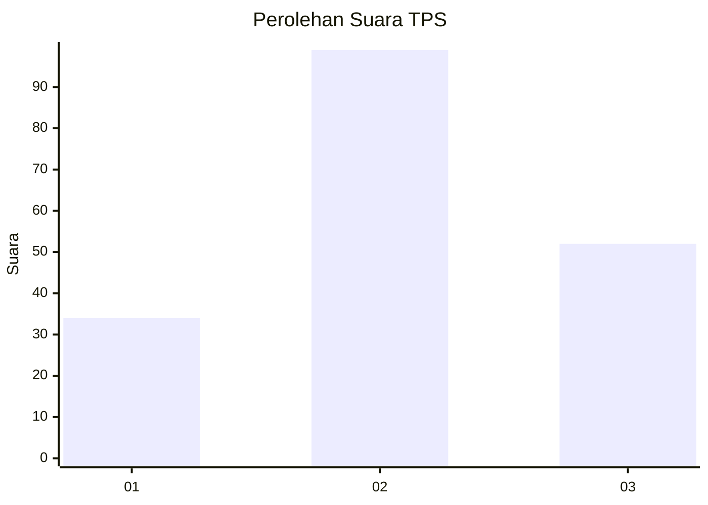
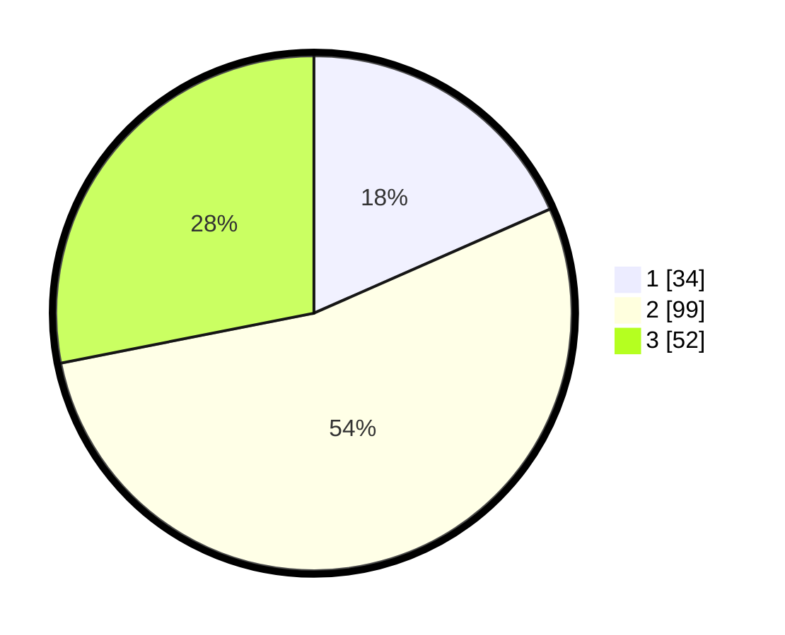

# Hasil

## Grafik

## Tabel

| No. | Nama Paslon    | Suara | Suara (raw) | Persentase |
|:--- |:-------------- | -----:| -----------:| ----------:|
| 1   | ANIES MUHAIMIN | 34    | [34][p-1]   | 18,38      |
| 2   | PRABOWO GIBRAN | 99    | [99][p-2]   | 53,51      |
| 3   | GANJAR MAHFUD  | 52    | [52][p-3]   | 28,11      |

[p-1]: https://github.com/gigit-pemilu/pemilu-2024-51-bali/blob/main/pilpres/hitung-suara/sub/51-bali/sub/08-buleleng/sub/05-sukasada/sub/2012-panji-anom/sub/015-tps/sub/paslon-1.txt
[p-2]: https://github.com/gigit-pemilu/pemilu-2024-51-bali/blob/main/pilpres/hitung-suara/sub/51-bali/sub/08-buleleng/sub/05-sukasada/sub/2012-panji-anom/sub/015-tps/sub/paslon-2.txt
[p-3]: https://github.com/gigit-pemilu/pemilu-2024-51-bali/blob/main/pilpres/hitung-suara/sub/51-bali/sub/08-buleleng/sub/05-sukasada/sub/2012-panji-anom/sub/015-tps/sub/paslon-3.txt

## Foto C Plano

https://sirekap-obj-formc.kpu.go.id/ebbf/pemilu/ppwp/51/08/05/20/12/5108052012015-20240214-215940--330aee19-d8ec-4899-b32a-0673dc82fc12.jpg

https://sirekap-obj-formc.kpu.go.id/ebbf/pemilu/ppwp/51/08/05/20/12/5108052012015-20240214-224305--8e37610c-ae3a-46f1-b73c-ad6aaf92675c.jpg

https://sirekap-obj-formc.kpu.go.id/ebbf/pemilu/ppwp/51/08/05/20/12/5108052012015-20240214-220211--66a943c5-4056-4d7a-afc9-febd27657b1a.jpg

## Metadata

| Key        | Value               |
| ---------- | ------------------- |
| Time Stamp | 2024-02-25 12:00:00 |

