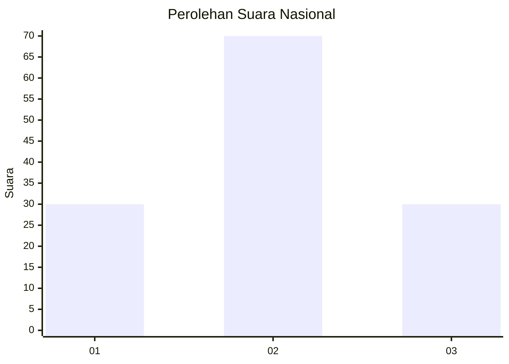
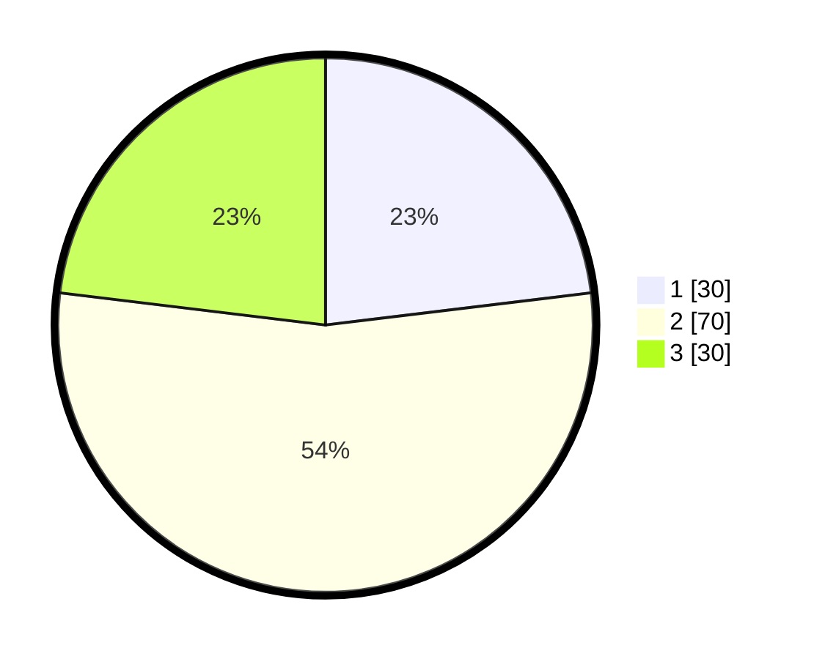

# Hasil

## Grafik

## Tabel

| No. | Nama Paslon    | Suara | Suara (raw) | Persentase |
|:--- |:-------------- | -----:| -----------:| ----------:|
| 1   | ANIES MUHAIMIN | 30    | [30][p-1]   | 23,08      |
| 2   | PRABOWO GIBRAN | 70    | [70][p-2]   | 53,85      |
| 3   | GANJAR MAHFUD  | 30    | [30][p-3]   | 23,08      |

[p-1]: https://github.com/gigit-pemilu/pemilu-2024/blob/main/pilpres/hitung-suara/sub/51-bali/sub/08-buleleng/sub/05-sukasada/sub/2012-panji-anom/sub/019-tps/sub/paslon-1.txt
[p-2]: https://github.com/gigit-pemilu/pemilu-2024/blob/main/pilpres/hitung-suara/sub/51-bali/sub/08-buleleng/sub/05-sukasada/sub/2012-panji-anom/sub/019-tps/sub/paslon-2.txt
[p-3]: https://github.com/gigit-pemilu/pemilu-2024/blob/main/pilpres/hitung-suara/sub/51-bali/sub/08-buleleng/sub/05-sukasada/sub/2012-panji-anom/sub/019-tps/sub/paslon-3.txt

## Foto C Plano

https://sirekap-obj-formc.kpu.go.id/0c6b/pemilu/ppwp/51/08/05/20/12/5108052012019-20240214-220742--0d0d1611-c07d-4adf-a663-e31d6ffba4c1.jpg

https://sirekap-obj-formc.kpu.go.id/0c6b/pemilu/ppwp/51/08/05/20/12/5108052012019-20240214-220420--8e3aeb61-bbf3-4c53-b693-43b53b519753.jpg

https://sirekap-obj-formc.kpu.go.id/0c6b/pemilu/ppwp/51/08/05/20/12/5108052012019-20240214-221052--b72ed7b7-b3a8-498f-bb7e-b70588905439.jpg

## Metadata

| Key        | Value               |
| ---------- | ------------------- |
| Time Stamp | 2024-02-24 22:31:28 |

