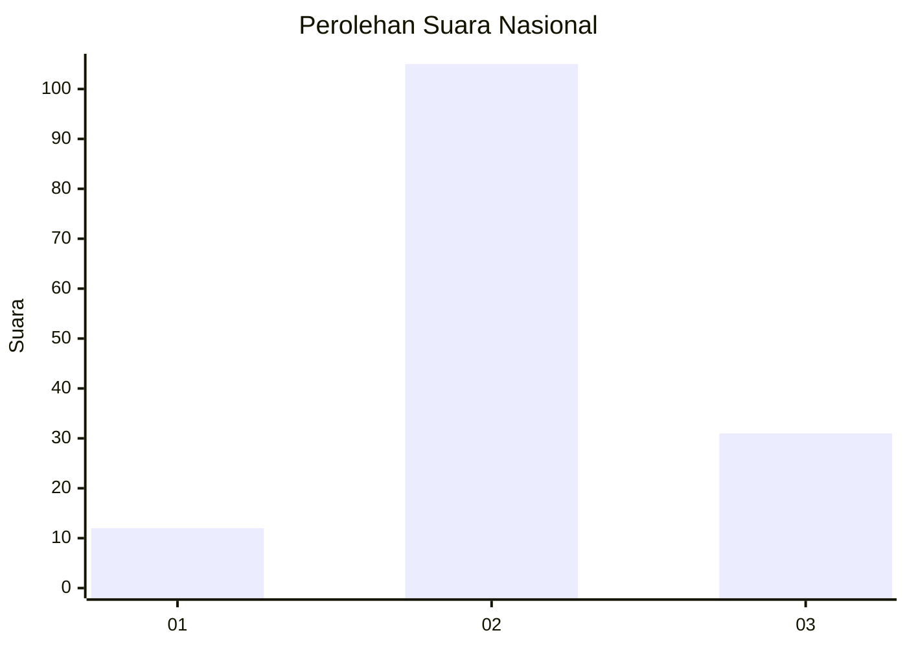
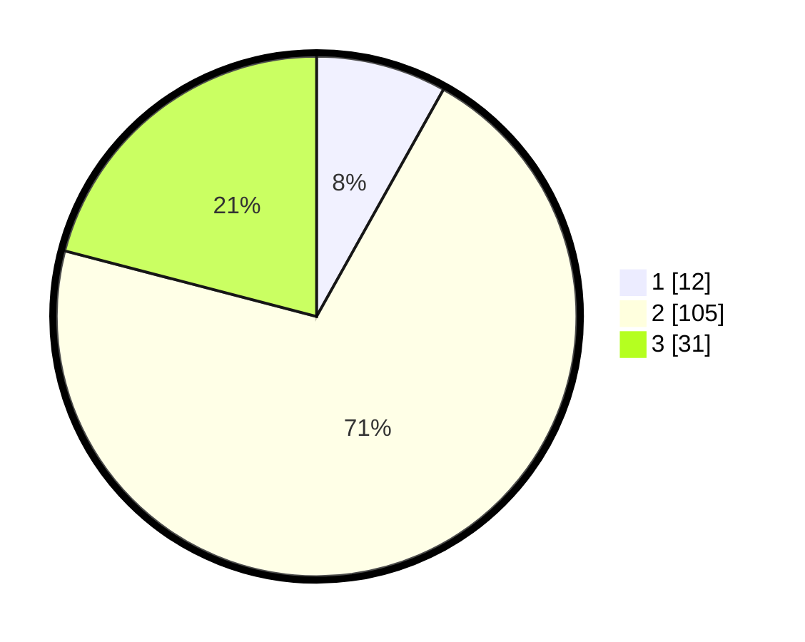

# Hasil

## Grafik

## Tabel

| No. | Nama Paslon    | Suara | Suara (raw) | Persentase |
|:--- |:-------------- | -----:| -----------:| ----------:|
| 1   | ANIES MUHAIMIN | 12    | [12][p-1]   | 8,11       |
| 2   | PRABOWO GIBRAN | 105   | [105][p-2]  | 70,95      |
| 3   | GANJAR MAHFUD  | 31    | [31][p-3]   | 20,95      |

[p-1]: https://github.com/gigit-pemilu/pemilu-2024/blob/main/pilpres/hitung-suara/sub/51-bali/sub/08-buleleng/sub/05-sukasada/sub/2012-panji-anom/sub/020-tps/sub/paslon-1.txt
[p-2]: https://github.com/gigit-pemilu/pemilu-2024/blob/main/pilpres/hitung-suara/sub/51-bali/sub/08-buleleng/sub/05-sukasada/sub/2012-panji-anom/sub/020-tps/sub/paslon-2.txt
[p-3]: https://github.com/gigit-pemilu/pemilu-2024/blob/main/pilpres/hitung-suara/sub/51-bali/sub/08-buleleng/sub/05-sukasada/sub/2012-panji-anom/sub/020-tps/sub/paslon-3.txt

## Foto C Plano

https://sirekap-obj-formc.kpu.go.id/9a90/pemilu/ppwp/51/08/05/20/12/5108052012020-20240214-230406--9a127648-67fa-4739-8aba-6bbcdd5a350a.jpg

https://sirekap-obj-formc.kpu.go.id/9a90/pemilu/ppwp/51/08/05/20/12/5108052012020-20240214-224202--4108176f-c779-4b48-bc26-b212e00e0e61.jpg

https://sirekap-obj-formc.kpu.go.id/9a90/pemilu/ppwp/51/08/05/20/12/5108052012020-20240214-223517--f96340b2-8a13-4322-818e-ab73e06c4efa.jpg

## Metadata

| Key        | Value               |
| ---------- | ------------------- |
| Time Stamp | 2024-02-25 11:00:00 |

