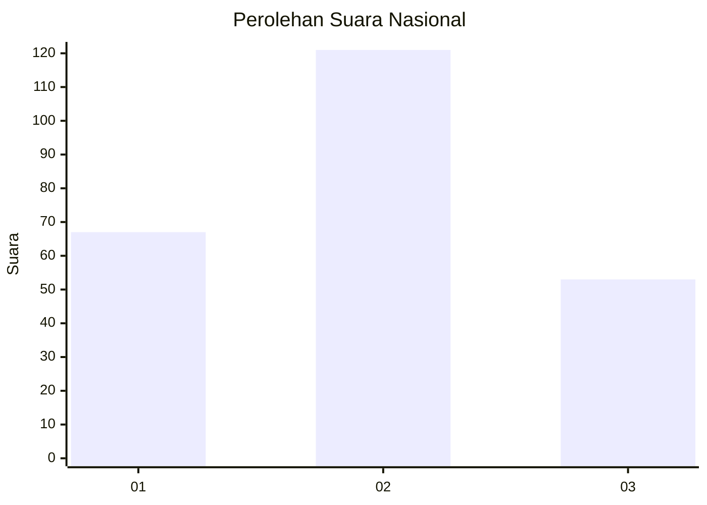
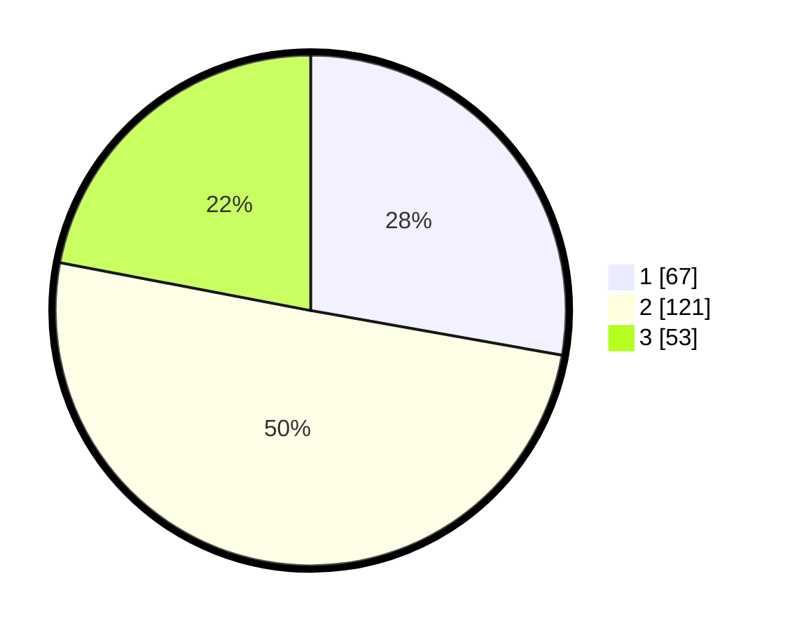

# Hasil

## Grafik

## Tabel

| No. | Nama Paslon    | Suara | Suara (raw) | Persentase |
|:--- |:-------------- | -----:| -----------:| ----------:|
| 1   | ANIES MUHAIMIN | 67    | [67][p-1]   | 27,80      |
| 2   | PRABOWO GIBRAN | 121   | [121][p-2]  | 50,21      |
| 3   | GANJAR MAHFUD  | 53    | [53][p-3]   | 21,99      |

[p-1]: https://github.com/gigit-pemilu/pemilu-2024/blob/main/pilpres/hitung-suara/sub/51-bali/sub/08-buleleng/sub/05-sukasada/sub/2013-tegallinggah/sub/006-tps/sub/paslon-1.txt
[p-2]: https://github.com/gigit-pemilu/pemilu-2024/blob/main/pilpres/hitung-suara/sub/51-bali/sub/08-buleleng/sub/05-sukasada/sub/2013-tegallinggah/sub/006-tps/sub/paslon-2.txt
[p-3]: https://github.com/gigit-pemilu/pemilu-2024/blob/main/pilpres/hitung-suara/sub/51-bali/sub/08-buleleng/sub/05-sukasada/sub/2013-tegallinggah/sub/006-tps/sub/paslon-3.txt

## Foto C Plano

https://sirekap-obj-formc.kpu.go.id/3779/pemilu/ppwp/51/08/05/20/13/5108052013006-20240214-204435--b9d3e639-2763-43bf-a10e-a8908098defb.jpg

https://sirekap-obj-formc.kpu.go.id/3779/pemilu/ppwp/51/08/05/20/13/5108052013006-20240214-204519--aa2064b1-5fdf-4a1f-85b5-9077ab125f9e.jpg

https://sirekap-obj-formc.kpu.go.id/3779/pemilu/ppwp/51/08/05/20/13/5108052013006-20240214-204605--6a568fbe-44b0-4690-9e94-6caac65a3523.jpg

## Metadata

| Key        | Value               |
| ---------- | ------------------- |
| Time Stamp | 2024-02-15 20:00:44 |

## DATA PEMILIH TETAP

Jumlah pemilih dalam DPT: **290**.
 * L: **151**.
 * P: **139**.

## DATA PENGGUNA HAK PILIH

Jumlah pengguna hak pilih dalam DPT: **245**.
 * L: **130**.
 * P: **115**.

Jumlah pengguna hak pilih dalam DPTb: **0**.
 * L: **0**.
 * P: **0**.

Jumlah pengguna hak pilih dalam DPK: **0**.
 * L: **0**.
 * P: **0**.

Jumlah pengguna hak pilih: **245**.
 * L: **130**.
 * P: **115**.

## JUMLAH SUARA SAH DAN TIDAK SAH

JUMLAH SELURUH SUARA SAH: **241**.

JUMLAH SUARA TIDAK SAH: **4**.

JUMLAH SELURUH SUARA SAH DAN SUARA TIDAK SAH: **245**.

