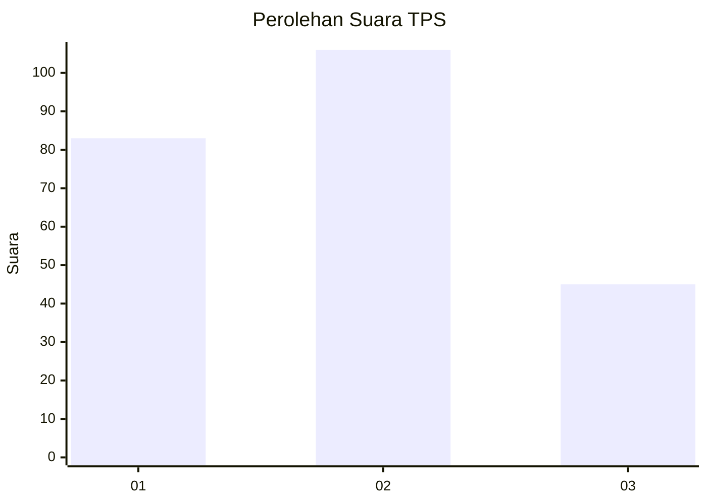
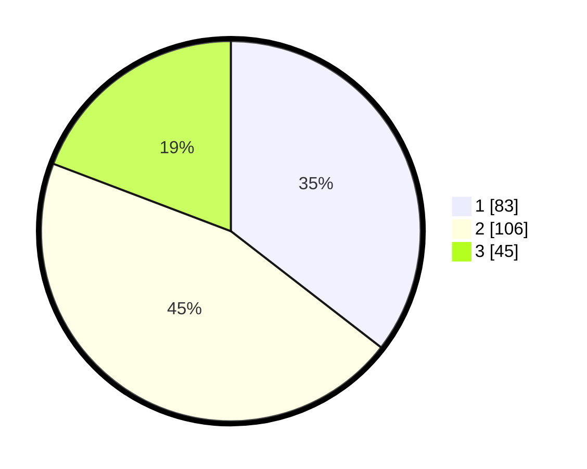

# Hasil

## Grafik

## Tabel

| No. | Nama Paslon    | Suara | Suara (raw) | Persentase |
|:--- |:-------------- | -----:| -----------:| ----------:|
| 1   | ANIES MUHAIMIN | 83    | [83][p-1]   | 35,47      |
| 2   | PRABOWO GIBRAN | 106   | [106][p-2]  | 45,30      |
| 3   | GANJAR MAHFUD  | 45    | [45][p-3]   | 19,23      |

[p-1]: https://github.com/gigit-pemilu/pemilu-2024-51-bali/blob/main/pilpres/hitung-suara/sub/51-bali/sub/08-buleleng/sub/05-sukasada/sub/2013-tegallinggah/sub/007-tps/sub/paslon-1.txt
[p-2]: https://github.com/gigit-pemilu/pemilu-2024-51-bali/blob/main/pilpres/hitung-suara/sub/51-bali/sub/08-buleleng/sub/05-sukasada/sub/2013-tegallinggah/sub/007-tps/sub/paslon-2.txt
[p-3]: https://github.com/gigit-pemilu/pemilu-2024-51-bali/blob/main/pilpres/hitung-suara/sub/51-bali/sub/08-buleleng/sub/05-sukasada/sub/2013-tegallinggah/sub/007-tps/sub/paslon-3.txt

## Foto C Plano

https://sirekap-obj-formc.kpu.go.id/3c45/pemilu/ppwp/51/08/05/20/13/5108052013007-20240215-001536--450145b9-723d-4c07-92dd-e97ba80902c1.jpg

https://sirekap-obj-formc.kpu.go.id/3c45/pemilu/ppwp/51/08/05/20/13/5108052013007-20240214-222903--d1b7bc3b-1738-44f2-a405-d650373da431.jpg

https://sirekap-obj-formc.kpu.go.id/3c45/pemilu/ppwp/51/08/05/20/13/5108052013007-20240214-223011--51a986b4-5107-4f99-acc1-8dd139e1e873.jpg

## Metadata

| Key        | Value               |
| ---------- | ------------------- |
| Time Stamp | 2024-02-24 22:31:28 |

