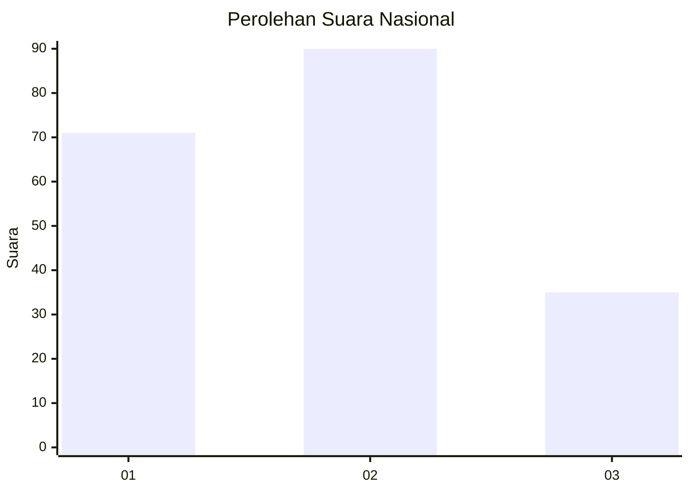
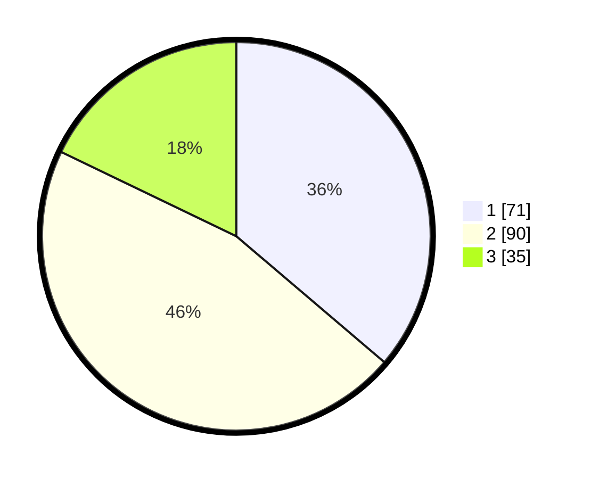

# Hasil

## Grafik

## Tabel

| No. | Nama Paslon    | Suara | Suara (raw) | Persentase |
|:--- |:-------------- | -----:| -----------:| ----------:|
| 1   | ANIES MUHAIMIN | 71    | [71][p-1]   | 36,22      |
| 2   | PRABOWO GIBRAN | 90    | [90][p-2]   | 45,92      |
| 3   | GANJAR MAHFUD  | 35    | [35][p-3]   | 17,86      |

[p-1]: https://github.com/gigit-pemilu/pemilu-2024/blob/main/pilpres/hitung-suara/sub/51-bali/sub/08-buleleng/sub/05-sukasada/sub/2013-tegallinggah/sub/011-tps/sub/paslon-1.txt
[p-2]: https://github.com/gigit-pemilu/pemilu-2024/blob/main/pilpres/hitung-suara/sub/51-bali/sub/08-buleleng/sub/05-sukasada/sub/2013-tegallinggah/sub/011-tps/sub/paslon-2.txt
[p-3]: https://github.com/gigit-pemilu/pemilu-2024/blob/main/pilpres/hitung-suara/sub/51-bali/sub/08-buleleng/sub/05-sukasada/sub/2013-tegallinggah/sub/011-tps/sub/paslon-3.txt

## Foto C Plano

https://sirekap-obj-formc.kpu.go.id/5f72/pemilu/ppwp/51/08/05/20/13/5108052013011-20240214-225138--51aa3c82-5877-4aac-bcbd-5c55a9a21fe2.jpg

https://sirekap-obj-formc.kpu.go.id/5f72/pemilu/ppwp/51/08/05/20/13/5108052013011-20240214-225528--ebe7dded-e29a-48c9-b0ff-0a1725caa31a.jpg

## Metadata

| Key        | Value               |
| ---------- | ------------------- |
| Time Stamp | 2024-02-25 11:00:00 |

