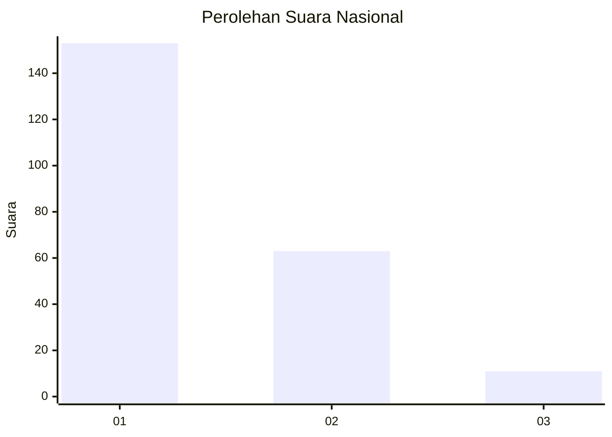
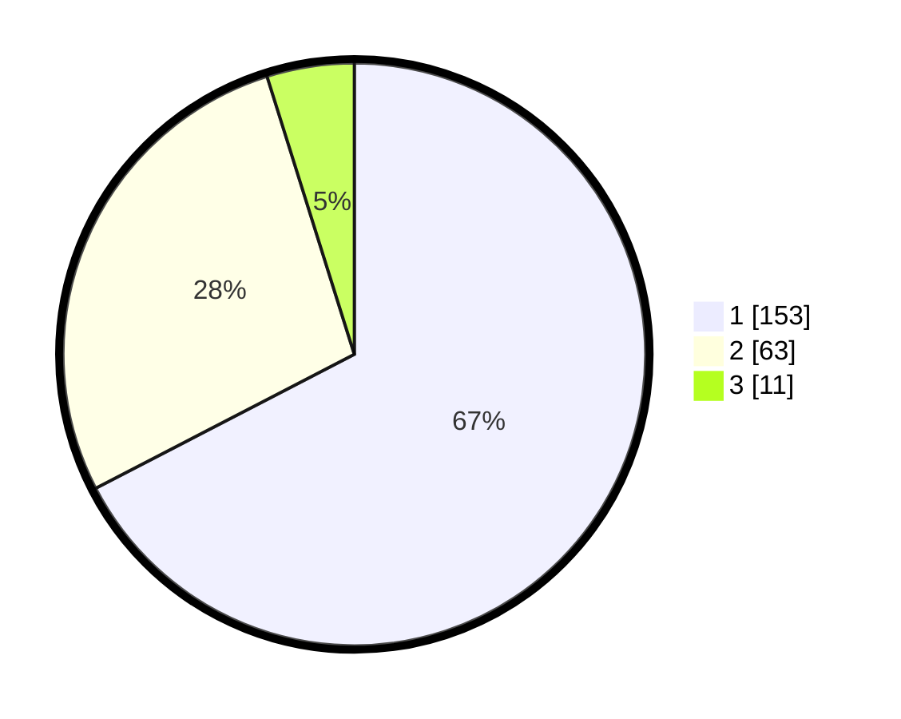

# Hasil

## Grafik

## Tabel

| No. | Nama Paslon    | Suara | Suara (raw) | Persentase |
|:--- |:-------------- | -----:| -----------:| ----------:|
| 1   | ANIES MUHAIMIN | 153   | [153][p-1]  | 67,40      |
| 2   | PRABOWO GIBRAN | 63    | [63][p-2]   | 27,75      |
| 3   | GANJAR MAHFUD  | 11    | [11][p-3]   | 4,85       |

[p-1]: https://github.com/gigit-pemilu/pemilu-2024/blob/main/pilpres/hitung-suara/sub/51-bali/sub/08-buleleng/sub/05-sukasada/sub/2013-tegallinggah/sub/013-tps/sub/paslon-1.txt
[p-2]: https://github.com/gigit-pemilu/pemilu-2024/blob/main/pilpres/hitung-suara/sub/51-bali/sub/08-buleleng/sub/05-sukasada/sub/2013-tegallinggah/sub/013-tps/sub/paslon-2.txt
[p-3]: https://github.com/gigit-pemilu/pemilu-2024/blob/main/pilpres/hitung-suara/sub/51-bali/sub/08-buleleng/sub/05-sukasada/sub/2013-tegallinggah/sub/013-tps/sub/paslon-3.txt

## Foto C Plano

https://sirekap-obj-formc.kpu.go.id/105a/pemilu/ppwp/51/08/05/20/13/5108052013013-20240214-233821--168b23a9-b8e2-41c7-84a5-43a9662c7082.jpg

https://sirekap-obj-formc.kpu.go.id/105a/pemilu/ppwp/51/08/05/20/13/5108052013013-20240215-001034--08a97084-b8e5-4518-86ec-fdc1e586ff1a.jpg

https://sirekap-obj-formc.kpu.go.id/105a/pemilu/ppwp/51/08/05/20/13/5108052013013-20240214-155136--10f98bb9-d344-45c0-be3c-79cbe8bb7e7e.jpg

## Metadata

| Key        | Value               |
| ---------- | ------------------- |
| Time Stamp | 2024-02-24 22:31:28 |

