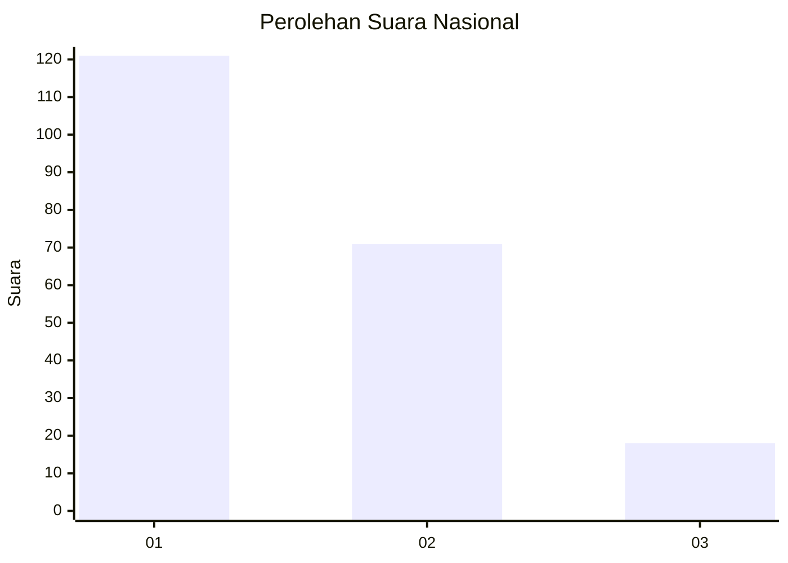
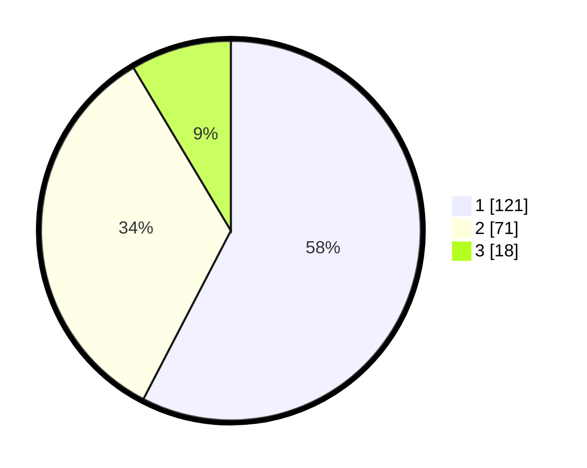

# Hasil

## Grafik

## Tabel

| No. | Nama Paslon    | Suara | Suara (raw) | Persentase |
|:--- |:-------------- | -----:| -----------:| ----------:|
| 1   | ANIES MUHAIMIN | 121   | [121][p-1]  | 57,62      |
| 2   | PRABOWO GIBRAN | 71    | [71][p-2]   | 33,81      |
| 3   | GANJAR MAHFUD  | 18    | [18][p-3]   | 8,57       |

[p-1]: https://github.com/gigit-pemilu/pemilu-2024/blob/main/pilpres/hitung-suara/sub/51-bali/sub/08-buleleng/sub/05-sukasada/sub/2013-tegallinggah/sub/014-tps/sub/paslon-1.txt
[p-2]: https://github.com/gigit-pemilu/pemilu-2024/blob/main/pilpres/hitung-suara/sub/51-bali/sub/08-buleleng/sub/05-sukasada/sub/2013-tegallinggah/sub/014-tps/sub/paslon-2.txt
[p-3]: https://github.com/gigit-pemilu/pemilu-2024/blob/main/pilpres/hitung-suara/sub/51-bali/sub/08-buleleng/sub/05-sukasada/sub/2013-tegallinggah/sub/014-tps/sub/paslon-3.txt

## Foto C Plano

https://sirekap-obj-formc.kpu.go.id/4423/pemilu/ppwp/51/08/05/20/13/5108052013014-20240216-175935--3cc15ba6-4242-42f2-8e52-4d37e366c001.jpg

https://sirekap-obj-formc.kpu.go.id/4423/pemilu/ppwp/51/08/05/20/13/5108052013014-20240216-175937--985f1cdf-2a57-4ff5-b40e-cf3072dd2fd5.jpg

https://sirekap-obj-formc.kpu.go.id/4423/pemilu/ppwp/51/08/05/20/13/5108052013014-20240216-175936--b1e8730a-03d7-4436-ac2a-2362b22c78c5.jpg

## Metadata

| Key        | Value               |
| ---------- | ------------------- |
| Time Stamp | 2024-02-16 21:01:00 |

## DATA PEMILIH TETAP

Jumlah pemilih dalam DPT: **227**.
 * L: **111**.
 * P: **116**.

## DATA PENGGUNA HAK PILIH

Jumlah pengguna hak pilih dalam DPT: **202**.
 * L: **97**.
 * P: **105**.

Jumlah pengguna hak pilih dalam DPTb: **0**.
 * L: **0**.
 * P: **0**.

Jumlah pengguna hak pilih dalam DPK: **11**.
 * L: **4**.
 * P: **7**.

Jumlah pengguna hak pilih: **213**.
 * L: **101**.
 * P: **112**.

## JUMLAH SUARA SAH DAN TIDAK SAH

JUMLAH SELURUH SUARA SAH: **210**.

JUMLAH SUARA TIDAK SAH: **3**.

JUMLAH SELURUH SUARA SAH DAN SUARA TIDAK SAH: **213**.

