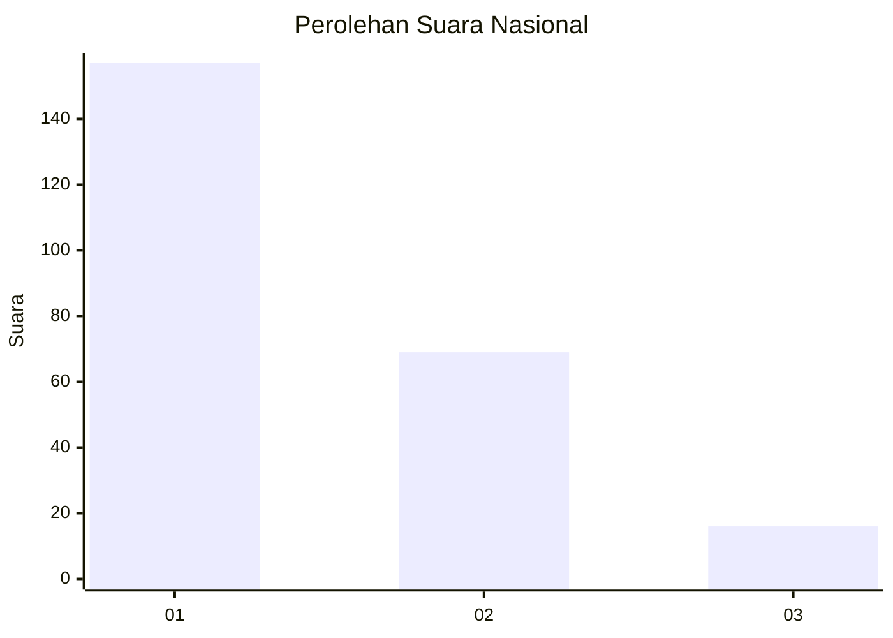
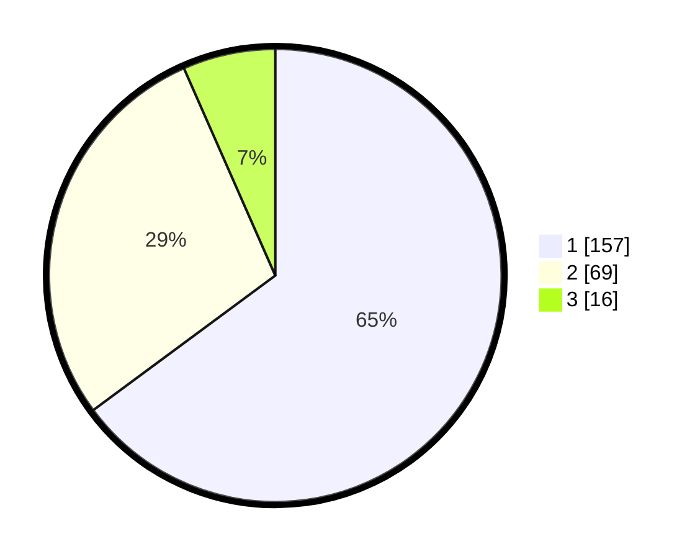

# Hasil

## Grafik

## Tabel

| No. | Nama Paslon    | Suara | Suara (raw) | Persentase |
|:--- |:-------------- | -----:| -----------:| ----------:|
| 1   | ANIES MUHAIMIN | 157   | [157][p-1]  | 64,88      |
| 2   | PRABOWO GIBRAN | 69    | [69][p-2]   | 28,51      |
| 3   | GANJAR MAHFUD  | 16    | [16][p-3]   | 6,61       |

[p-1]: https://github.com/gigit-pemilu/pemilu-2024/blob/main/pilpres/hitung-suara/sub/51-bali/sub/08-buleleng/sub/05-sukasada/sub/2013-tegallinggah/sub/015-tps/sub/paslon-1.txt
[p-2]: https://github.com/gigit-pemilu/pemilu-2024/blob/main/pilpres/hitung-suara/sub/51-bali/sub/08-buleleng/sub/05-sukasada/sub/2013-tegallinggah/sub/015-tps/sub/paslon-2.txt
[p-3]: https://github.com/gigit-pemilu/pemilu-2024/blob/main/pilpres/hitung-suara/sub/51-bali/sub/08-buleleng/sub/05-sukasada/sub/2013-tegallinggah/sub/015-tps/sub/paslon-3.txt

## Foto C Plano

https://sirekap-obj-formc.kpu.go.id/31c7/pemilu/ppwp/51/08/05/20/13/5108052013015-20240214-235353--1b27a845-8576-4d30-aff9-7a88009e285e.jpg

https://sirekap-obj-formc.kpu.go.id/31c7/pemilu/ppwp/51/08/05/20/13/5108052013015-20240214-235822--4edacf52-8684-41a7-8816-978d931002f3.jpg

https://sirekap-obj-formc.kpu.go.id/31c7/pemilu/ppwp/51/08/05/20/13/5108052013015-20240214-235941--38adf355-bb23-48a2-969f-2eaa02b8d8c8.jpg

## Metadata

| Key        | Value               |
| ---------- | ------------------- |
| Time Stamp | 2024-02-24 22:31:28 |

