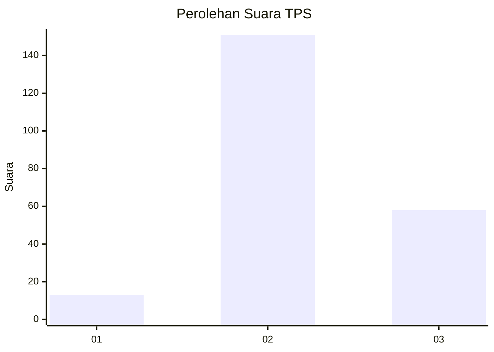

# Hasil

## Grafik

## Tabel

| No. | Nama Paslon    | Suara | Suara (raw) | Persentase |
|:--- |:-------------- | -----:| -----------:| ----------:|
| 1   | ANIES MUHAIMIN | 13    | [13][p-1]   | 5,86       |
| 2   | PRABOWO GIBRAN | 151   | [151][p-2]  | 68,02      |
| 3   | GANJAR MAHFUD  | 58    | [58][p-3]   | 26,13      |

[p-1]: https://github.com/gigit-pemilu/pemilu-2024-51-bali/blob/main/pilpres/hitung-suara/sub/51-bali/sub/08-buleleng/sub/05-sukasada/sub/2013-tegallinggah/sub/018-tps/sub/paslon-1.txt
[p-2]: https://github.com/gigit-pemilu/pemilu-2024-51-bali/blob/main/pilpres/hitung-suara/sub/51-bali/sub/08-buleleng/sub/05-sukasada/sub/2013-tegallinggah/sub/018-tps/sub/paslon-2.txt
[p-3]: https://github.com/gigit-pemilu/pemilu-2024-51-bali/blob/main/pilpres/hitung-suara/sub/51-bali/sub/08-buleleng/sub/05-sukasada/sub/2013-tegallinggah/sub/018-tps/sub/paslon-3.txt

## Foto C Plano

https://sirekap-obj-formc.kpu.go.id/7fa3/pemilu/ppwp/51/08/05/20/13/5108052013018-20240214-220326--555eb27a-1c3a-47b5-978c-aaca664827bb.jpg

https://sirekap-obj-formc.kpu.go.id/7fa3/pemilu/ppwp/51/08/05/20/13/5108052013018-20240214-231139--805f2efe-3923-4ed9-90d4-bc41ee061d0b.jpg

https://sirekap-obj-formc.kpu.go.id/7fa3/pemilu/ppwp/51/08/05/20/13/5108052013018-20240214-213146--fba675b5-2b13-406e-8370-7c1fbde21647.jpg

## Metadata

| Key        | Value               |
| ---------- | ------------------- |
| Time Stamp | 2024-02-24 22:31:28 |

