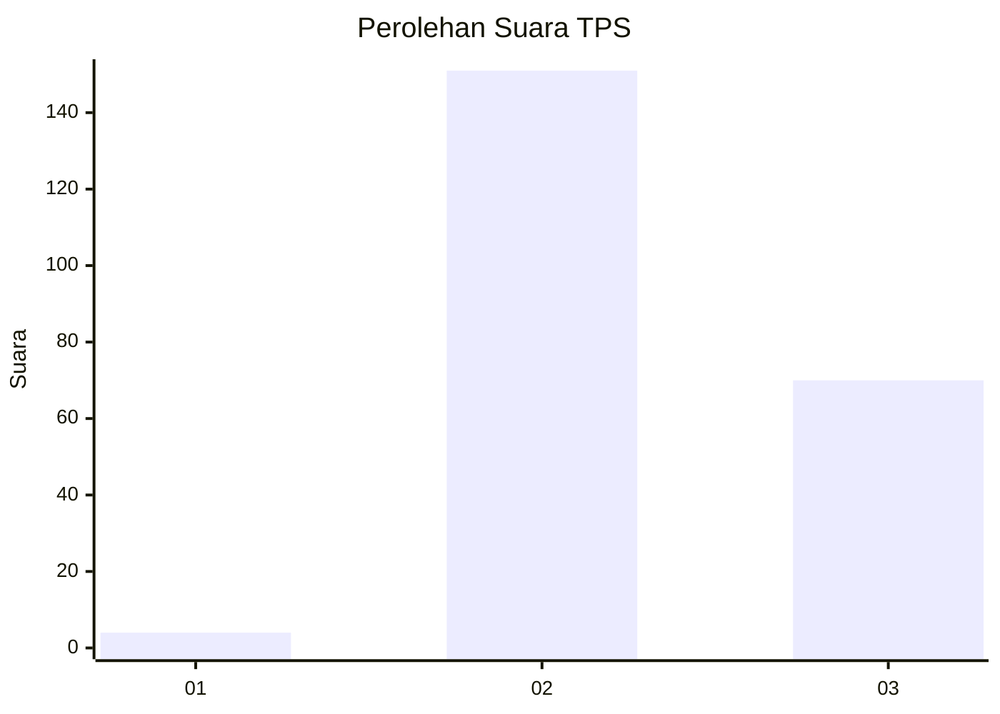
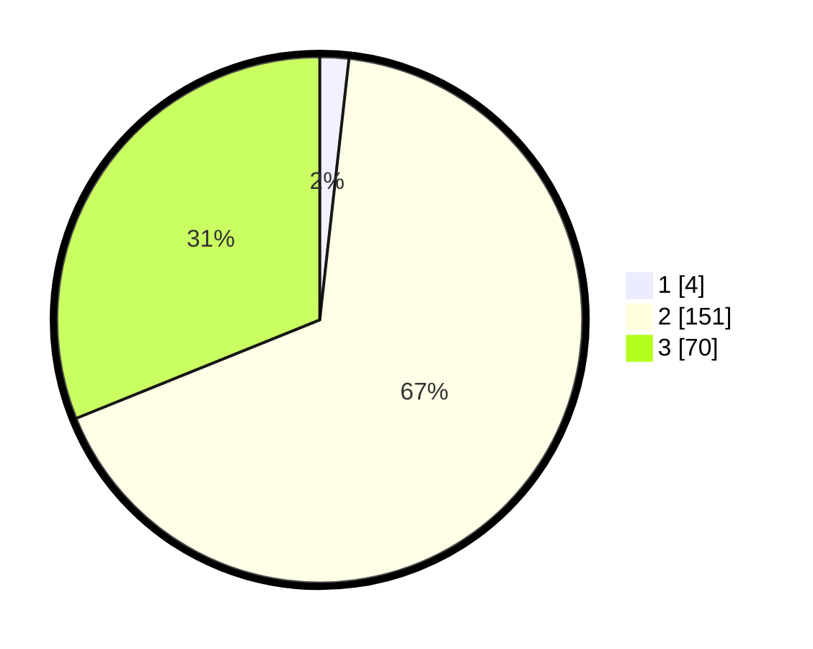

# Hasil

## Grafik

## Tabel

| No. | Nama Paslon    | Suara | Suara (raw) | Persentase |
|:--- |:-------------- | -----:| -----------:| ----------:|
| 1   | ANIES MUHAIMIN | 4     | [4][p-1]    | 1,78       |
| 2   | PRABOWO GIBRAN | 151   | [151][p-2]  | 67,11      |
| 3   | GANJAR MAHFUD  | 70    | [70][p-3]   | 31,11      |

[p-1]: https://github.com/gigit-pemilu/pemilu-2024-51-bali/blob/main/pilpres/hitung-suara/sub/51-bali/sub/08-buleleng/sub/05-sukasada/sub/2013-tegallinggah/sub/019-tps/sub/paslon-1.txt
[p-2]: https://github.com/gigit-pemilu/pemilu-2024-51-bali/blob/main/pilpres/hitung-suara/sub/51-bali/sub/08-buleleng/sub/05-sukasada/sub/2013-tegallinggah/sub/019-tps/sub/paslon-2.txt
[p-3]: https://github.com/gigit-pemilu/pemilu-2024-51-bali/blob/main/pilpres/hitung-suara/sub/51-bali/sub/08-buleleng/sub/05-sukasada/sub/2013-tegallinggah/sub/019-tps/sub/paslon-3.txt

## Foto C Plano

https://sirekap-obj-formc.kpu.go.id/02ef/pemilu/ppwp/51/08/05/20/13/5108052013019-20240214-235718--f1a846ce-ef5f-4fbd-9d34-7b43d8a83a0d.jpg

https://sirekap-obj-formc.kpu.go.id/02ef/pemilu/ppwp/51/08/05/20/13/5108052013019-20240214-235743--6a554423-daac-40ef-89ab-0524c631e7a5.jpg

https://sirekap-obj-formc.kpu.go.id/02ef/pemilu/ppwp/51/08/05/20/13/5108052013019-20240214-235810--f9976561-b39c-4bd5-9902-b85ccdc5dcab.jpg

## Metadata

| Key        | Value               |
| ---------- | ------------------- |
| Time Stamp | 2024-02-24 22:31:28 |

