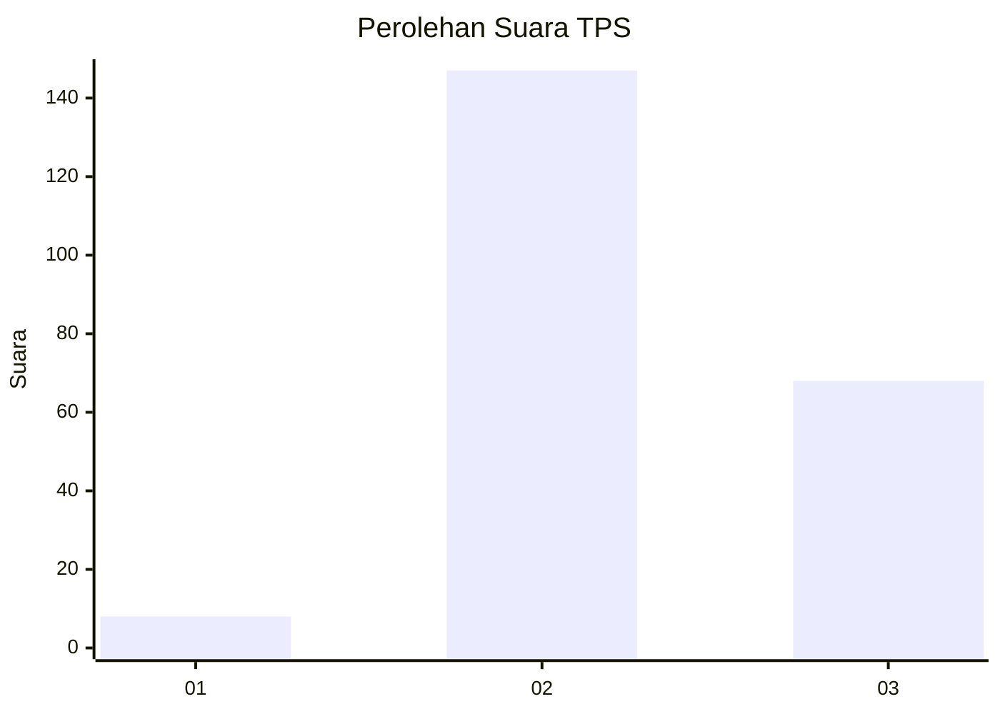

# Hasil

## Grafik

## Tabel

| No. | Nama Paslon    | Suara | Suara (raw) | Persentase |
|:--- |:-------------- | -----:| -----------:| ----------:|
| 1   | ANIES MUHAIMIN | 8     | [8][p-1]    | 3,59       |
| 2   | PRABOWO GIBRAN | 147   | [147][p-2]  | 65,92      |
| 3   | GANJAR MAHFUD  | 68    | [68][p-3]   | 30,49      |

[p-1]: https://github.com/gigit-pemilu/pemilu-2024-51-bali/blob/main/pilpres/hitung-suara/sub/51-bali/sub/08-buleleng/sub/05-sukasada/sub/2013-tegallinggah/sub/020-tps/sub/paslon-1.txt
[p-2]: https://github.com/gigit-pemilu/pemilu-2024-51-bali/blob/main/pilpres/hitung-suara/sub/51-bali/sub/08-buleleng/sub/05-sukasada/sub/2013-tegallinggah/sub/020-tps/sub/paslon-2.txt
[p-3]: https://github.com/gigit-pemilu/pemilu-2024-51-bali/blob/main/pilpres/hitung-suara/sub/51-bali/sub/08-buleleng/sub/05-sukasada/sub/2013-tegallinggah/sub/020-tps/sub/paslon-3.txt

## Foto C Plano

https://sirekap-obj-formc.kpu.go.id/925a/pemilu/ppwp/51/08/05/20/13/5108052013020-20240214-224025--d07eb662-595f-454a-a99a-a2a6c9bfb180.jpg

https://sirekap-obj-formc.kpu.go.id/925a/pemilu/ppwp/51/08/05/20/13/5108052013020-20240214-224140--0bd3cd66-e51c-48da-933d-248461ac8d34.jpg

https://sirekap-obj-formc.kpu.go.id/925a/pemilu/ppwp/51/08/05/20/13/5108052013020-20240214-224258--e9cc607a-2be7-4c46-ae09-ee565baa88b6.jpg

## Metadata

| Key        | Value               |
| ---------- | ------------------- |
| Time Stamp | 2024-02-24 22:31:28 |

