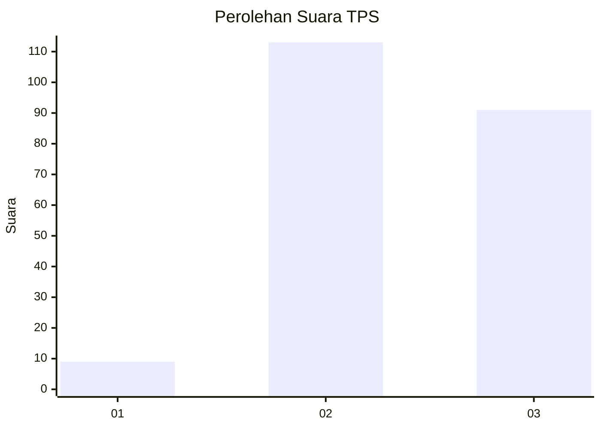
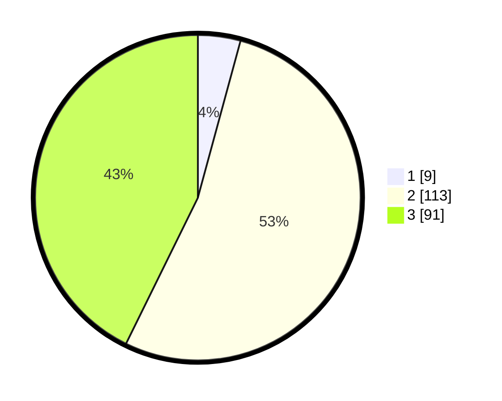

# Hasil

## Grafik

## Tabel

| No. | Nama Paslon    | Suara | Suara (raw) | Persentase |
|:--- |:-------------- | -----:| -----------:| ----------:|
| 1   | ANIES MUHAIMIN | 9     | [9][p-1]    | 4,23       |
| 2   | PRABOWO GIBRAN | 113   | [113][p-2]  | 53,05      |
| 3   | GANJAR MAHFUD  | 91    | [91][p-3]   | 42,72      |

[p-1]: https://github.com/gigit-pemilu/pemilu-2024-51-bali/blob/main/pilpres/hitung-suara/sub/51-bali/sub/08-buleleng/sub/05-sukasada/sub/2013-tegallinggah/sub/022-tps/sub/paslon-1.txt
[p-2]: https://github.com/gigit-pemilu/pemilu-2024-51-bali/blob/main/pilpres/hitung-suara/sub/51-bali/sub/08-buleleng/sub/05-sukasada/sub/2013-tegallinggah/sub/022-tps/sub/paslon-2.txt
[p-3]: https://github.com/gigit-pemilu/pemilu-2024-51-bali/blob/main/pilpres/hitung-suara/sub/51-bali/sub/08-buleleng/sub/05-sukasada/sub/2013-tegallinggah/sub/022-tps/sub/paslon-3.txt

## Foto C Plano

https://sirekap-obj-formc.kpu.go.id/c284/pemilu/ppwp/51/08/05/20/13/5108052013022-20240215-001448--2a7b476d-693b-4360-a08c-484541cb985f.jpg

https://sirekap-obj-formc.kpu.go.id/c284/pemilu/ppwp/51/08/05/20/13/5108052013022-20240215-001607--15644fe8-2bb0-4253-ac82-6c1a62c528ad.jpg

https://sirekap-obj-formc.kpu.go.id/c284/pemilu/ppwp/51/08/05/20/13/5108052013022-20240215-001723--c6a08346-d628-4a76-8d77-8ec1a8f76449.jpg

## Metadata

| Key        | Value               |
| ---------- | ------------------- |
| Time Stamp | 2024-02-24 22:31:28 |

