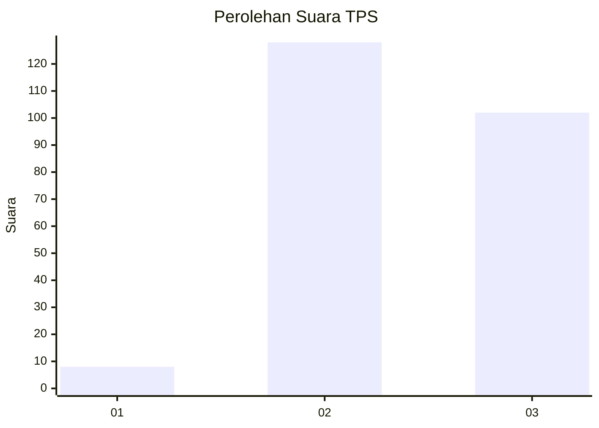
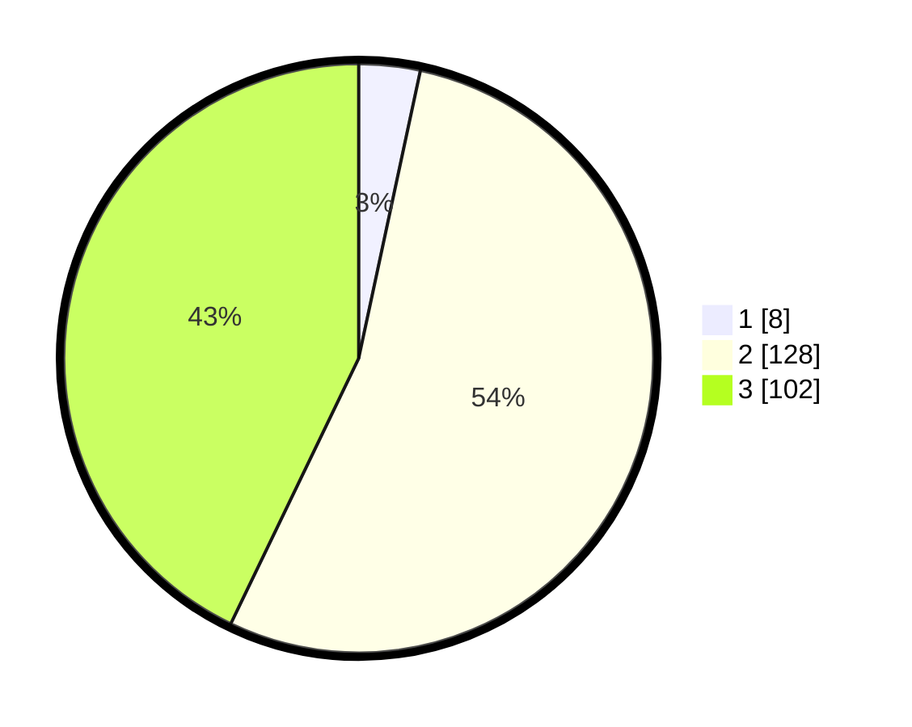

# Hasil

## Grafik

## Tabel

| No. | Nama Paslon    | Suara | Suara (raw) | Persentase |
|:--- |:-------------- | -----:| -----------:| ----------:|
| 1   | ANIES MUHAIMIN | 8     | [8][p-1]    | 3,36       |
| 2   | PRABOWO GIBRAN | 128   | [128][p-2]  | 53,78      |
| 3   | GANJAR MAHFUD  | 102   | [102][p-3]  | 42,86      |

[p-1]: https://github.com/gigit-pemilu/pemilu-2024-51-bali/blob/main/pilpres/hitung-suara/sub/51-bali/sub/08-buleleng/sub/05-sukasada/sub/2014-selat/sub/004-tps/sub/paslon-1.txt
[p-2]: https://github.com/gigit-pemilu/pemilu-2024-51-bali/blob/main/pilpres/hitung-suara/sub/51-bali/sub/08-buleleng/sub/05-sukasada/sub/2014-selat/sub/004-tps/sub/paslon-2.txt
[p-3]: https://github.com/gigit-pemilu/pemilu-2024-51-bali/blob/main/pilpres/hitung-suara/sub/51-bali/sub/08-buleleng/sub/05-sukasada/sub/2014-selat/sub/004-tps/sub/paslon-3.txt

## Foto C Plano

https://sirekap-obj-formc.kpu.go.id/7c2e/pemilu/ppwp/51/08/05/20/14/5108052014004-20240214-205813--651a6b23-b023-4969-a0ec-4cc41aa4c983.jpg

https://sirekap-obj-formc.kpu.go.id/7c2e/pemilu/ppwp/51/08/05/20/14/5108052014004-20240214-132921--e7d12e79-cc3a-46b9-8ef9-942e8b56c448.jpg

https://sirekap-obj-formc.kpu.go.id/7c2e/pemilu/ppwp/51/08/05/20/14/5108052014004-20240214-224931--14539c67-eef7-4f46-9dac-eb96b2858dae.jpg

## Metadata

| Key        | Value               |
| ---------- | ------------------- |
| Time Stamp | 2024-02-15 05:00:24 |

