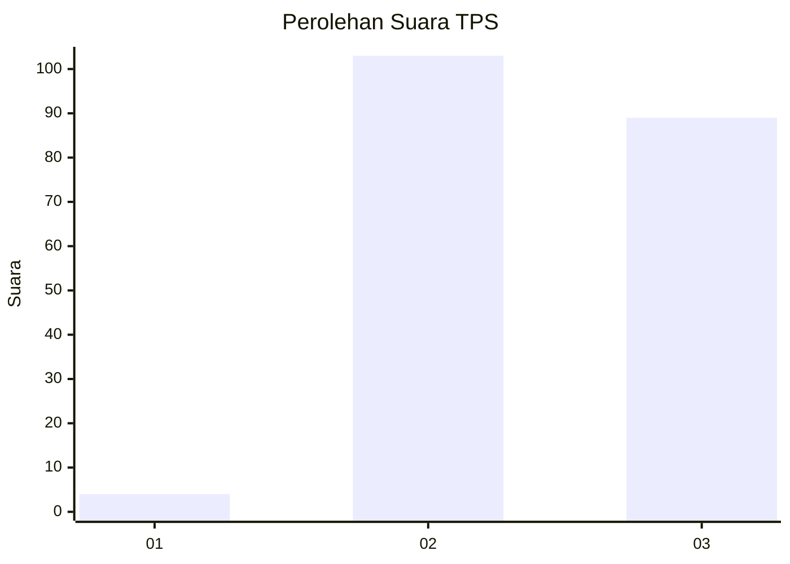
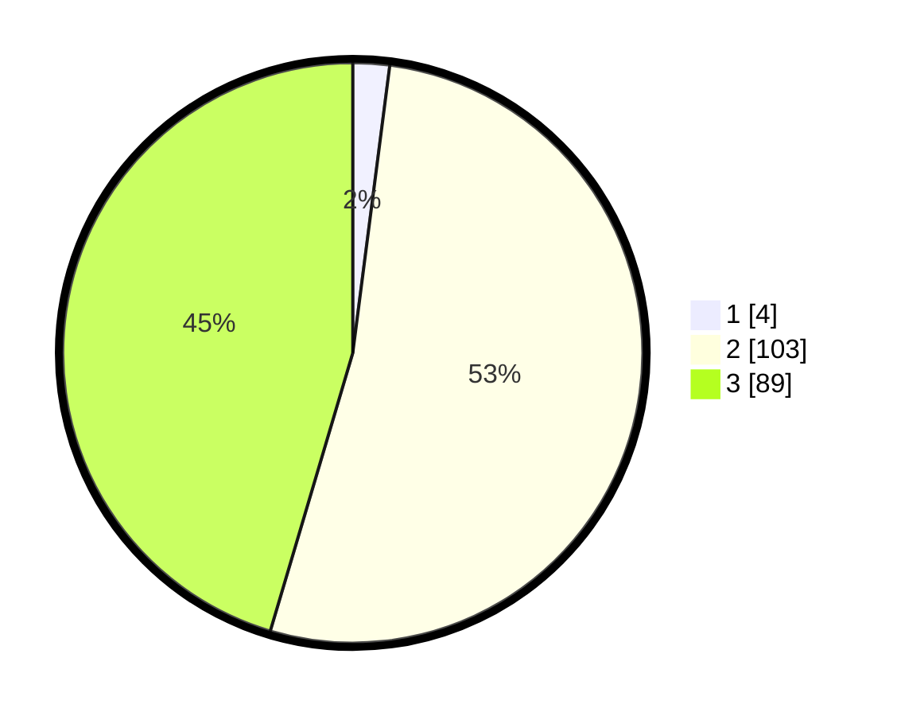

# Hasil

## Grafik

## Tabel

| No. | Nama Paslon    | Suara | Suara (raw) | Persentase |
|:--- |:-------------- | -----:| -----------:| ----------:|
| 1   | ANIES MUHAIMIN | 4     | [4][p-1]    | 2,04       |
| 2   | PRABOWO GIBRAN | 103   | [103][p-2]  | 52,55      |
| 3   | GANJAR MAHFUD  | 89    | [89][p-3]   | 45,41      |

[p-1]: https://github.com/gigit-pemilu/pemilu-2024-51-bali/blob/main/pilpres/hitung-suara/sub/51-bali/sub/08-buleleng/sub/05-sukasada/sub/2014-selat/sub/007-tps/sub/paslon-1.txt
[p-2]: https://github.com/gigit-pemilu/pemilu-2024-51-bali/blob/main/pilpres/hitung-suara/sub/51-bali/sub/08-buleleng/sub/05-sukasada/sub/2014-selat/sub/007-tps/sub/paslon-2.txt
[p-3]: https://github.com/gigit-pemilu/pemilu-2024-51-bali/blob/main/pilpres/hitung-suara/sub/51-bali/sub/08-buleleng/sub/05-sukasada/sub/2014-selat/sub/007-tps/sub/paslon-3.txt

## Foto C Plano

https://sirekap-obj-formc.kpu.go.id/210d/pemilu/ppwp/51/08/05/20/14/5108052014007-20240214-223030--d3933a49-071b-4d83-875d-b48e840cb6ec.jpg

https://sirekap-obj-formc.kpu.go.id/210d/pemilu/ppwp/51/08/05/20/14/5108052014007-20240214-223202--c177b958-109b-4705-88c5-a508c3ecb58e.jpg

https://sirekap-obj-formc.kpu.go.id/210d/pemilu/ppwp/51/08/05/20/14/5108052014007-20240214-223258--aa330729-1932-47da-8aa8-2b0019298a80.jpg

## Metadata

| Key        | Value               |
| ---------- | ------------------- |
| Time Stamp | 2024-02-25 12:00:00 |

