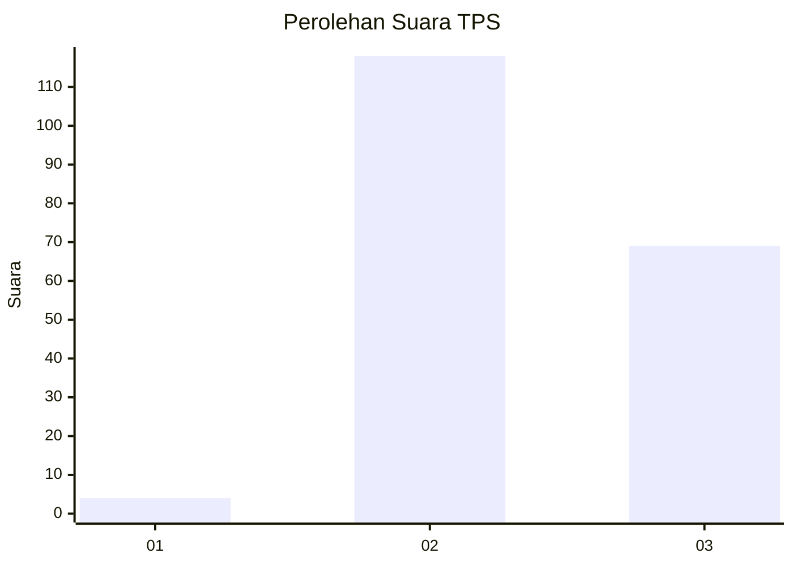
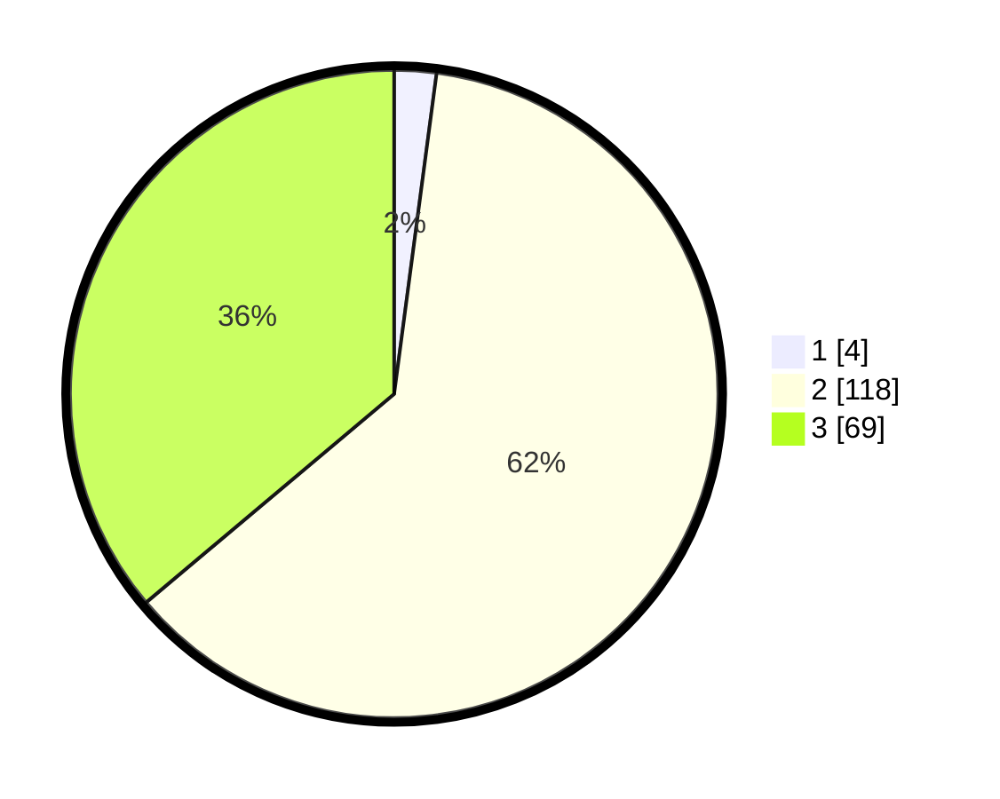

# Hasil

## Grafik

## Tabel

| No. | Nama Paslon    | Suara | Suara (raw) | Persentase |
|:--- |:-------------- | -----:| -----------:| ----------:|
| 1   | ANIES MUHAIMIN | 4     | [4][p-1]    | 2,09       |
| 2   | PRABOWO GIBRAN | 118   | [118][p-2]  | 61,78      |
| 3   | GANJAR MAHFUD  | 69    | [69][p-3]   | 36,13      |

[p-1]: https://github.com/gigit-pemilu/pemilu-2024-51-bali/blob/main/pilpres/hitung-suara/sub/51-bali/sub/08-buleleng/sub/05-sukasada/sub/2014-selat/sub/015-tps/sub/paslon-1.txt
[p-2]: https://github.com/gigit-pemilu/pemilu-2024-51-bali/blob/main/pilpres/hitung-suara/sub/51-bali/sub/08-buleleng/sub/05-sukasada/sub/2014-selat/sub/015-tps/sub/paslon-2.txt
[p-3]: https://github.com/gigit-pemilu/pemilu-2024-51-bali/blob/main/pilpres/hitung-suara/sub/51-bali/sub/08-buleleng/sub/05-sukasada/sub/2014-selat/sub/015-tps/sub/paslon-3.txt

## Foto C Plano

https://sirekap-obj-formc.kpu.go.id/93f1/pemilu/ppwp/51/08/05/20/14/5108052014015-20240214-211245--4815304e-6766-4ecf-9a3f-6eb3903e411f.jpg

https://sirekap-obj-formc.kpu.go.id/93f1/pemilu/ppwp/51/08/05/20/14/5108052014015-20240214-211341--f558b747-fae0-46d2-98aa-6565f377d5f4.jpg

https://sirekap-obj-formc.kpu.go.id/93f1/pemilu/ppwp/51/08/05/20/14/5108052014015-20240214-211440--871dd9aa-d482-4da4-a7c9-1b1aee94a81d.jpg

## Metadata

| Key        | Value               |
| ---------- | ------------------- |
| Time Stamp | 2024-02-25 19:00:00 |

