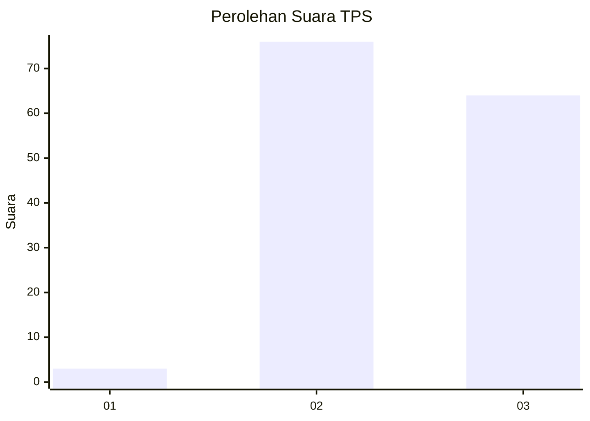
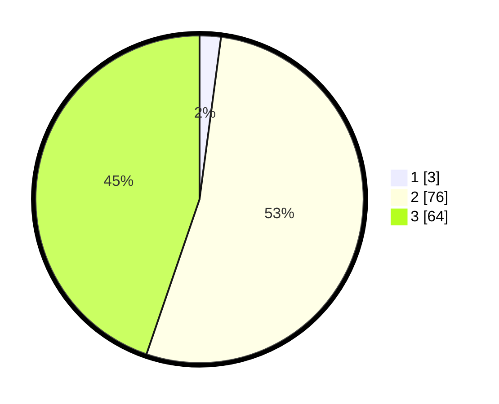

# Hasil

## Grafik

## Tabel

| No. | Nama Paslon    | Suara | Suara (raw) | Persentase |
|:--- |:-------------- | -----:| -----------:| ----------:|
| 1   | ANIES MUHAIMIN | 3     | [3][p-1]    | 2,10       |
| 2   | PRABOWO GIBRAN | 76    | [76][p-2]   | 53,15      |
| 3   | GANJAR MAHFUD  | 64    | [64][p-3]   | 44,76      |

[p-1]: https://github.com/gigit-pemilu/pemilu-2024-51-bali/blob/main/pilpres/hitung-suara/sub/51-bali/sub/08-buleleng/sub/05-sukasada/sub/2015-kayuputih/sub/001-tps/sub/paslon-1.txt
[p-2]: https://github.com/gigit-pemilu/pemilu-2024-51-bali/blob/main/pilpres/hitung-suara/sub/51-bali/sub/08-buleleng/sub/05-sukasada/sub/2015-kayuputih/sub/001-tps/sub/paslon-2.txt
[p-3]: https://github.com/gigit-pemilu/pemilu-2024-51-bali/blob/main/pilpres/hitung-suara/sub/51-bali/sub/08-buleleng/sub/05-sukasada/sub/2015-kayuputih/sub/001-tps/sub/paslon-3.txt

## Foto C Plano

https://sirekap-obj-formc.kpu.go.id/acf1/pemilu/ppwp/51/08/05/20/15/5108052015001-20240214-222838--7e11c35e-25f9-4922-b2a8-6b3535522fa1.jpg

https://sirekap-obj-formc.kpu.go.id/acf1/pemilu/ppwp/51/08/05/20/15/5108052015001-20240214-221300--fcf21738-e288-4636-a2ef-be5fa337db3e.jpg

https://sirekap-obj-formc.kpu.go.id/acf1/pemilu/ppwp/51/08/05/20/15/5108052015001-20240214-222235--79cd2b66-fc7f-48c6-8f61-46fb1cd1a9f4.jpg

## Metadata

| Key        | Value               |
| ---------- | ------------------- |
| Time Stamp | 2024-02-24 22:31:28 |

