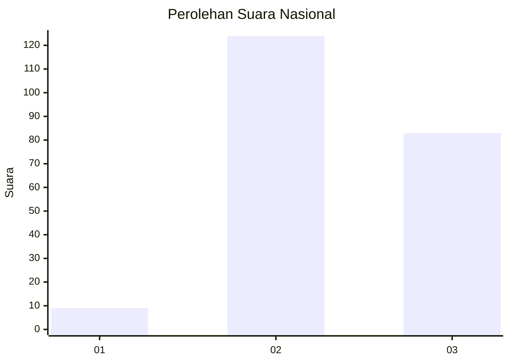
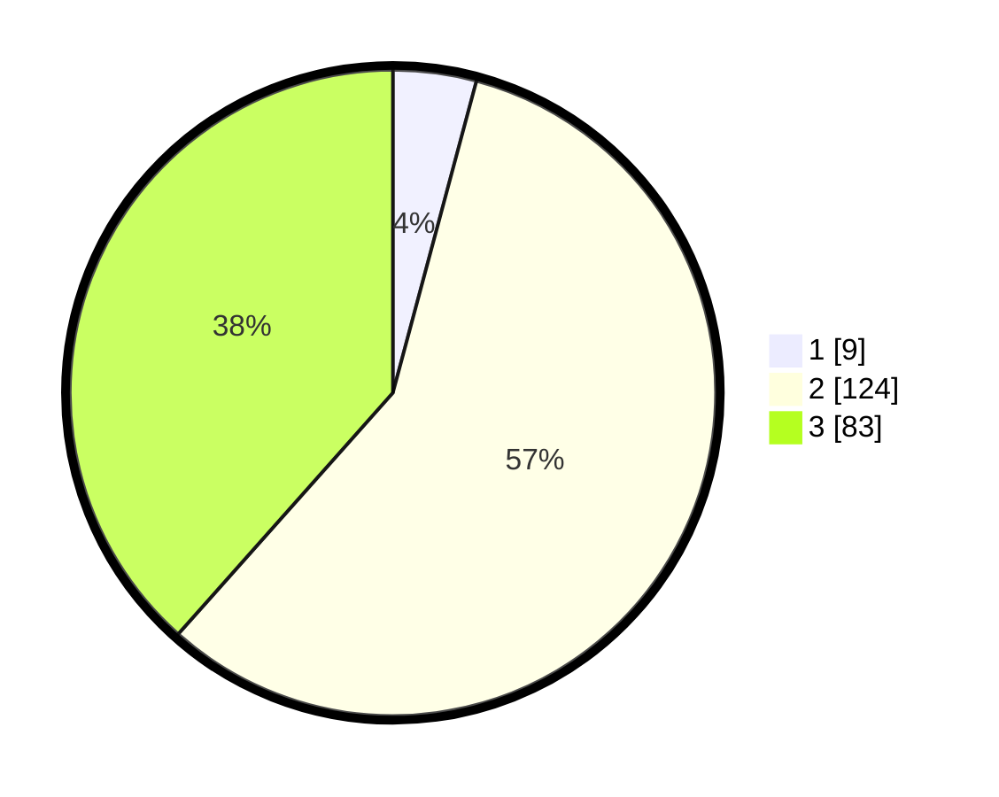

# Hasil

## Grafik

## Tabel

| No. | Nama Paslon    | Suara | Suara (raw) | Persentase |
|:--- |:-------------- | -----:| -----------:| ----------:|
| 1   | ANIES MUHAIMIN | 9     | [9][p-1]    | 4,17       |
| 2   | PRABOWO GIBRAN | 124   | [124][p-2]  | 57,41      |
| 3   | GANJAR MAHFUD  | 83    | [83][p-3]   | 38,43      |

[p-1]: https://github.com/gigit-pemilu/pemilu-2024/blob/main/pilpres/hitung-suara/sub/51-bali/sub/08-buleleng/sub/05-sukasada/sub/2015-kayuputih/sub/009-tps/sub/paslon-1.txt
[p-2]: https://github.com/gigit-pemilu/pemilu-2024/blob/main/pilpres/hitung-suara/sub/51-bali/sub/08-buleleng/sub/05-sukasada/sub/2015-kayuputih/sub/009-tps/sub/paslon-2.txt
[p-3]: https://github.com/gigit-pemilu/pemilu-2024/blob/main/pilpres/hitung-suara/sub/51-bali/sub/08-buleleng/sub/05-sukasada/sub/2015-kayuputih/sub/009-tps/sub/paslon-3.txt

## Foto C Plano

https://sirekap-obj-formc.kpu.go.id/076e/pemilu/ppwp/51/08/05/20/15/5108052015009-20240215-001952--133fcb29-3dbb-4b76-acce-2d6652e2a102.jpg

https://sirekap-obj-formc.kpu.go.id/076e/pemilu/ppwp/51/08/05/20/15/5108052015009-20240215-002245--c649c2a6-ed29-4d16-84c3-58e0f801bb41.jpg

https://sirekap-obj-formc.kpu.go.id/076e/pemilu/ppwp/51/08/05/20/15/5108052015009-20240215-002416--720aa306-9738-47b9-8dac-97f89999278d.jpg

## Metadata

| Key        | Value               |
| ---------- | ------------------- |
| Time Stamp | 2024-02-24 22:31:28 |

