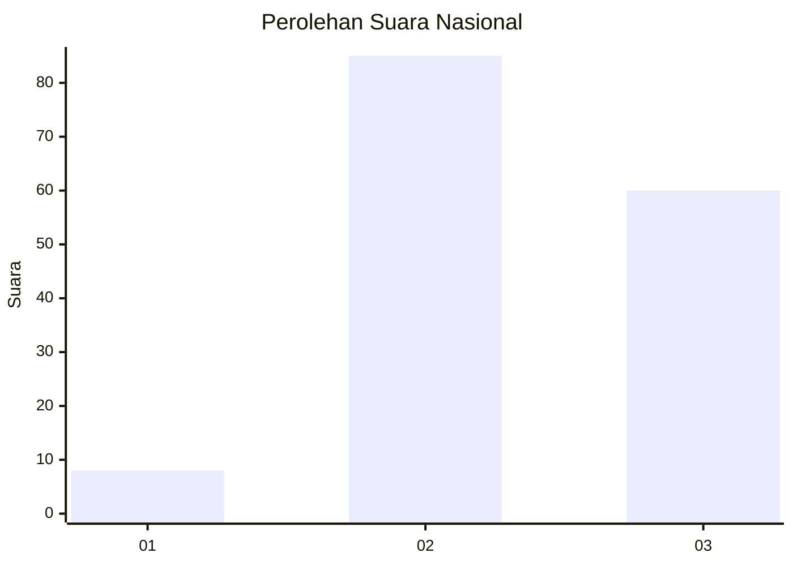
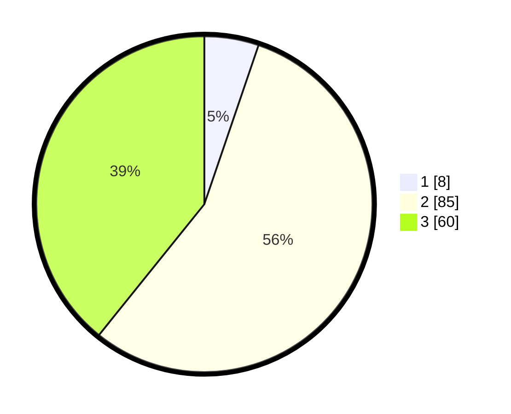

# Hasil

## Grafik

## Tabel

| No. | Nama Paslon    | Suara | Suara (raw) | Persentase |
|:--- |:-------------- | -----:| -----------:| ----------:|
| 1   | ANIES MUHAIMIN | 8     | [8][p-1]    | 5,23       |
| 2   | PRABOWO GIBRAN | 85    | [85][p-2]   | 55,56      |
| 3   | GANJAR MAHFUD  | 60    | [60][p-3]   | 39,22      |

[p-1]: https://github.com/gigit-pemilu/pemilu-2024/blob/main/pilpres/hitung-suara/sub/51-bali/sub/08-buleleng/sub/05-sukasada/sub/2015-kayuputih/sub/012-tps/sub/paslon-1.txt
[p-2]: https://github.com/gigit-pemilu/pemilu-2024/blob/main/pilpres/hitung-suara/sub/51-bali/sub/08-buleleng/sub/05-sukasada/sub/2015-kayuputih/sub/012-tps/sub/paslon-2.txt
[p-3]: https://github.com/gigit-pemilu/pemilu-2024/blob/main/pilpres/hitung-suara/sub/51-bali/sub/08-buleleng/sub/05-sukasada/sub/2015-kayuputih/sub/012-tps/sub/paslon-3.txt

## Foto C Plano

https://sirekap-obj-formc.kpu.go.id/cce4/pemilu/ppwp/51/08/05/20/15/5108052015012-20240214-204258--f19ab70a-9e97-408c-ae85-c29a3c288a75.jpg

https://sirekap-obj-formc.kpu.go.id/cce4/pemilu/ppwp/51/08/05/20/15/5108052015012-20240214-204340--e046c8c0-d957-4a1c-a93b-c51fdea3f63e.jpg

## Metadata

| Key        | Value               |
| ---------- | ------------------- |
| Time Stamp | 2024-02-24 22:31:28 |

