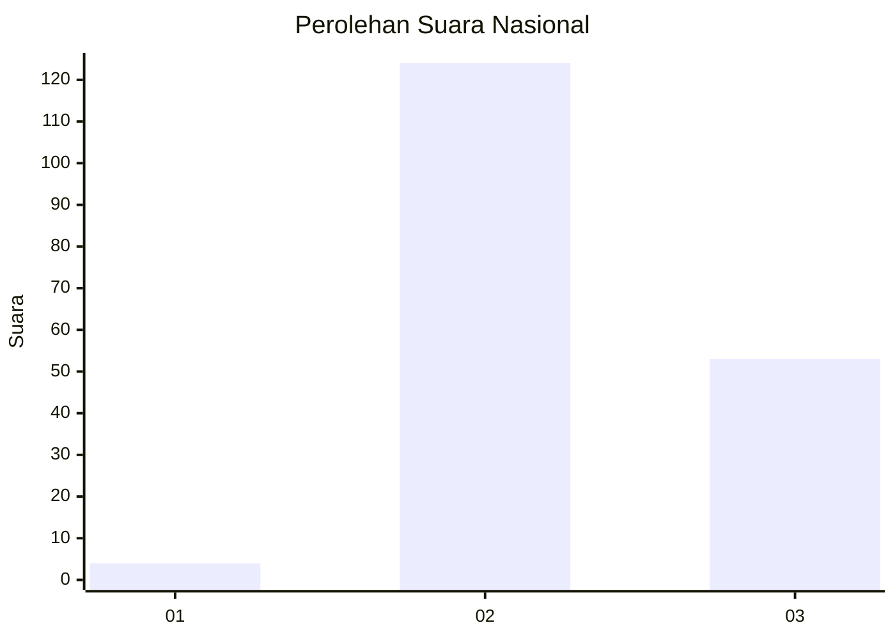

# Hasil

## Grafik

## Tabel

| No. | Nama Paslon    | Suara | Suara (raw) | Persentase |
|:--- |:-------------- | -----:| -----------:| ----------:|
| 1   | ANIES MUHAIMIN | 4     | [4][p-1]    | 2,21       |
| 2   | PRABOWO GIBRAN | 124   | [124][p-2]  | 68,51      |
| 3   | GANJAR MAHFUD  | 53    | [53][p-3]   | 29,28      |

[p-1]: https://github.com/gigit-pemilu/pemilu-2024/blob/main/pilpres/hitung-suara/sub/51-bali/sub/08-buleleng/sub/05-sukasada/sub/2015-kayuputih/sub/013-tps/sub/paslon-1.txt
[p-2]: https://github.com/gigit-pemilu/pemilu-2024/blob/main/pilpres/hitung-suara/sub/51-bali/sub/08-buleleng/sub/05-sukasada/sub/2015-kayuputih/sub/013-tps/sub/paslon-2.txt
[p-3]: https://github.com/gigit-pemilu/pemilu-2024/blob/main/pilpres/hitung-suara/sub/51-bali/sub/08-buleleng/sub/05-sukasada/sub/2015-kayuputih/sub/013-tps/sub/paslon-3.txt

## Foto C Plano

https://sirekap-obj-formc.kpu.go.id/8be4/pemilu/ppwp/51/08/05/20/15/5108052015013-20240214-203326--4ee2faf0-1e0f-46b9-9339-83e88584fce9.jpg

https://sirekap-obj-formc.kpu.go.id/8be4/pemilu/ppwp/51/08/05/20/15/5108052015013-20240214-203401--ffd598ac-c7fe-4a8c-b56d-025c40f53a93.jpg

https://sirekap-obj-formc.kpu.go.id/8be4/pemilu/ppwp/51/08/05/20/15/5108052015013-20240214-203429--5650d375-13c8-4afc-9a35-48878faa976c.jpg

## Metadata

| Key        | Value               |
| ---------- | ------------------- |
| Time Stamp | 2024-02-24 22:31:28 |

