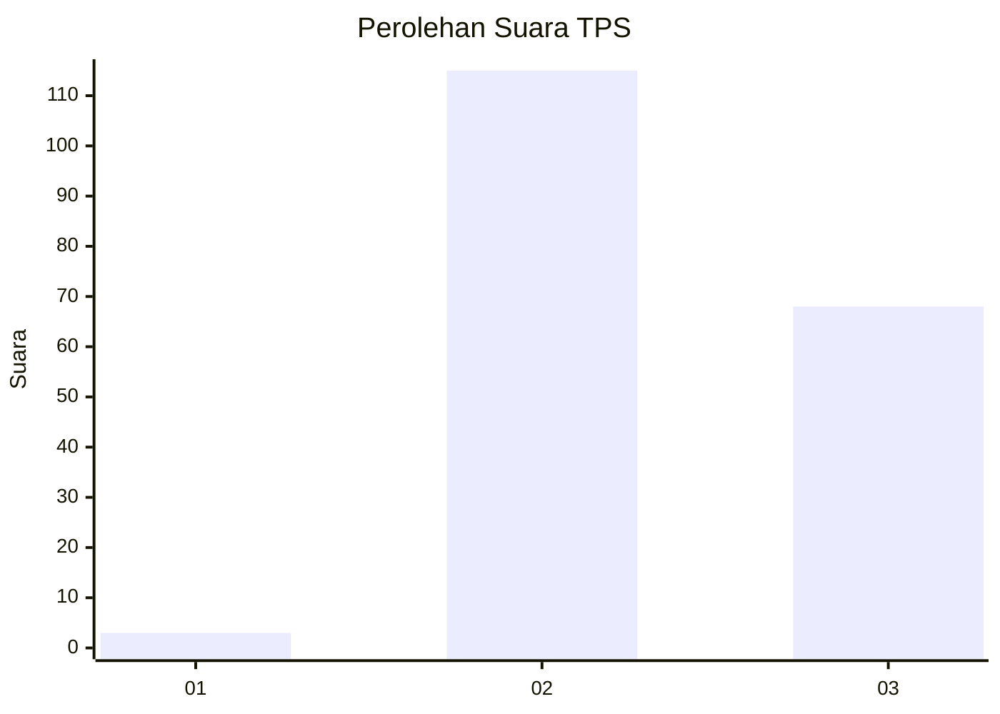
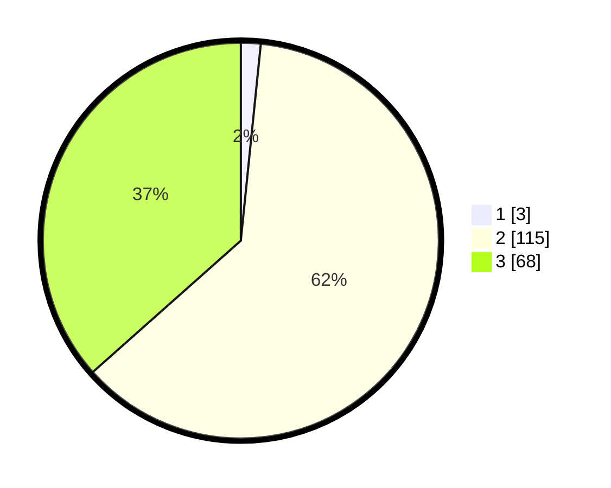

# Hasil

## Grafik

## Tabel

| No. | Nama Paslon    | Suara | Suara (raw) | Persentase |
|:--- |:-------------- | -----:| -----------:| ----------:|
| 1   | ANIES MUHAIMIN | 3     | [3][p-1]    | 1,61       |
| 2   | PRABOWO GIBRAN | 115   | [115][p-2]  | 61,83      |
| 3   | GANJAR MAHFUD  | 68    | [68][p-3]   | 36,56      |

[p-1]: https://github.com/gigit-pemilu/pemilu-2024-51-bali/blob/main/pilpres/hitung-suara/sub/51-bali/sub/08-buleleng/sub/06-buleleng/sub/1006-banyuasri/sub/001-tps/sub/paslon-1.txt
[p-2]: https://github.com/gigit-pemilu/pemilu-2024-51-bali/blob/main/pilpres/hitung-suara/sub/51-bali/sub/08-buleleng/sub/06-buleleng/sub/1006-banyuasri/sub/001-tps/sub/paslon-2.txt
[p-3]: https://github.com/gigit-pemilu/pemilu-2024-51-bali/blob/main/pilpres/hitung-suara/sub/51-bali/sub/08-buleleng/sub/06-buleleng/sub/1006-banyuasri/sub/001-tps/sub/paslon-3.txt

## Foto C Plano

https://sirekap-obj-formc.kpu.go.id/3b3f/pemilu/ppwp/51/08/06/10/06/5108061006001-20240216-133611--6ac08bc7-58e9-490c-b8b3-e0c2173b603f.jpg

https://sirekap-obj-formc.kpu.go.id/3b3f/pemilu/ppwp/51/08/06/10/06/5108061006001-20240216-133612--61e6040c-eb4e-483d-b814-908f86c9a6ab.jpg

https://sirekap-obj-formc.kpu.go.id/3b3f/pemilu/ppwp/51/08/06/10/06/5108061006001-20240216-133612--1211f42e-8642-4a46-acd5-14f555fb2ed6.jpg

## Metadata

| Key        | Value               |
| ---------- | ------------------- |
| Time Stamp | 2024-02-16 21:01:00 |

## DATA PEMILIH TETAP

Jumlah pemilih dalam DPT: **289**.
 * L: **137**.
 * P: **152**.

## DATA PENGGUNA HAK PILIH

Jumlah pengguna hak pilih dalam DPT: **179**.
 * L: **86**.
 * P: **93**.

Jumlah pengguna hak pilih dalam DPTb: **4**.
 * L: **0**.
 * P: **4**.

Jumlah pengguna hak pilih dalam DPK: **5**.
 * L: **2**.
 * P: **3**.

Jumlah pengguna hak pilih: **188**.
 * L: **88**.
 * P: **100**.

## JUMLAH SUARA SAH DAN TIDAK SAH

JUMLAH SELURUH SUARA SAH: **186**.

JUMLAH SUARA TIDAK SAH: **2**.

JUMLAH SELURUH SUARA SAH DAN SUARA TIDAK SAH: **188**.

