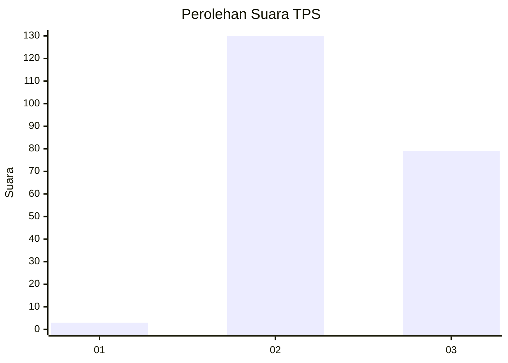
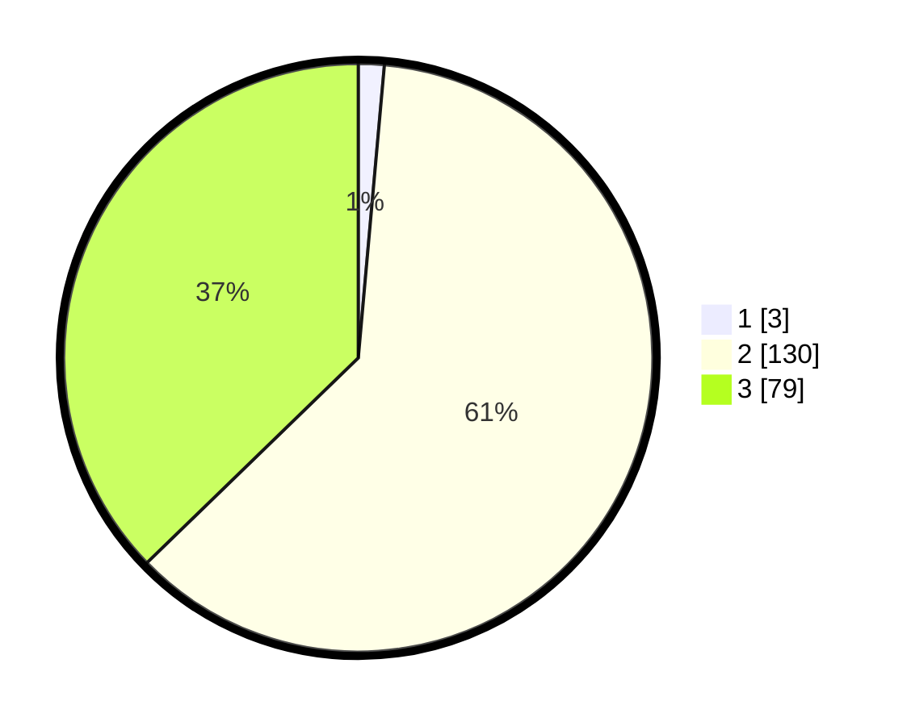

# Hasil

## Grafik

## Tabel

| No. | Nama Paslon    | Suara | Suara (raw) | Persentase |
|:--- |:-------------- | -----:| -----------:| ----------:|
| 1   | ANIES MUHAIMIN | 3     | [3][p-1]    | 1,42       |
| 2   | PRABOWO GIBRAN | 130   | [130][p-2]  | 61,32      |
| 3   | GANJAR MAHFUD  | 79    | [79][p-3]   | 37,26      |

[p-1]: https://github.com/gigit-pemilu/pemilu-2024-51-bali/blob/main/pilpres/hitung-suara/sub/51-bali/sub/08-buleleng/sub/06-buleleng/sub/1006-banyuasri/sub/002-tps/sub/paslon-1.txt
[p-2]: https://github.com/gigit-pemilu/pemilu-2024-51-bali/blob/main/pilpres/hitung-suara/sub/51-bali/sub/08-buleleng/sub/06-buleleng/sub/1006-banyuasri/sub/002-tps/sub/paslon-2.txt
[p-3]: https://github.com/gigit-pemilu/pemilu-2024-51-bali/blob/main/pilpres/hitung-suara/sub/51-bali/sub/08-buleleng/sub/06-buleleng/sub/1006-banyuasri/sub/002-tps/sub/paslon-3.txt

## Foto C Plano

https://sirekap-obj-formc.kpu.go.id/bf84/pemilu/ppwp/51/08/06/10/06/5108061006002-20240214-205021--8566dac6-f223-4c5c-8446-d18967bb9076.jpg

https://sirekap-obj-formc.kpu.go.id/bf84/pemilu/ppwp/51/08/06/10/06/5108061006002-20240214-205111--9554d849-4577-4e4f-8d62-d1a669a33b4c.jpg

https://sirekap-obj-formc.kpu.go.id/bf84/pemilu/ppwp/51/08/06/10/06/5108061006002-20240214-205154--4f6fd183-f2d6-480d-99e0-16c7f2492ec4.jpg

## Metadata

| Key        | Value               |
| ---------- | ------------------- |
| Time Stamp | 2024-02-28 20:00:00 |

## DATA PEMILIH TETAP

Jumlah pemilih dalam DPT: **276**.
 * L: **146**.
 * P: **130**.

## DATA PENGGUNA HAK PILIH

Jumlah pengguna hak pilih dalam DPT: **205**.
 * L: **104**.
 * P: **101**.

Jumlah pengguna hak pilih dalam DPTb: **8**.
 * L: **2**.
 * P: **6**.

Jumlah pengguna hak pilih dalam DPK: **4**.
 * L: **1**.
 * P: **3**.

Jumlah pengguna hak pilih: **217**.
 * L: **107**.
 * P: **110**.

## JUMLAH SUARA SAH DAN TIDAK SAH

JUMLAH SELURUH SUARA SAH: **212**.

JUMLAH SUARA TIDAK SAH: **5**.

JUMLAH SELURUH SUARA SAH DAN SUARA TIDAK SAH: **217**.

