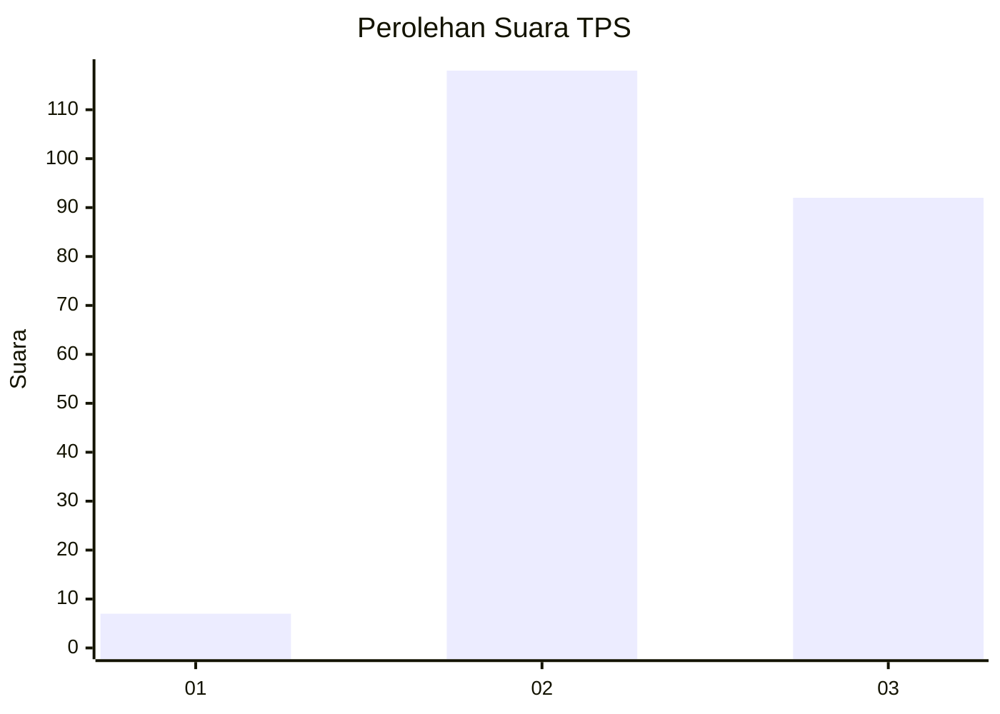
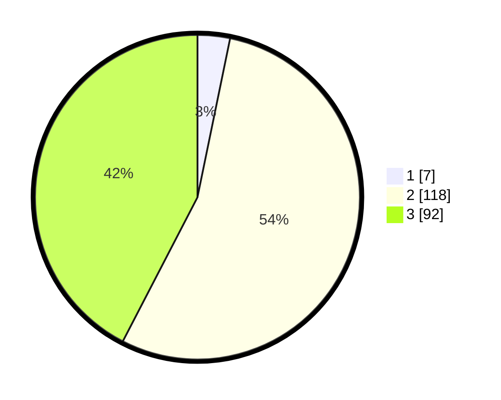

# Hasil

## Grafik

## Tabel

| No. | Nama Paslon    | Suara | Suara (raw) | Persentase |
|:--- |:-------------- | -----:| -----------:| ----------:|
| 1   | ANIES MUHAIMIN | 7     | [7][p-1]    | 3,23       |
| 2   | PRABOWO GIBRAN | 118   | [118][p-2]  | 54,38      |
| 3   | GANJAR MAHFUD  | 92    | [92][p-3]   | 42,40      |

[p-1]: https://github.com/gigit-pemilu/pemilu-2024-51-bali/blob/main/pilpres/hitung-suara/sub/51-bali/sub/08-buleleng/sub/06-buleleng/sub/1006-banyuasri/sub/003-tps/sub/paslon-1.txt
[p-2]: https://github.com/gigit-pemilu/pemilu-2024-51-bali/blob/main/pilpres/hitung-suara/sub/51-bali/sub/08-buleleng/sub/06-buleleng/sub/1006-banyuasri/sub/003-tps/sub/paslon-2.txt
[p-3]: https://github.com/gigit-pemilu/pemilu-2024-51-bali/blob/main/pilpres/hitung-suara/sub/51-bali/sub/08-buleleng/sub/06-buleleng/sub/1006-banyuasri/sub/003-tps/sub/paslon-3.txt

## Foto C Plano

https://sirekap-obj-formc.kpu.go.id/9316/pemilu/ppwp/51/08/06/10/06/5108061006003-20240214-205853--685b6dfa-dc85-4a24-b578-a3004a8b85f6.jpg

https://sirekap-obj-formc.kpu.go.id/9316/pemilu/ppwp/51/08/06/10/06/5108061006003-20240214-141100--12e8a996-89fe-484e-8e8a-4fd04e5dab54.jpg

https://sirekap-obj-formc.kpu.go.id/9316/pemilu/ppwp/51/08/06/10/06/5108061006003-20240214-141134--08da5341-e6b4-401e-a585-6ae026b892f3.jpg

## Metadata

| Key        | Value               |
| ---------- | ------------------- |
| Time Stamp | 2024-02-15 00:41:44 |

