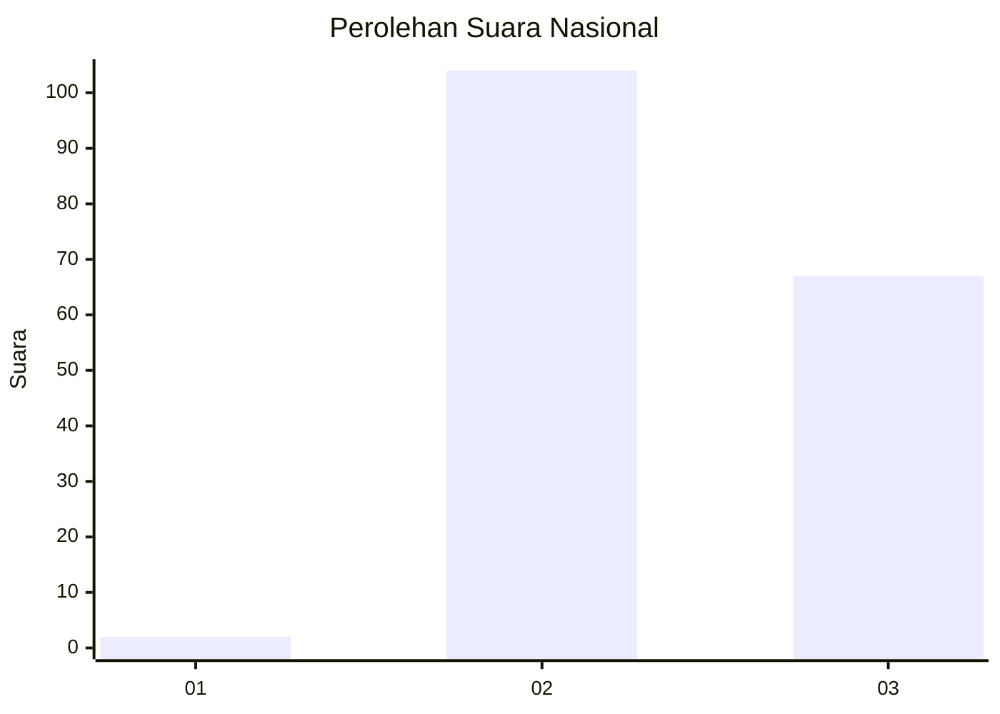
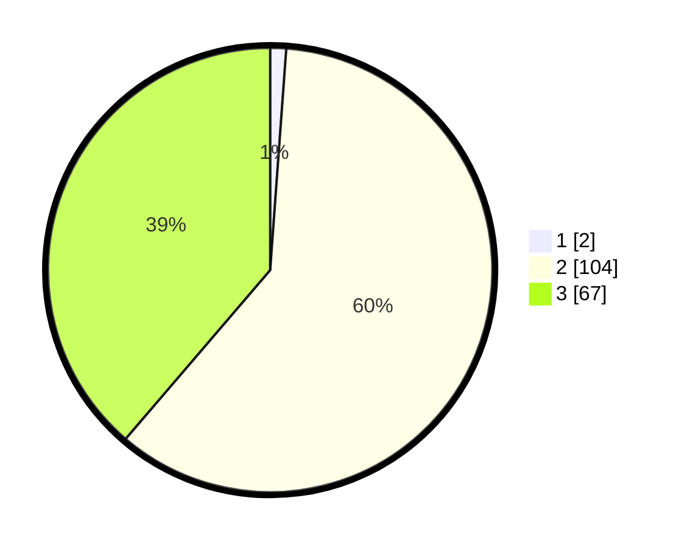

# Hasil

## Grafik

## Tabel

| No. | Nama Paslon    | Suara | Suara (raw) | Persentase |
|:--- |:-------------- | -----:| -----------:| ----------:|
| 1   | ANIES MUHAIMIN | 2     | [2][p-1]    | 1,16       |
| 2   | PRABOWO GIBRAN | 104   | [104][p-2]  | 60,12      |
| 3   | GANJAR MAHFUD  | 67    | [67][p-3]   | 38,73      |

[p-1]: https://github.com/gigit-pemilu/pemilu-2024/blob/main/pilpres/hitung-suara/sub/51-bali/sub/08-buleleng/sub/06-buleleng/sub/1006-banyuasri/sub/004-tps/sub/paslon-1.txt
[p-2]: https://github.com/gigit-pemilu/pemilu-2024/blob/main/pilpres/hitung-suara/sub/51-bali/sub/08-buleleng/sub/06-buleleng/sub/1006-banyuasri/sub/004-tps/sub/paslon-2.txt
[p-3]: https://github.com/gigit-pemilu/pemilu-2024/blob/main/pilpres/hitung-suara/sub/51-bali/sub/08-buleleng/sub/06-buleleng/sub/1006-banyuasri/sub/004-tps/sub/paslon-3.txt

## Foto C Plano

https://sirekap-obj-formc.kpu.go.id/2305/pemilu/ppwp/51/08/06/10/06/5108061006004-20240214-184627--f17357dc-36f2-450a-989b-1b8697811763.jpg

https://sirekap-obj-formc.kpu.go.id/2305/pemilu/ppwp/51/08/06/10/06/5108061006004-20240214-212006--1d25aaba-2030-4ce0-ae21-ca6117738266.jpg

https://sirekap-obj-formc.kpu.go.id/2305/pemilu/ppwp/51/08/06/10/06/5108061006004-20240214-212230--95bca800-d11a-4f9b-9800-9160eed9f913.jpg

## Metadata

| Key        | Value               |
| ---------- | ------------------- |
| Time Stamp | 2024-02-15 00:41:44 |

## DATA PEMILIH TETAP

Jumlah pemilih dalam DPT: **289**.
 * L: **138**.
 * P: **151**.

## DATA PENGGUNA HAK PILIH

Jumlah pengguna hak pilih dalam DPT: **168**.
 * L: **80**.
 * P: **88**.

Jumlah pengguna hak pilih dalam DPTb: **4**.
 * L: **0**.
 * P: **4**.

Jumlah pengguna hak pilih dalam DPK: **3**.
 * L: **1**.
 * P: **2**.

Jumlah pengguna hak pilih: **175**.
 * L: **81**.
 * P: **94**.

## JUMLAH SUARA SAH DAN TIDAK SAH

JUMLAH SELURUH SUARA SAH: **173**.

JUMLAH SUARA TIDAK SAH: **2**.

JUMLAH SELURUH SUARA SAH DAN SUARA TIDAK SAH: **175**.

