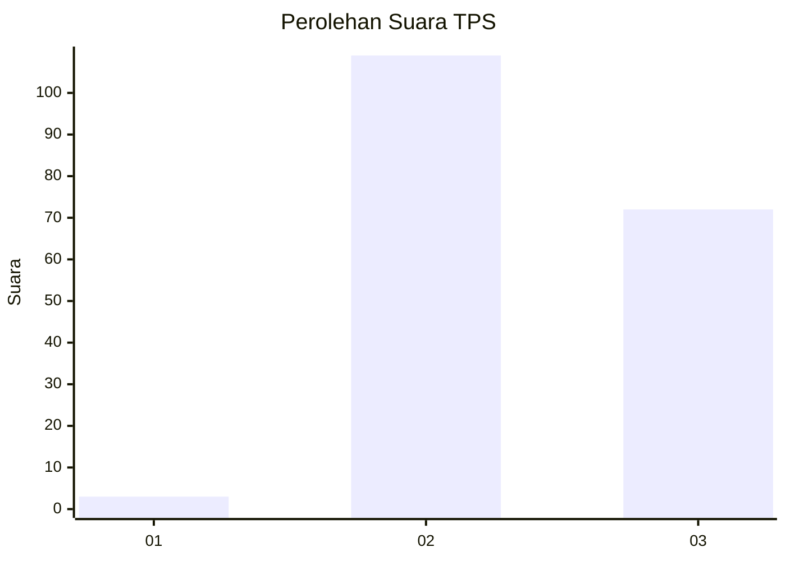
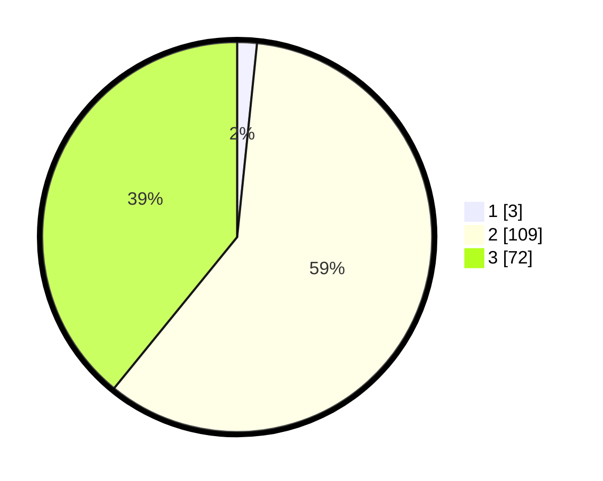

# Hasil

## Grafik

## Tabel

| No. | Nama Paslon    | Suara | Suara (raw) | Persentase |
|:--- |:-------------- | -----:| -----------:| ----------:|
| 1   | ANIES MUHAIMIN | 3     | [3][p-1]    | 1,63       |
| 2   | PRABOWO GIBRAN | 109   | [109][p-2]  | 59,24      |
| 3   | GANJAR MAHFUD  | 72    | [72][p-3]   | 39,13      |

[p-1]: https://github.com/gigit-pemilu/pemilu-2024-51-bali/blob/main/pilpres/hitung-suara/sub/51-bali/sub/08-buleleng/sub/06-buleleng/sub/1006-banyuasri/sub/005-tps/sub/paslon-1.txt
[p-2]: https://github.com/gigit-pemilu/pemilu-2024-51-bali/blob/main/pilpres/hitung-suara/sub/51-bali/sub/08-buleleng/sub/06-buleleng/sub/1006-banyuasri/sub/005-tps/sub/paslon-2.txt
[p-3]: https://github.com/gigit-pemilu/pemilu-2024-51-bali/blob/main/pilpres/hitung-suara/sub/51-bali/sub/08-buleleng/sub/06-buleleng/sub/1006-banyuasri/sub/005-tps/sub/paslon-3.txt

## Foto C Plano

https://sirekap-obj-formc.kpu.go.id/7d31/pemilu/ppwp/51/08/06/10/06/5108061006005-20240215-010836--bfe3e34d-03a6-431a-a714-bc0e6c20d333.jpg

https://sirekap-obj-formc.kpu.go.id/7d31/pemilu/ppwp/51/08/06/10/06/5108061006005-20240215-011047--1078e6f4-9a57-4340-919a-b5e6c6dbda06.jpg

https://sirekap-obj-formc.kpu.go.id/7d31/pemilu/ppwp/51/08/06/10/06/5108061006005-20240215-011306--21350275-ac0a-4a28-b8cf-569ea16dd70d.jpg

## Metadata

| Key        | Value               |
| ---------- | ------------------- |
| Time Stamp | 2024-02-24 22:31:28 |

