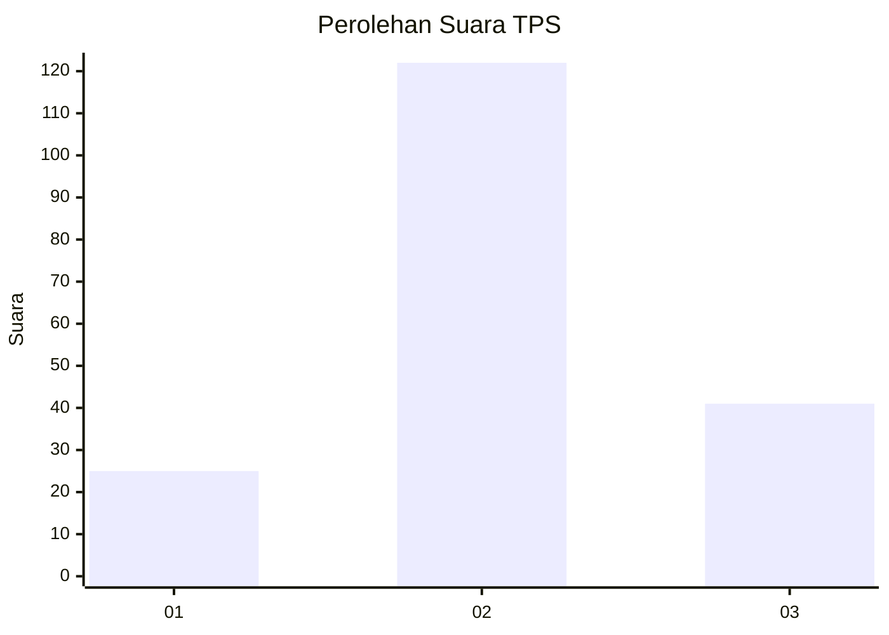
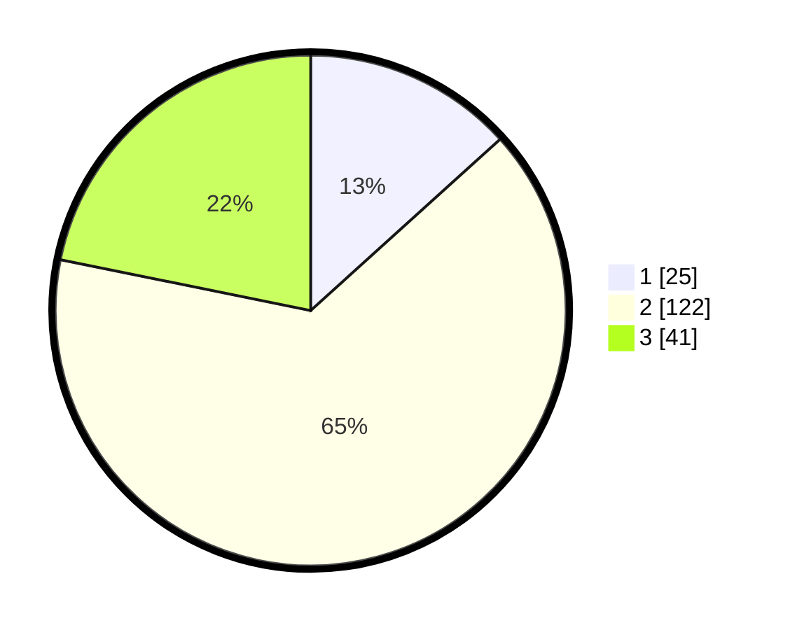

# Hasil

## Grafik

## Tabel

| No. | Nama Paslon    | Suara | Suara (raw) | Persentase |
|:--- |:-------------- | -----:| -----------:| ----------:|
| 1   | ANIES MUHAIMIN | 25    | [25][p-1]   | 13,30      |
| 2   | PRABOWO GIBRAN | 122   | [122][p-2]  | 64,89      |
| 3   | GANJAR MAHFUD  | 41    | [41][p-3]   | 21,81      |

[p-1]: https://github.com/gigit-pemilu/pemilu-2024-51-bali/blob/main/pilpres/hitung-suara/sub/51-bali/sub/08-buleleng/sub/06-buleleng/sub/1006-banyuasri/sub/013-tps/sub/paslon-1.txt
[p-2]: https://github.com/gigit-pemilu/pemilu-2024-51-bali/blob/main/pilpres/hitung-suara/sub/51-bali/sub/08-buleleng/sub/06-buleleng/sub/1006-banyuasri/sub/013-tps/sub/paslon-2.txt
[p-3]: https://github.com/gigit-pemilu/pemilu-2024-51-bali/blob/main/pilpres/hitung-suara/sub/51-bali/sub/08-buleleng/sub/06-buleleng/sub/1006-banyuasri/sub/013-tps/sub/paslon-3.txt

## Foto C Plano

https://sirekap-obj-formc.kpu.go.id/4687/pemilu/ppwp/51/08/06/10/06/5108061006013-20240214-193855--ee061171-f147-4517-8da0-06ec81599516.jpg

https://sirekap-obj-formc.kpu.go.id/4687/pemilu/ppwp/51/08/06/10/06/5108061006013-20240214-194012--5b88a518-1a7a-4fc7-bcc8-bda2f8ac9c98.jpg

https://sirekap-obj-formc.kpu.go.id/4687/pemilu/ppwp/51/08/06/10/06/5108061006013-20240214-194109--c62d550b-e6d6-41cb-95df-e30082cc610a.jpg

## Metadata

| Key        | Value               |
| ---------- | ------------------- |
| Time Stamp | 2024-02-14 21:46:01 |

## DATA PEMILIH TETAP

Jumlah pemilih dalam DPT: **177**.
 * L: **74**.
 * P: **103**.

## DATA PENGGUNA HAK PILIH

Jumlah pengguna hak pilih dalam DPT: **177**.
 * L: **74**.
 * P: **103**.

Jumlah pengguna hak pilih dalam DPTb: **1**.
 * L: **0**.
 * P: **1**.

Jumlah pengguna hak pilih dalam DPK: **11**.
 * L: **6**.
 * P: **5**.

Jumlah pengguna hak pilih: **189**.
 * L: **80**.
 * P: **109**.

## JUMLAH SUARA SAH DAN TIDAK SAH

JUMLAH SELURUH SUARA SAH: **188**.

JUMLAH SUARA TIDAK SAH: **1**.

JUMLAH SELURUH SUARA SAH DAN SUARA TIDAK SAH: **189**.

