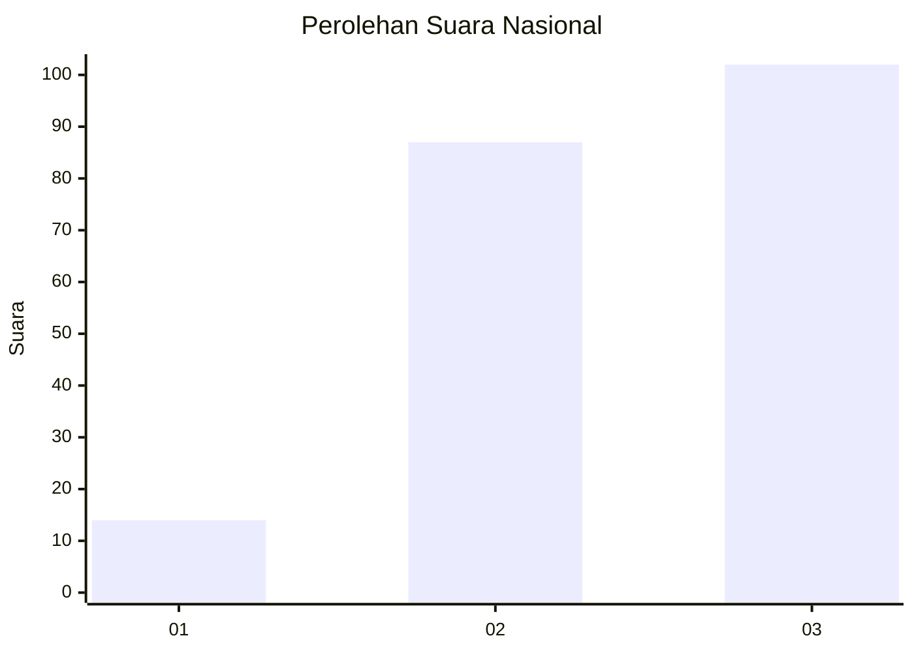
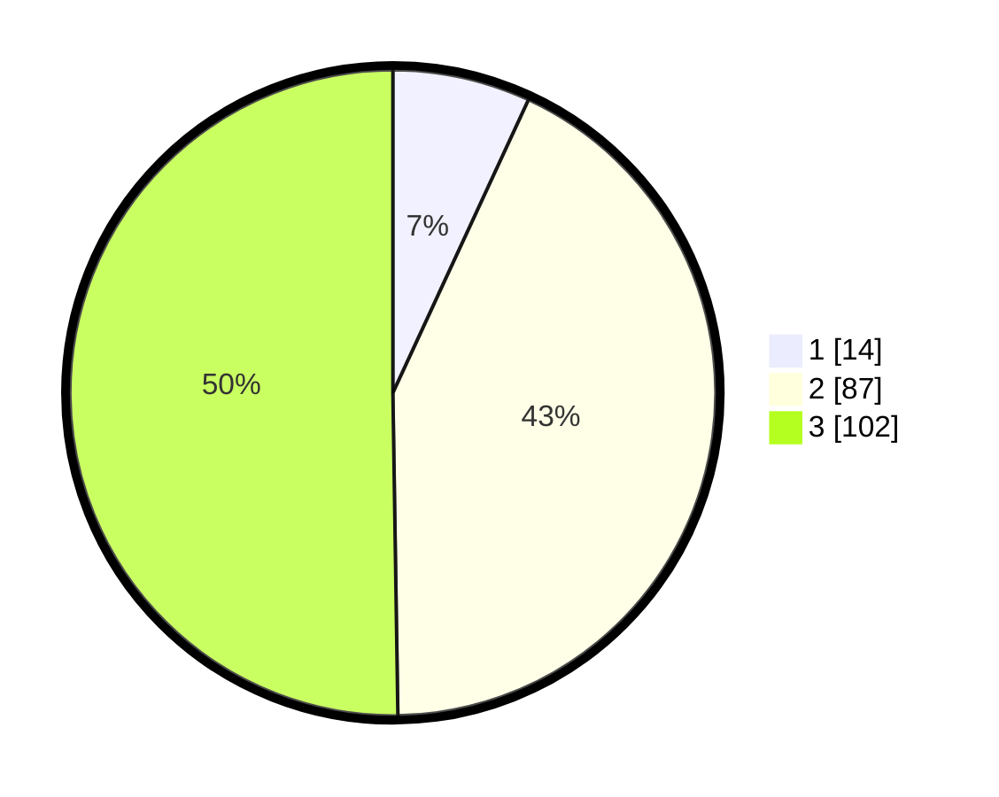

# Hasil

## Grafik

## Tabel

| No. | Nama Paslon    | Suara | Suara (raw) | Persentase |
|:--- |:-------------- | -----:| -----------:| ----------:|
| 1   | ANIES MUHAIMIN | 14    | [14][p-1]   | 6,90       |
| 2   | PRABOWO GIBRAN | 87    | [87][p-2]   | 42,86      |
| 3   | GANJAR MAHFUD  | 102   | [102][p-3]  | 50,25      |

[p-1]: https://github.com/gigit-pemilu/pemilu-2024/blob/main/pilpres/hitung-suara/sub/51-bali/sub/08-buleleng/sub/06-buleleng/sub/1006-banyuasri/sub/015-tps/sub/paslon-1.txt
[p-2]: https://github.com/gigit-pemilu/pemilu-2024/blob/main/pilpres/hitung-suara/sub/51-bali/sub/08-buleleng/sub/06-buleleng/sub/1006-banyuasri/sub/015-tps/sub/paslon-2.txt
[p-3]: https://github.com/gigit-pemilu/pemilu-2024/blob/main/pilpres/hitung-suara/sub/51-bali/sub/08-buleleng/sub/06-buleleng/sub/1006-banyuasri/sub/015-tps/sub/paslon-3.txt

## Foto C Plano

https://sirekap-obj-formc.kpu.go.id/6222/pemilu/ppwp/51/08/06/10/06/5108061006015-20240214-155409--083b1341-0c64-4ff5-b82d-19c18c23d9b8.jpg

https://sirekap-obj-formc.kpu.go.id/6222/pemilu/ppwp/51/08/06/10/06/5108061006015-20240215-000740--9f01e0b5-2d98-4d40-98ae-a97dc4bb0a88.jpg

## Metadata

| Key        | Value               |
| ---------- | ------------------- |
| Time Stamp | 2024-02-15 07:00:44 |

