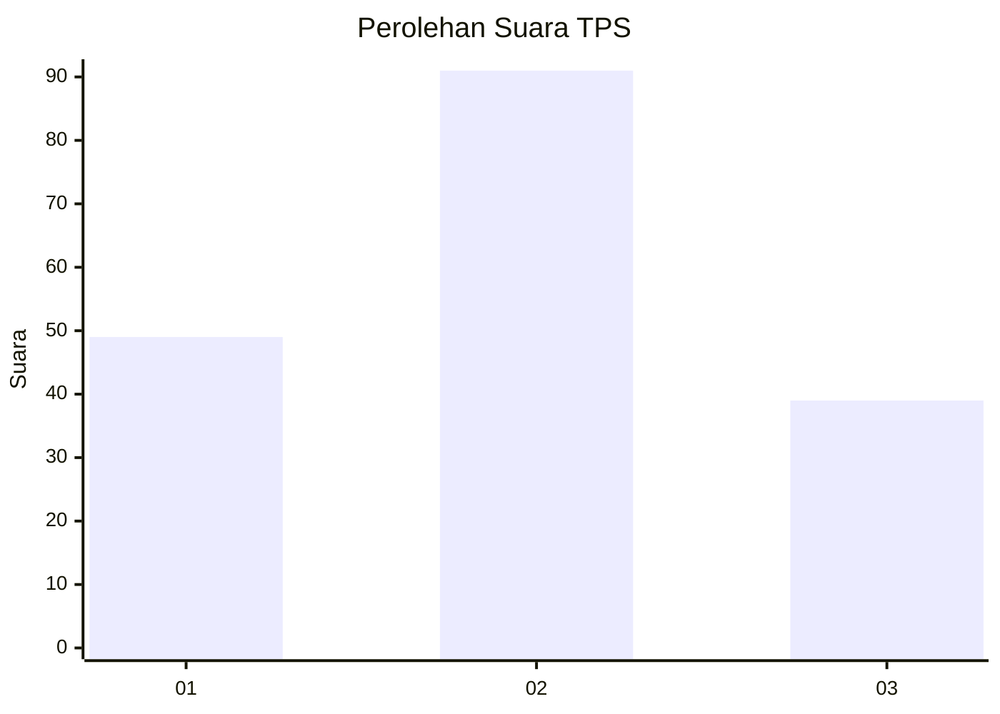
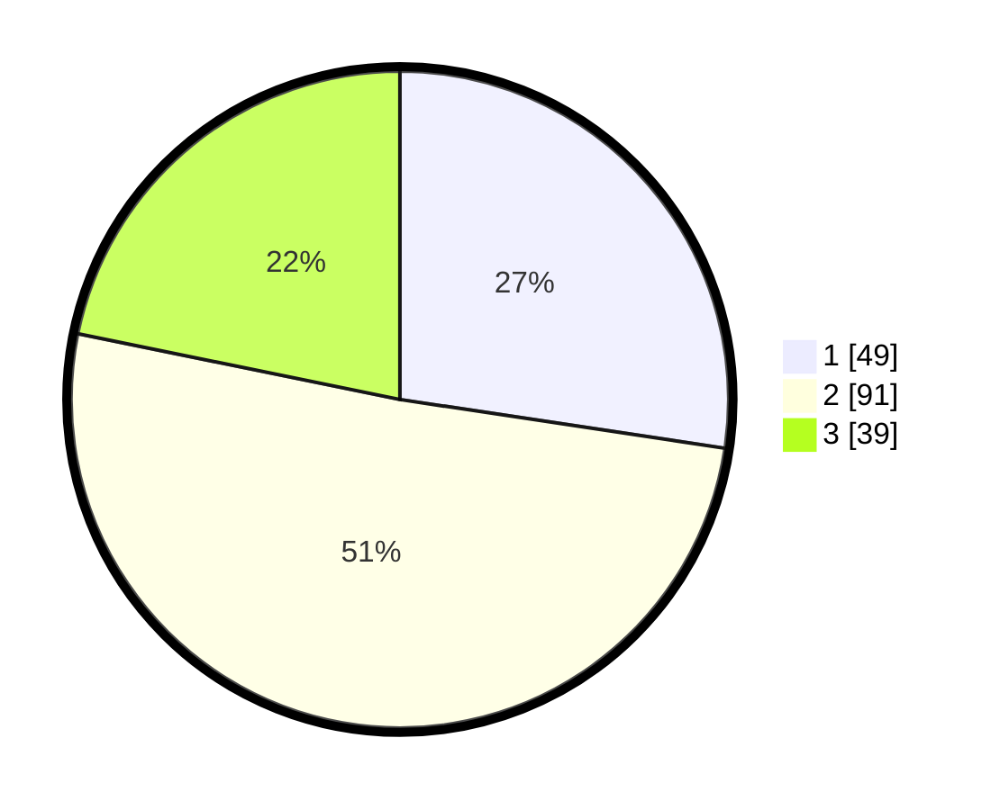

# Hasil

## Grafik

## Tabel

| No. | Nama Paslon    | Suara | Suara (raw) | Persentase |
|:--- |:-------------- | -----:| -----------:| ----------:|
| 1   | ANIES MUHAIMIN | 49    | [49][p-1]   | 27,37      |
| 2   | PRABOWO GIBRAN | 91    | [91][p-2]   | 50,84      |
| 3   | GANJAR MAHFUD  | 39    | [39][p-3]   | 21,79      |

[p-1]: https://github.com/gigit-pemilu/pemilu-2024-51-bali/blob/main/pilpres/hitung-suara/sub/51-bali/sub/08-buleleng/sub/06-buleleng/sub/1006-banyuasri/sub/017-tps/sub/paslon-1.txt
[p-2]: https://github.com/gigit-pemilu/pemilu-2024-51-bali/blob/main/pilpres/hitung-suara/sub/51-bali/sub/08-buleleng/sub/06-buleleng/sub/1006-banyuasri/sub/017-tps/sub/paslon-2.txt
[p-3]: https://github.com/gigit-pemilu/pemilu-2024-51-bali/blob/main/pilpres/hitung-suara/sub/51-bali/sub/08-buleleng/sub/06-buleleng/sub/1006-banyuasri/sub/017-tps/sub/paslon-3.txt

## Foto C Plano

https://sirekap-obj-formc.kpu.go.id/392c/pemilu/ppwp/51/08/06/10/06/5108061006017-20240216-135828--54e3a78b-71ef-47d2-85a7-ac084a5ec685.jpg

https://sirekap-obj-formc.kpu.go.id/392c/pemilu/ppwp/51/08/06/10/06/5108061006017-20240216-135829--7a36bafe-8f38-490c-a896-8cfba94d1cc0.jpg

https://sirekap-obj-formc.kpu.go.id/392c/pemilu/ppwp/51/08/06/10/06/5108061006017-20240216-135828--19aaf9fa-8620-4c10-a022-be686aac7d3d.jpg

## Metadata

| Key        | Value               |
| ---------- | ------------------- |
| Time Stamp | 2024-02-16 16:25:10 |

## DATA PEMILIH TETAP

Jumlah pemilih dalam DPT: **287**.
 * L: **140**.
 * P: **147**.

## DATA PENGGUNA HAK PILIH

Jumlah pengguna hak pilih dalam DPT: **165**.
 * L: **79**.
 * P: **86**.

Jumlah pengguna hak pilih dalam DPTb: **8**.
 * L: **5**.
 * P: **3**.

Jumlah pengguna hak pilih dalam DPK: **6**.
 * L: **0**.
 * P: **6**.

Jumlah pengguna hak pilih: **179**.
 * L: **84**.
 * P: **95**.

## JUMLAH SUARA SAH DAN TIDAK SAH

JUMLAH SELURUH SUARA SAH: **179**.

JUMLAH SUARA TIDAK SAH: **0**.

JUMLAH SELURUH SUARA SAH DAN SUARA TIDAK SAH: **179**.

