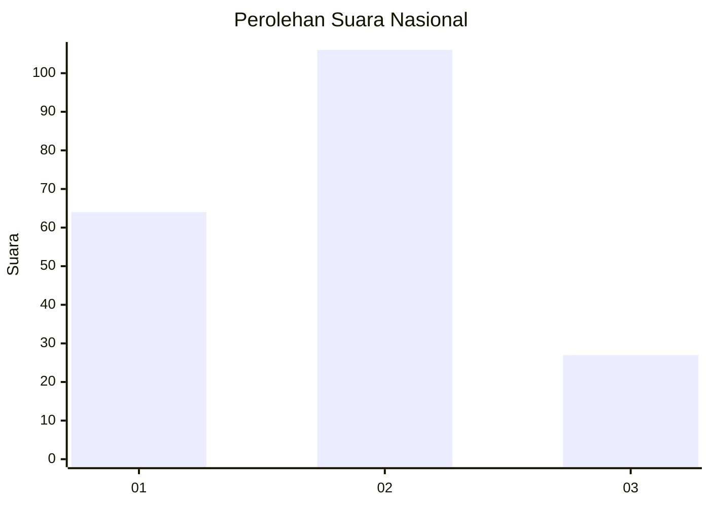
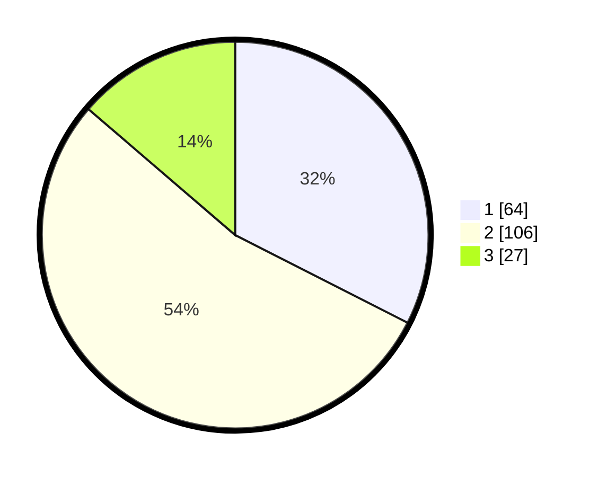

# Hasil

## Grafik

## Tabel

| No. | Nama Paslon    | Suara | Suara (raw) | Persentase |
|:--- |:-------------- | -----:| -----------:| ----------:|
| 1   | ANIES MUHAIMIN | 64    | [64][p-1]   | 32,49      |
| 2   | PRABOWO GIBRAN | 106   | [106][p-2]  | 53,81      |
| 3   | GANJAR MAHFUD  | 27    | [27][p-3]   | 13,71      |

[p-1]: https://github.com/gigit-pemilu/pemilu-2024/blob/main/pilpres/hitung-suara/sub/51-bali/sub/08-buleleng/sub/06-buleleng/sub/1006-banyuasri/sub/021-tps/sub/paslon-1.txt
[p-2]: https://github.com/gigit-pemilu/pemilu-2024/blob/main/pilpres/hitung-suara/sub/51-bali/sub/08-buleleng/sub/06-buleleng/sub/1006-banyuasri/sub/021-tps/sub/paslon-2.txt
[p-3]: https://github.com/gigit-pemilu/pemilu-2024/blob/main/pilpres/hitung-suara/sub/51-bali/sub/08-buleleng/sub/06-buleleng/sub/1006-banyuasri/sub/021-tps/sub/paslon-3.txt

## Foto C Plano

https://sirekap-obj-formc.kpu.go.id/0b62/pemilu/ppwp/51/08/06/10/06/5108061006021-20240215-025739--f5bf34f4-c94e-4d89-8bfe-5271b267d3b2.jpg

https://sirekap-obj-formc.kpu.go.id/0b62/pemilu/ppwp/51/08/06/10/06/5108061006021-20240215-030003--8576c67c-5e58-43b9-97e2-361904069f1a.jpg

https://sirekap-obj-formc.kpu.go.id/0b62/pemilu/ppwp/51/08/06/10/06/5108061006021-20240215-030131--3eb2ea6b-1058-4300-8317-2c8b2500263d.jpg

## Metadata

| Key        | Value               |
| ---------- | ------------------- |
| Time Stamp | 2024-02-24 22:31:28 |

