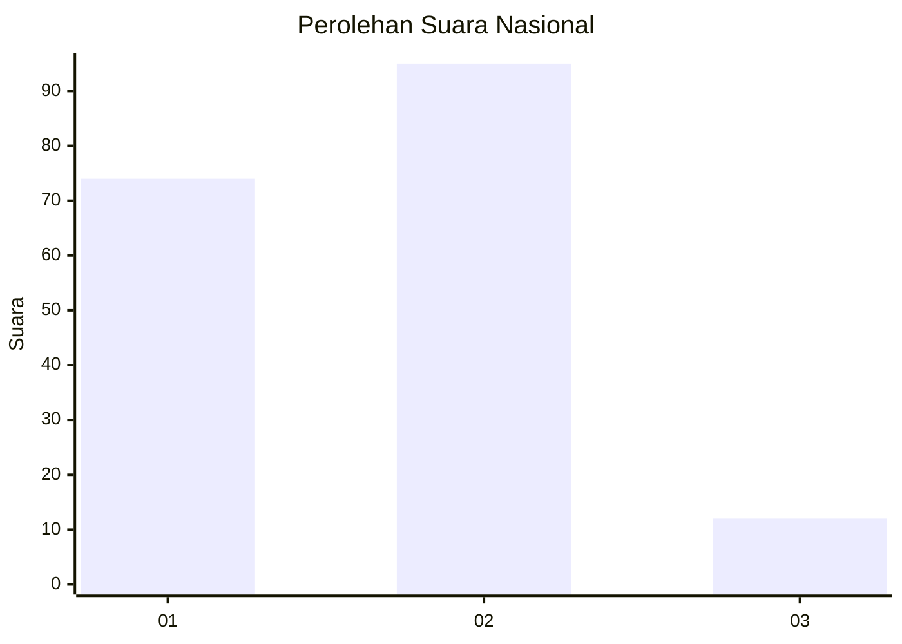
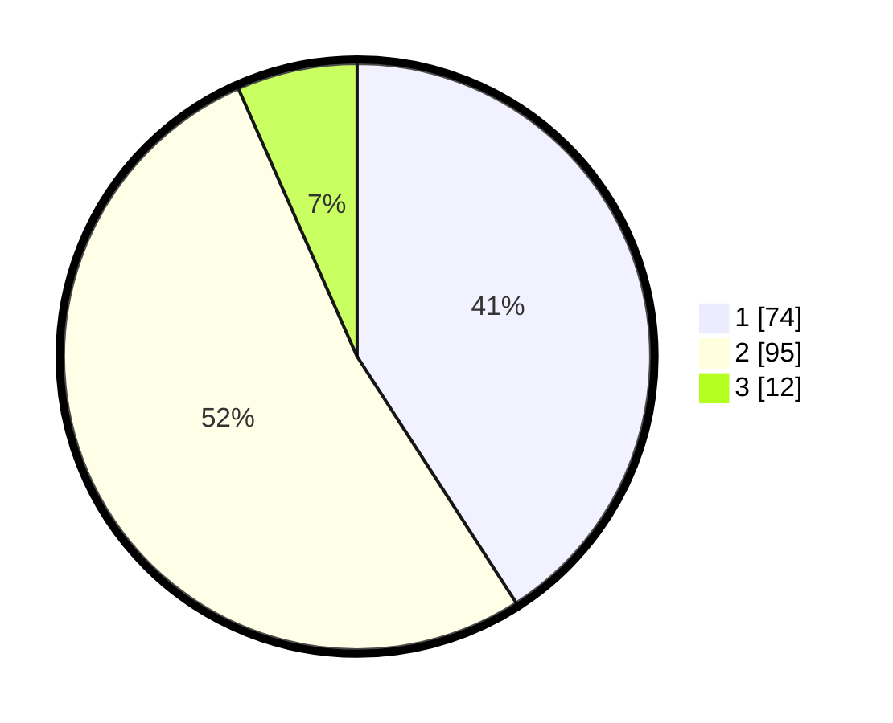

# Hasil

## Grafik

## Tabel

| No. | Nama Paslon    | Suara | Suara (raw) | Persentase |
|:--- |:-------------- | -----:| -----------:| ----------:|
| 1   | ANIES MUHAIMIN | 74    | [74][p-1]   | 40,88      |
| 2   | PRABOWO GIBRAN | 95    | [95][p-2]   | 52,49      |
| 3   | GANJAR MAHFUD  | 12    | [12][p-3]   | 6,63       |

[p-1]: https://github.com/gigit-pemilu/pemilu-2024/blob/main/pilpres/hitung-suara/sub/51-bali/sub/08-buleleng/sub/06-buleleng/sub/1006-banyuasri/sub/024-tps/sub/paslon-1.txt
[p-2]: https://github.com/gigit-pemilu/pemilu-2024/blob/main/pilpres/hitung-suara/sub/51-bali/sub/08-buleleng/sub/06-buleleng/sub/1006-banyuasri/sub/024-tps/sub/paslon-2.txt
[p-3]: https://github.com/gigit-pemilu/pemilu-2024/blob/main/pilpres/hitung-suara/sub/51-bali/sub/08-buleleng/sub/06-buleleng/sub/1006-banyuasri/sub/024-tps/sub/paslon-3.txt

## Foto C Plano

https://sirekap-obj-formc.kpu.go.id/2e91/pemilu/ppwp/51/08/06/10/06/5108061006024-20240214-155327--59e10782-7b43-4a9b-8636-5bc8e31b503a.jpg

https://sirekap-obj-formc.kpu.go.id/2e91/pemilu/ppwp/51/08/06/10/06/5108061006024-20240214-155446--153e868a-7b4e-47d9-97d2-2b74b57642f1.jpg

https://sirekap-obj-formc.kpu.go.id/2e91/pemilu/ppwp/51/08/06/10/06/5108061006024-20240214-155527--ba6ec846-6450-49fa-9cd0-cb5ee7af5558.jpg

## Metadata

| Key        | Value               |
| ---------- | ------------------- |
| Time Stamp | 2024-02-14 21:46:01 |

## DATA PEMILIH TETAP

Jumlah pemilih dalam DPT: **281**.
 * L: **143**.
 * P: **138**.

## DATA PENGGUNA HAK PILIH

Jumlah pengguna hak pilih dalam DPT: **168**.
 * L: **76**.
 * P: **92**.

Jumlah pengguna hak pilih dalam DPTb: **5**.
 * L: **3**.
 * P: **2**.

Jumlah pengguna hak pilih dalam DPK: **10**.
 * L: **4**.
 * P: **6**.

Jumlah pengguna hak pilih: **183**.
 * L: **83**.
 * P: **100**.

## JUMLAH SUARA SAH DAN TIDAK SAH

JUMLAH SELURUH SUARA SAH: **181**.

JUMLAH SUARA TIDAK SAH: **2**.

JUMLAH SELURUH SUARA SAH DAN SUARA TIDAK SAH: **183**.

