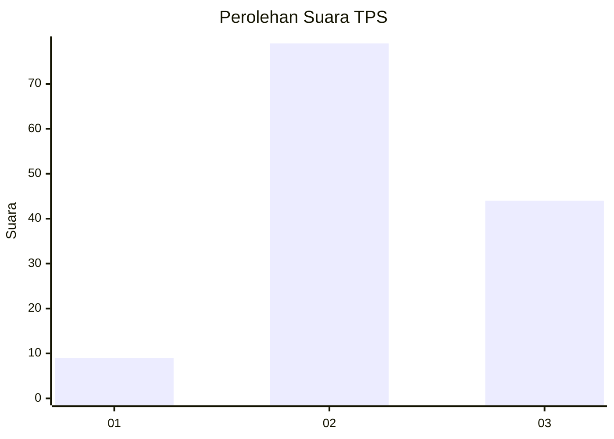
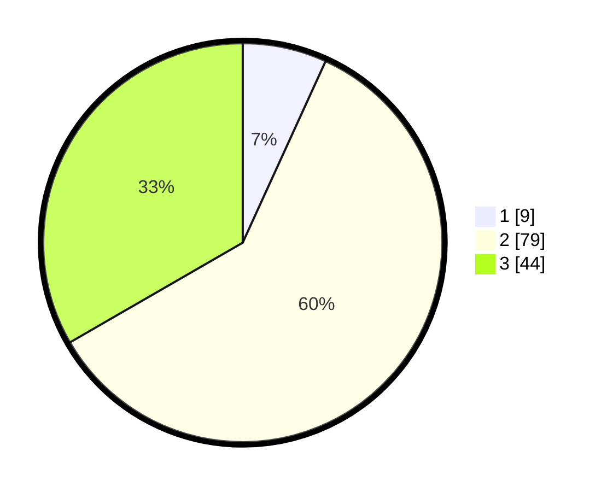

# Hasil

## Grafik

## Tabel

| No. | Nama Paslon    | Suara | Suara (raw) | Persentase |
|:--- |:-------------- | -----:| -----------:| ----------:|
| 1   | ANIES MUHAIMIN | 9     | [9][p-1]    | 6,82       |
| 2   | PRABOWO GIBRAN | 79    | [79][p-2]   | 59,85      |
| 3   | GANJAR MAHFUD  | 44    | [44][p-3]   | 33,33      |

[p-1]: https://github.com/gigit-pemilu/pemilu-2024-51-bali/blob/main/pilpres/hitung-suara/sub/51-bali/sub/08-buleleng/sub/06-buleleng/sub/1006-banyuasri/sub/025-tps/sub/paslon-1.txt
[p-2]: https://github.com/gigit-pemilu/pemilu-2024-51-bali/blob/main/pilpres/hitung-suara/sub/51-bali/sub/08-buleleng/sub/06-buleleng/sub/1006-banyuasri/sub/025-tps/sub/paslon-2.txt
[p-3]: https://github.com/gigit-pemilu/pemilu-2024-51-bali/blob/main/pilpres/hitung-suara/sub/51-bali/sub/08-buleleng/sub/06-buleleng/sub/1006-banyuasri/sub/025-tps/sub/paslon-3.txt

## Foto C Plano

https://sirekap-obj-formc.kpu.go.id/c34a/pemilu/ppwp/51/08/06/10/06/5108061006025-20240214-210235--9e3647ca-9bd4-40fa-8f69-cd267ec53bd4.jpg

https://sirekap-obj-formc.kpu.go.id/c34a/pemilu/ppwp/51/08/06/10/06/5108061006025-20240214-210417--b679f766-5e75-4cd2-88dd-06dd193369a0.jpg

https://sirekap-obj-formc.kpu.go.id/c34a/pemilu/ppwp/51/08/06/10/06/5108061006025-20240214-210547--04387230-095b-4667-a2f5-a8ccbf2f6a7c.jpg

## Metadata

| Key        | Value               |
| ---------- | ------------------- |
| Time Stamp | 2024-02-24 22:31:28 |

