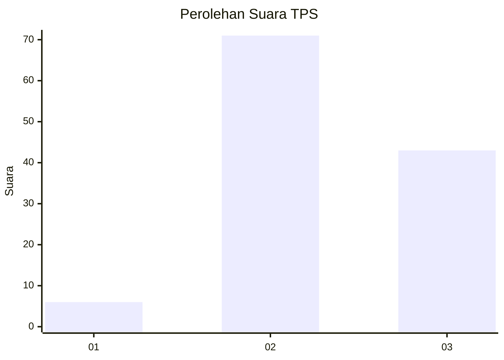
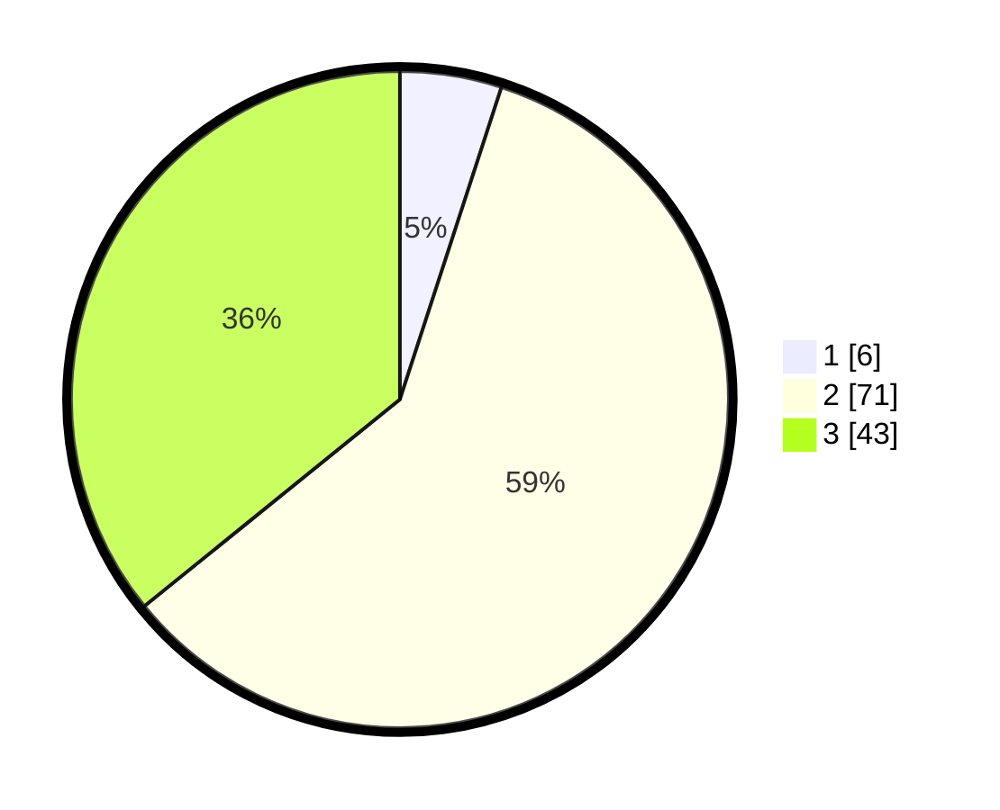

# Hasil

## Grafik

## Tabel

| No. | Nama Paslon    | Suara | Suara (raw) | Persentase |
|:--- |:-------------- | -----:| -----------:| ----------:|
| 1   | ANIES MUHAIMIN | 6     | [6][p-1]    | 5,00       |
| 2   | PRABOWO GIBRAN | 71    | [71][p-2]   | 59,17      |
| 3   | GANJAR MAHFUD  | 43    | [43][p-3]   | 35,83      |

[p-1]: https://github.com/gigit-pemilu/pemilu-2024-51-bali/blob/main/pilpres/hitung-suara/sub/51-bali/sub/08-buleleng/sub/06-buleleng/sub/1006-banyuasri/sub/026-tps/sub/paslon-1.txt
[p-2]: https://github.com/gigit-pemilu/pemilu-2024-51-bali/blob/main/pilpres/hitung-suara/sub/51-bali/sub/08-buleleng/sub/06-buleleng/sub/1006-banyuasri/sub/026-tps/sub/paslon-2.txt
[p-3]: https://github.com/gigit-pemilu/pemilu-2024-51-bali/blob/main/pilpres/hitung-suara/sub/51-bali/sub/08-buleleng/sub/06-buleleng/sub/1006-banyuasri/sub/026-tps/sub/paslon-3.txt

## Foto C Plano

https://sirekap-obj-formc.kpu.go.id/ef94/pemilu/ppwp/51/08/06/10/06/5108061006026-20240214-202806--6d4560b5-a3eb-4694-82a4-7c1e52872e71.jpg

https://sirekap-obj-formc.kpu.go.id/ef94/pemilu/ppwp/51/08/06/10/06/5108061006026-20240214-201449--3de4f728-f710-4ae5-8fdc-d21f016e73bf.jpg

https://sirekap-obj-formc.kpu.go.id/ef94/pemilu/ppwp/51/08/06/10/06/5108061006026-20240214-202103--bdbf10cf-1cb3-40c2-a15f-7d20248c278f.jpg

## Metadata

| Key        | Value               |
| ---------- | ------------------- |
| Time Stamp | 2024-02-25 15:00:00 |

