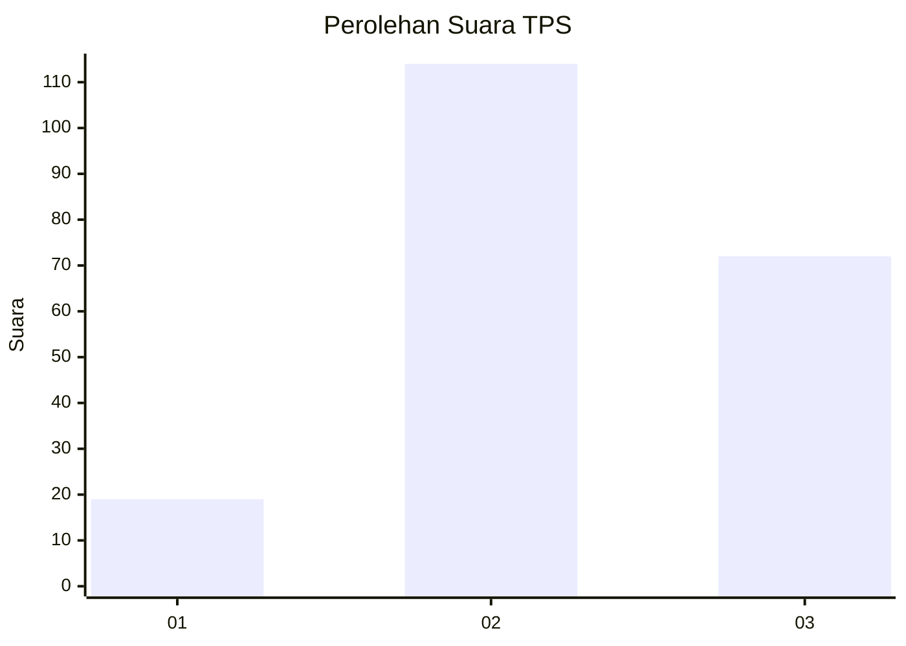
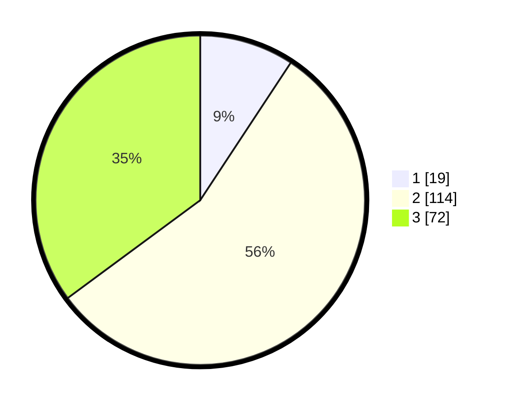

# Hasil

## Grafik

## Tabel

| No. | Nama Paslon    | Suara | Suara (raw) | Persentase |
|:--- |:-------------- | -----:| -----------:| ----------:|
| 1   | ANIES MUHAIMIN | 19    | [19][p-1]   | 9,27       |
| 2   | PRABOWO GIBRAN | 114   | [114][p-2]  | 55,61      |
| 3   | GANJAR MAHFUD  | 72    | [72][p-3]   | 35,12      |

[p-1]: https://github.com/gigit-pemilu/pemilu-2024-51-bali/blob/main/pilpres/hitung-suara/sub/51-bali/sub/08-buleleng/sub/06-buleleng/sub/1007-banjar-tegal/sub/001-tps/sub/paslon-1.txt
[p-2]: https://github.com/gigit-pemilu/pemilu-2024-51-bali/blob/main/pilpres/hitung-suara/sub/51-bali/sub/08-buleleng/sub/06-buleleng/sub/1007-banjar-tegal/sub/001-tps/sub/paslon-2.txt
[p-3]: https://github.com/gigit-pemilu/pemilu-2024-51-bali/blob/main/pilpres/hitung-suara/sub/51-bali/sub/08-buleleng/sub/06-buleleng/sub/1007-banjar-tegal/sub/001-tps/sub/paslon-3.txt

## Foto C Plano

https://sirekap-obj-formc.kpu.go.id/ff49/pemilu/ppwp/51/08/06/10/07/5108061007001-20240217-170114--8872f845-ec0c-44c3-8cf2-5e20ebf2474e.jpg

https://sirekap-obj-formc.kpu.go.id/ff49/pemilu/ppwp/51/08/06/10/07/5108061007001-20240217-170116--f677c0d5-99a4-44ea-8c36-355b82e7c6b7.jpg

https://sirekap-obj-formc.kpu.go.id/ff49/pemilu/ppwp/51/08/06/10/07/5108061007001-20240217-170115--6cc0ff83-a530-40a4-a38e-eb3ca24314e0.jpg

## Metadata

| Key        | Value               |
| ---------- | ------------------- |
| Time Stamp | 2024-02-17 18:00:00 |

## DATA PEMILIH TETAP

Jumlah pemilih dalam DPT: **269**.
 * L: **137**.
 * P: **132**.

## DATA PENGGUNA HAK PILIH

Jumlah pengguna hak pilih dalam DPT: **192**.
 * L: **95**.
 * P: **97**.

Jumlah pengguna hak pilih dalam DPTb: **16**.
 * L: **4**.
 * P: **12**.

Jumlah pengguna hak pilih dalam DPK: **2**.
 * L: **0**.
 * P: **2**.

Jumlah pengguna hak pilih: **210**.
 * L: **99**.
 * P: **111**.

## JUMLAH SUARA SAH DAN TIDAK SAH

JUMLAH SELURUH SUARA SAH: **205**.

JUMLAH SUARA TIDAK SAH: **5**.

JUMLAH SELURUH SUARA SAH DAN SUARA TIDAK SAH: **210**.

