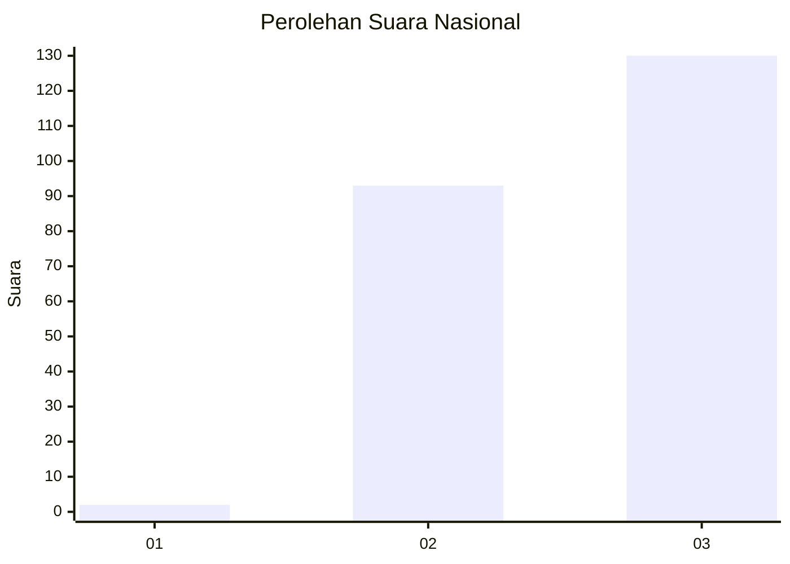
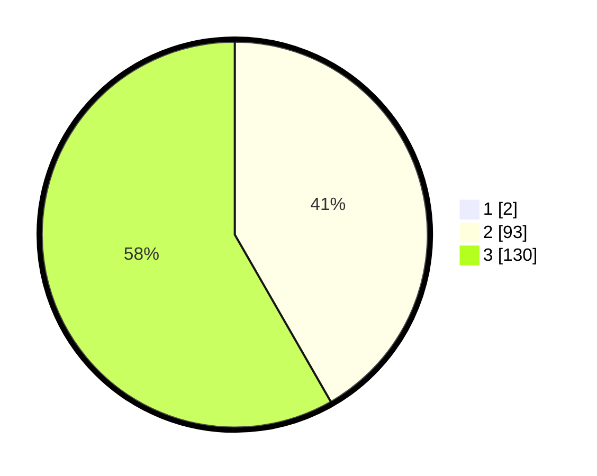

# Hasil

## Grafik

## Tabel

| No. | Nama Paslon    | Suara | Suara (raw) | Persentase |
|:--- |:-------------- | -----:| -----------:| ----------:|
| 1   | ANIES MUHAIMIN | 2     | [2][p-1]    | 0,89       |
| 2   | PRABOWO GIBRAN | 93    | [93][p-2]   | 41,33      |
| 3   | GANJAR MAHFUD  | 130   | [130][p-3]  | 57,78      |

[p-1]: https://github.com/gigit-pemilu/pemilu-2024/blob/main/pilpres/hitung-suara/sub/51-bali/sub/08-buleleng/sub/06-buleleng/sub/1007-banjar-tegal/sub/003-tps/sub/paslon-1.txt
[p-2]: https://github.com/gigit-pemilu/pemilu-2024/blob/main/pilpres/hitung-suara/sub/51-bali/sub/08-buleleng/sub/06-buleleng/sub/1007-banjar-tegal/sub/003-tps/sub/paslon-2.txt
[p-3]: https://github.com/gigit-pemilu/pemilu-2024/blob/main/pilpres/hitung-suara/sub/51-bali/sub/08-buleleng/sub/06-buleleng/sub/1007-banjar-tegal/sub/003-tps/sub/paslon-3.txt

## Foto C Plano

https://sirekap-obj-formc.kpu.go.id/2864/pemilu/ppwp/51/08/06/10/07/5108061007003-20240217-215429--815cd5ea-340e-4a18-a7e5-8c7f98702f6f.jpg

https://sirekap-obj-formc.kpu.go.id/2864/pemilu/ppwp/51/08/06/10/07/5108061007003-20240217-215431--f5b94fa3-8fac-4516-baac-c329f2325ff9.jpg

https://sirekap-obj-formc.kpu.go.id/2864/pemilu/ppwp/51/08/06/10/07/5108061007003-20240217-215430--f8bc3aa6-78b8-46b4-acd5-8374b7c21d2d.jpg

## Metadata

| Key        | Value               |
| ---------- | ------------------- |
| Time Stamp | 2024-02-21 11:00:00 |

## DATA PEMILIH TETAP

Jumlah pemilih dalam DPT: **279**.
 * L: **137**.
 * P: **142**.

## DATA PENGGUNA HAK PILIH

Jumlah pengguna hak pilih dalam DPT: **217**.
 * L: **108**.
 * P: **109**.

Jumlah pengguna hak pilih dalam DPTb: **12**.
 * L: **0**.
 * P: **12**.

Jumlah pengguna hak pilih dalam DPK: **1**.
 * L: **1**.
 * P: **0**.

Jumlah pengguna hak pilih: **230**.
 * L: **109**.
 * P: **121**.

## JUMLAH SUARA SAH DAN TIDAK SAH

JUMLAH SELURUH SUARA SAH: **225**.

JUMLAH SUARA TIDAK SAH: **5**.

JUMLAH SELURUH SUARA SAH DAN SUARA TIDAK SAH: **230**.

