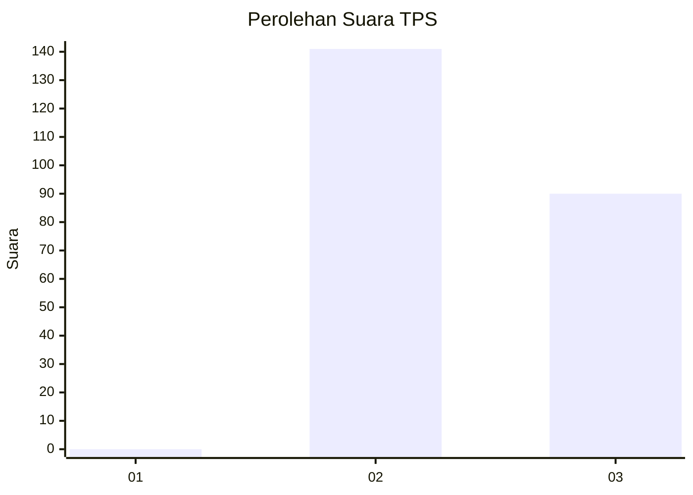
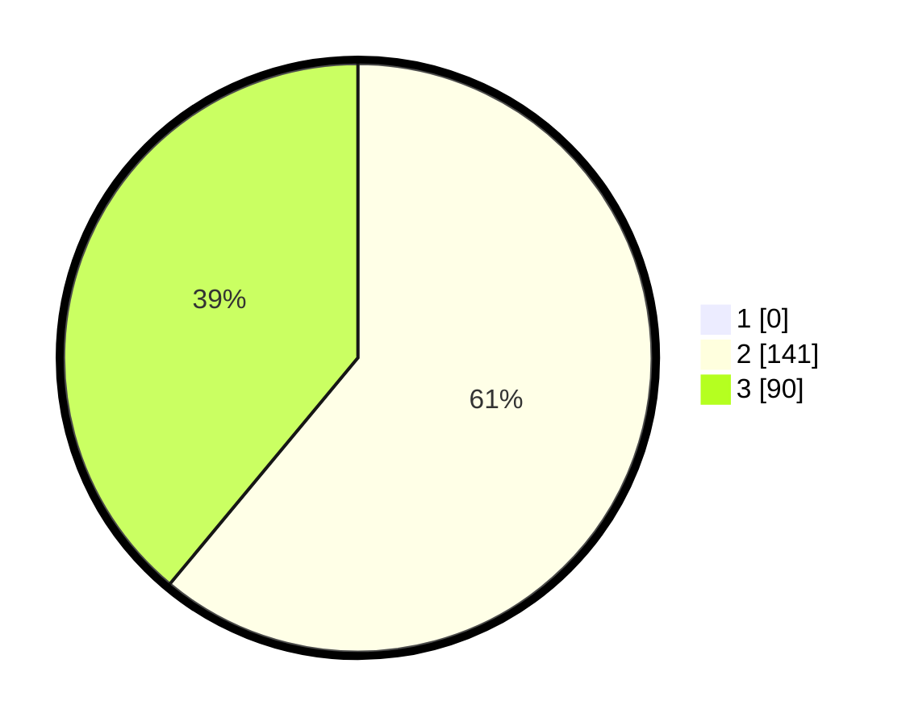

# Hasil

## Grafik

## Tabel

| No. | Nama Paslon    | Suara | Suara (raw) | Persentase |
|:--- |:-------------- | -----:| -----------:| ----------:|
| 1   | ANIES MUHAIMIN | 0     | [0][p-1]    | 0,00       |
| 2   | PRABOWO GIBRAN | 141   | [141][p-2]  | 61,04      |
| 3   | GANJAR MAHFUD  | 90    | [90][p-3]   | 38,96      |

[p-1]: https://github.com/gigit-pemilu/pemilu-2024-51-bali/blob/main/pilpres/hitung-suara/sub/51-bali/sub/08-buleleng/sub/06-buleleng/sub/1007-banjar-tegal/sub/005-tps/sub/paslon-1.txt
[p-2]: https://github.com/gigit-pemilu/pemilu-2024-51-bali/blob/main/pilpres/hitung-suara/sub/51-bali/sub/08-buleleng/sub/06-buleleng/sub/1007-banjar-tegal/sub/005-tps/sub/paslon-2.txt
[p-3]: https://github.com/gigit-pemilu/pemilu-2024-51-bali/blob/main/pilpres/hitung-suara/sub/51-bali/sub/08-buleleng/sub/06-buleleng/sub/1007-banjar-tegal/sub/005-tps/sub/paslon-3.txt

## Foto C Plano

https://sirekap-obj-formc.kpu.go.id/ede5/pemilu/ppwp/51/08/06/10/07/5108061007005-20240215-021127--653e0d0f-740b-4680-bd3e-93ff946148c9.jpg

https://sirekap-obj-formc.kpu.go.id/ede5/pemilu/ppwp/51/08/06/10/07/5108061007005-20240215-021328--bd1e5274-9e8a-420b-961d-f8492d8bc9ba.jpg

https://sirekap-obj-formc.kpu.go.id/ede5/pemilu/ppwp/51/08/06/10/07/5108061007005-20240215-021412--f2cf3c9e-140f-4e7b-a3e6-4a7f94f6a5c9.jpg

## Metadata

| Key        | Value               |
| ---------- | ------------------- |
| Time Stamp | 2024-02-24 22:31:28 |

