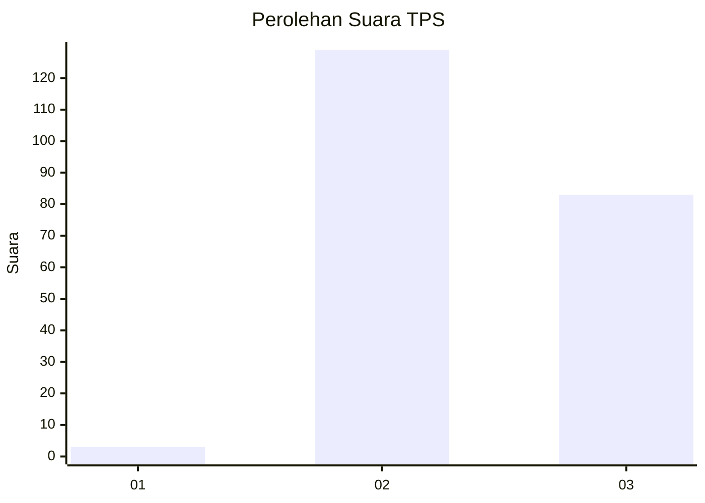
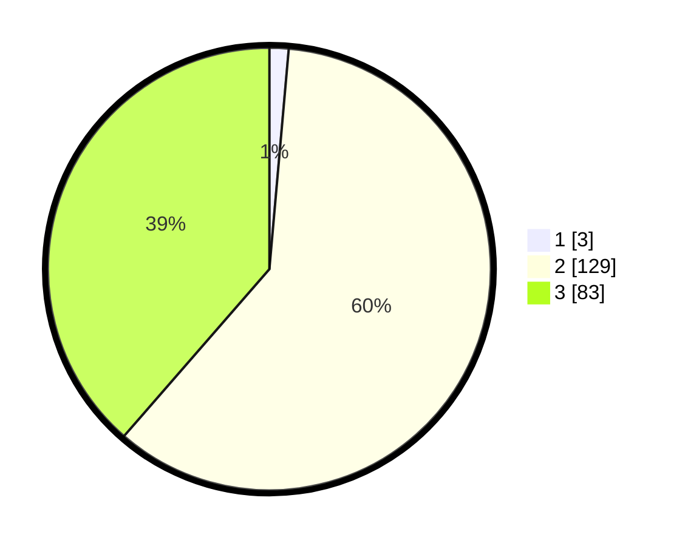

# Hasil

## Grafik

## Tabel

| No. | Nama Paslon    | Suara | Suara (raw) | Persentase |
|:--- |:-------------- | -----:| -----------:| ----------:|
| 1   | ANIES MUHAIMIN | 3     | [3][p-1]    | 1,40       |
| 2   | PRABOWO GIBRAN | 129   | [129][p-2]  | 60,00      |
| 3   | GANJAR MAHFUD  | 83    | [83][p-3]   | 38,60      |

[p-1]: https://github.com/gigit-pemilu/pemilu-2024-51-bali/blob/main/pilpres/hitung-suara/sub/51-bali/sub/08-buleleng/sub/06-buleleng/sub/1007-banjar-tegal/sub/007-tps/sub/paslon-1.txt
[p-2]: https://github.com/gigit-pemilu/pemilu-2024-51-bali/blob/main/pilpres/hitung-suara/sub/51-bali/sub/08-buleleng/sub/06-buleleng/sub/1007-banjar-tegal/sub/007-tps/sub/paslon-2.txt
[p-3]: https://github.com/gigit-pemilu/pemilu-2024-51-bali/blob/main/pilpres/hitung-suara/sub/51-bali/sub/08-buleleng/sub/06-buleleng/sub/1007-banjar-tegal/sub/007-tps/sub/paslon-3.txt

## Foto C Plano

https://sirekap-obj-formc.kpu.go.id/87e7/pemilu/ppwp/51/08/06/10/07/5108061007007-20240215-013623--596d12c5-1d1c-4164-8035-ec95903c3bba.jpg

https://sirekap-obj-formc.kpu.go.id/87e7/pemilu/ppwp/51/08/06/10/07/5108061007007-20240215-014038--1fa2b003-3e34-497e-939a-78260b0b8006.jpg

https://sirekap-obj-formc.kpu.go.id/87e7/pemilu/ppwp/51/08/06/10/07/5108061007007-20240215-014137--f70efb8d-845d-4acb-8cb3-4fadba5f531f.jpg

## Metadata

| Key        | Value               |
| ---------- | ------------------- |
| Time Stamp | 2024-02-17 18:00:00 |

