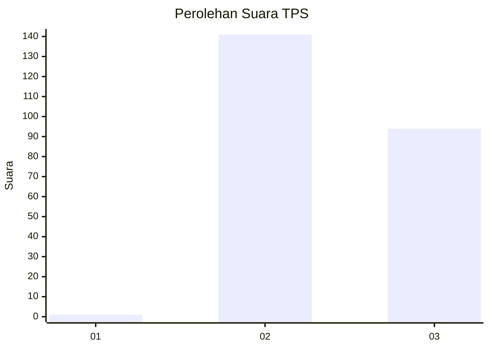
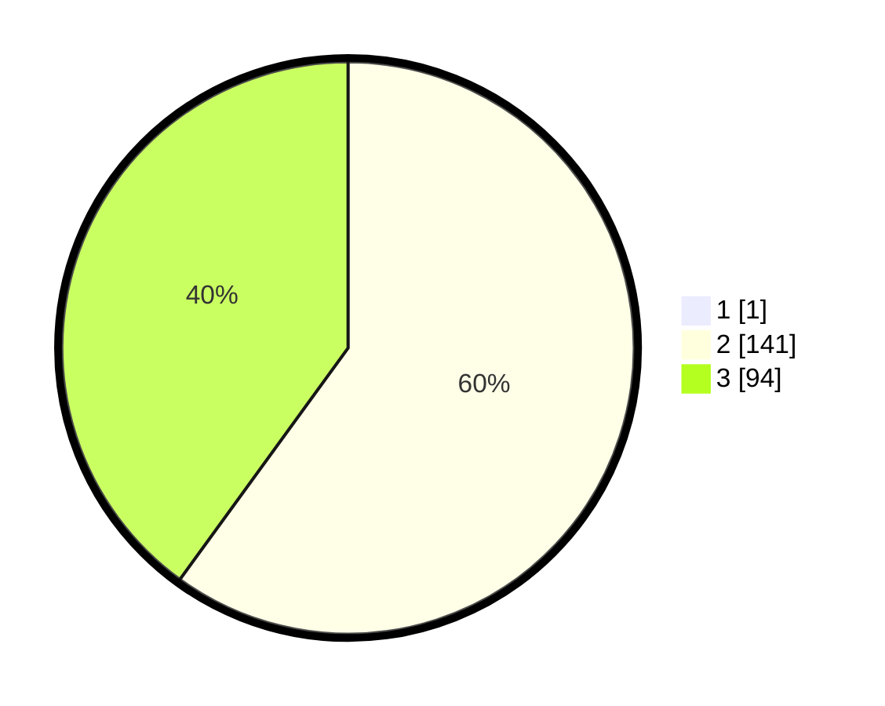

# Hasil

## Grafik

## Tabel

| No. | Nama Paslon    | Suara | Suara (raw) | Persentase |
|:--- |:-------------- | -----:| -----------:| ----------:|
| 1   | ANIES MUHAIMIN | 1     | [1][p-1]    | 0,42       |
| 2   | PRABOWO GIBRAN | 141   | [141][p-2]  | 59,75      |
| 3   | GANJAR MAHFUD  | 94    | [94][p-3]   | 39,83      |

[p-1]: https://github.com/gigit-pemilu/pemilu-2024-51-bali/blob/main/pilpres/hitung-suara/sub/51-bali/sub/08-buleleng/sub/06-buleleng/sub/1007-banjar-tegal/sub/011-tps/sub/paslon-1.txt
[p-2]: https://github.com/gigit-pemilu/pemilu-2024-51-bali/blob/main/pilpres/hitung-suara/sub/51-bali/sub/08-buleleng/sub/06-buleleng/sub/1007-banjar-tegal/sub/011-tps/sub/paslon-2.txt
[p-3]: https://github.com/gigit-pemilu/pemilu-2024-51-bali/blob/main/pilpres/hitung-suara/sub/51-bali/sub/08-buleleng/sub/06-buleleng/sub/1007-banjar-tegal/sub/011-tps/sub/paslon-3.txt

## Foto C Plano

https://sirekap-obj-formc.kpu.go.id/5150/pemilu/ppwp/51/08/06/10/07/5108061007011-20240220-133936--2d5e3233-ba4e-4a63-93cb-05920f9ef725.jpg

https://sirekap-obj-formc.kpu.go.id/5150/pemilu/ppwp/51/08/06/10/07/5108061007011-20240220-134027--9d759737-6ee8-4312-8ce3-6341154e817b.jpg

https://sirekap-obj-formc.kpu.go.id/5150/pemilu/ppwp/51/08/06/10/07/5108061007011-20240220-134109--09b1be38-9a83-4e86-80d6-3a474ba529f7.jpg

## Metadata

| Key        | Value               |
| ---------- | ------------------- |
| Time Stamp | 2024-02-24 22:31:28 |

