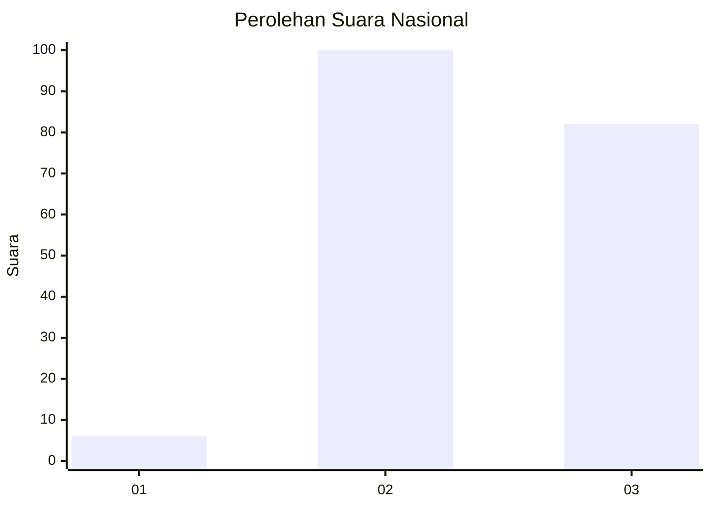
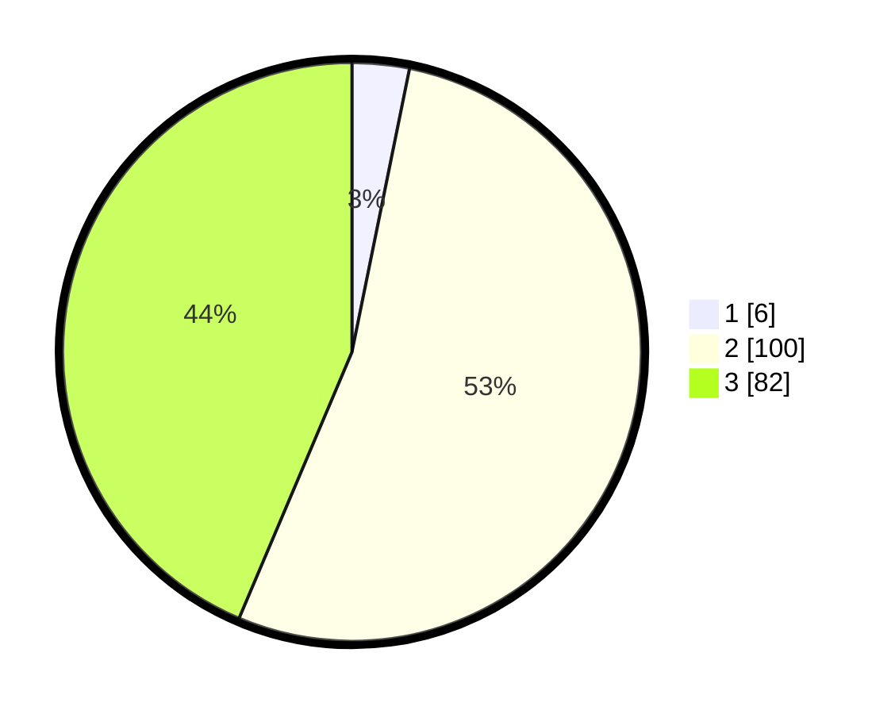

# Hasil

## Grafik

## Tabel

| No. | Nama Paslon    | Suara | Suara (raw) | Persentase |
|:--- |:-------------- | -----:| -----------:| ----------:|
| 1   | ANIES MUHAIMIN | 6     | [6][p-1]    | 3,19       |
| 2   | PRABOWO GIBRAN | 100   | [100][p-2]  | 53,19      |
| 3   | GANJAR MAHFUD  | 82    | [82][p-3]   | 43,62      |

[p-1]: https://github.com/gigit-pemilu/pemilu-2024/blob/main/pilpres/hitung-suara/sub/51-bali/sub/08-buleleng/sub/06-buleleng/sub/1009-paket-agung/sub/001-tps/sub/paslon-1.txt
[p-2]: https://github.com/gigit-pemilu/pemilu-2024/blob/main/pilpres/hitung-suara/sub/51-bali/sub/08-buleleng/sub/06-buleleng/sub/1009-paket-agung/sub/001-tps/sub/paslon-2.txt
[p-3]: https://github.com/gigit-pemilu/pemilu-2024/blob/main/pilpres/hitung-suara/sub/51-bali/sub/08-buleleng/sub/06-buleleng/sub/1009-paket-agung/sub/001-tps/sub/paslon-3.txt

## Foto C Plano

https://sirekap-obj-formc.kpu.go.id/a27d/pemilu/ppwp/51/08/06/10/09/5108061009001-20240217-125515--17863791-e0c9-4f12-8b02-cf934782a770.jpg

https://sirekap-obj-formc.kpu.go.id/a27d/pemilu/ppwp/51/08/06/10/09/5108061009001-20240217-125533--3e54a7fc-b9b5-4bba-85e7-f82c5a4e962c.jpg

https://sirekap-obj-formc.kpu.go.id/a27d/pemilu/ppwp/51/08/06/10/09/5108061009001-20240217-125543--f2086a15-7adb-4f5c-aad4-f496da574721.jpg

## Metadata

| Key        | Value               |
| ---------- | ------------------- |
| Time Stamp | 2024-02-24 22:31:28 |

