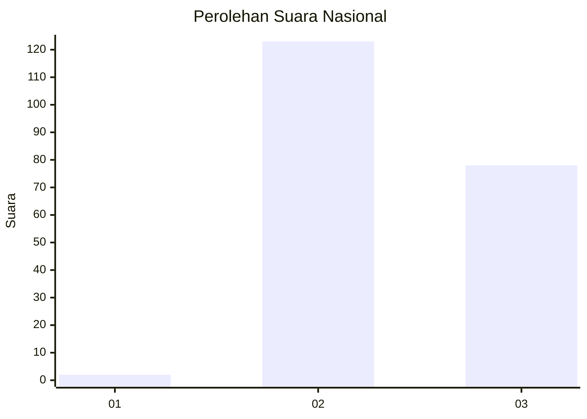
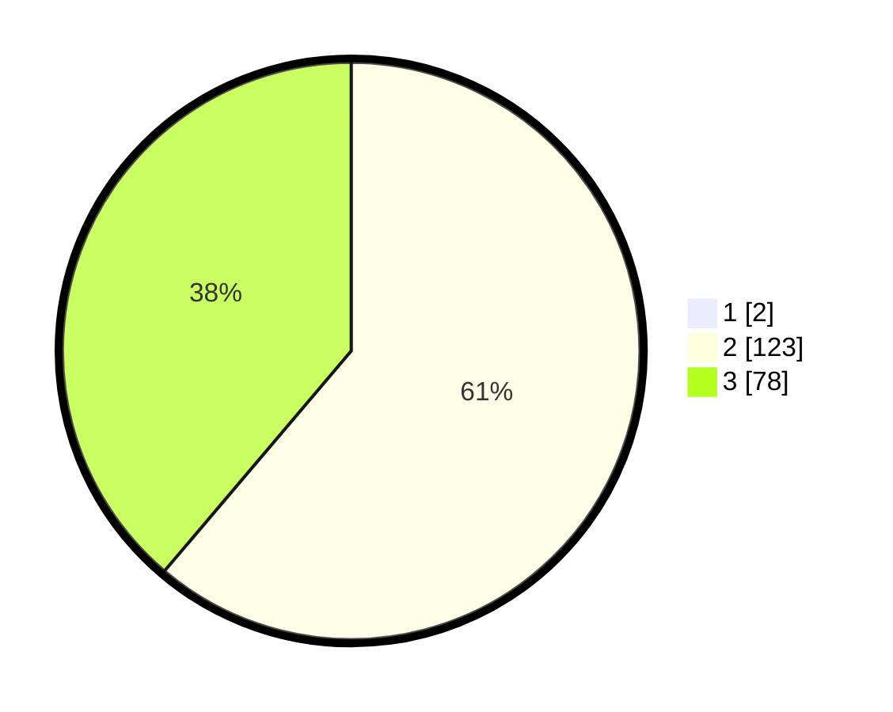

# Hasil

## Grafik

## Tabel

| No. | Nama Paslon    | Suara | Suara (raw) | Persentase |
|:--- |:-------------- | -----:| -----------:| ----------:|
| 1   | ANIES MUHAIMIN | 2     | [2][p-1]    | 0,99       |
| 2   | PRABOWO GIBRAN | 123   | [123][p-2]  | 60,59      |
| 3   | GANJAR MAHFUD  | 78    | [78][p-3]   | 38,42      |

[p-1]: https://github.com/gigit-pemilu/pemilu-2024/blob/main/pilpres/hitung-suara/sub/51-bali/sub/08-buleleng/sub/06-buleleng/sub/1009-paket-agung/sub/002-tps/sub/paslon-1.txt
[p-2]: https://github.com/gigit-pemilu/pemilu-2024/blob/main/pilpres/hitung-suara/sub/51-bali/sub/08-buleleng/sub/06-buleleng/sub/1009-paket-agung/sub/002-tps/sub/paslon-2.txt
[p-3]: https://github.com/gigit-pemilu/pemilu-2024/blob/main/pilpres/hitung-suara/sub/51-bali/sub/08-buleleng/sub/06-buleleng/sub/1009-paket-agung/sub/002-tps/sub/paslon-3.txt

## Foto C Plano

https://sirekap-obj-formc.kpu.go.id/b9f5/pemilu/ppwp/51/08/06/10/09/5108061009002-20240216-024721--c80d9d46-f6e6-44d8-940b-e9fa9398f542.jpg

https://sirekap-obj-formc.kpu.go.id/b9f5/pemilu/ppwp/51/08/06/10/09/5108061009002-20240216-024727--d60589b2-c9ef-4e9b-a6b5-0e53332fdeef.jpg

https://sirekap-obj-formc.kpu.go.id/b9f5/pemilu/ppwp/51/08/06/10/09/5108061009002-20240216-024726--685b3a04-83a8-47a4-944f-66adf63cbab8.jpg

## Metadata

| Key        | Value               |
| ---------- | ------------------- |
| Time Stamp | 2024-02-16 21:01:00 |

## DATA PEMILIH TETAP

Jumlah pemilih dalam DPT: **192**.
 * L: **98**.
 * P: **94**.

## DATA PENGGUNA HAK PILIH

Jumlah pengguna hak pilih dalam DPT: **192**.
 * L: **98**.
 * P: **94**.

Jumlah pengguna hak pilih dalam DPTb: **9**.
 * L: **8**.
 * P: **1**.

Jumlah pengguna hak pilih dalam DPK: **2**.
 * L: **1**.
 * P: **1**.

Jumlah pengguna hak pilih: **203**.
 * L: **107**.
 * P: **96**.

## JUMLAH SUARA SAH DAN TIDAK SAH

JUMLAH SELURUH SUARA SAH: **203**.

JUMLAH SUARA TIDAK SAH: **0**.

JUMLAH SELURUH SUARA SAH DAN SUARA TIDAK SAH: **203**.

