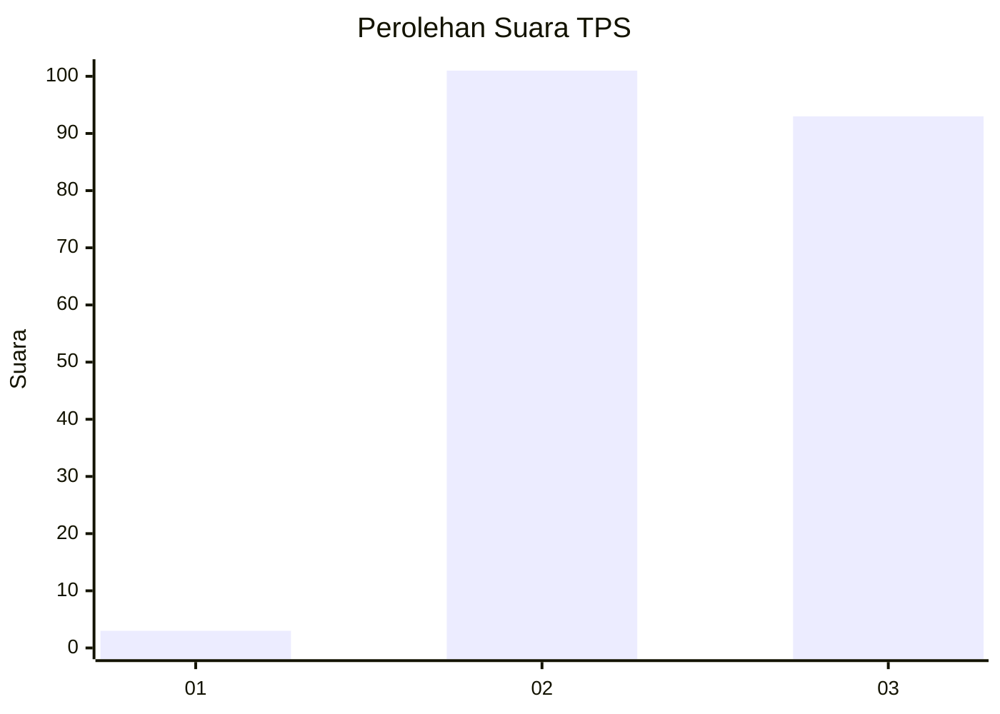
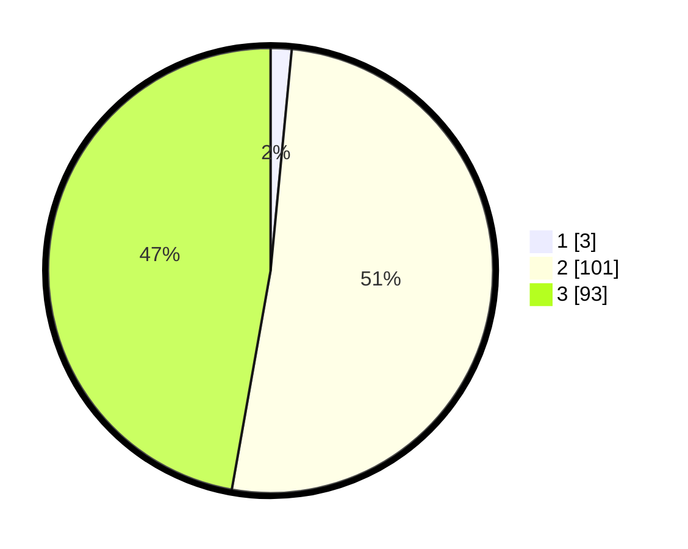

# Hasil

## Grafik

## Tabel

| No. | Nama Paslon    | Suara | Suara (raw) | Persentase |
|:--- |:-------------- | -----:| -----------:| ----------:|
| 1   | ANIES MUHAIMIN | 3     | [3][p-1]    | 1,52       |
| 2   | PRABOWO GIBRAN | 101   | [101][p-2]  | 51,27      |
| 3   | GANJAR MAHFUD  | 93    | [93][p-3]   | 47,21      |

[p-1]: https://github.com/gigit-pemilu/pemilu-2024-51-bali/blob/main/pilpres/hitung-suara/sub/51-bali/sub/08-buleleng/sub/06-buleleng/sub/1009-paket-agung/sub/003-tps/sub/paslon-1.txt
[p-2]: https://github.com/gigit-pemilu/pemilu-2024-51-bali/blob/main/pilpres/hitung-suara/sub/51-bali/sub/08-buleleng/sub/06-buleleng/sub/1009-paket-agung/sub/003-tps/sub/paslon-2.txt
[p-3]: https://github.com/gigit-pemilu/pemilu-2024-51-bali/blob/main/pilpres/hitung-suara/sub/51-bali/sub/08-buleleng/sub/06-buleleng/sub/1009-paket-agung/sub/003-tps/sub/paslon-3.txt

## Foto C Plano

https://sirekap-obj-formc.kpu.go.id/f374/pemilu/ppwp/51/08/06/10/09/5108061009003-20240215-011240--9604fcda-798f-43cb-a504-49da78fb4b2d.jpg

https://sirekap-obj-formc.kpu.go.id/f374/pemilu/ppwp/51/08/06/10/09/5108061009003-20240215-011435--06d5d68f-df5d-4f54-a561-b9f378cb823b.jpg

https://sirekap-obj-formc.kpu.go.id/f374/pemilu/ppwp/51/08/06/10/09/5108061009003-20240215-011620--70fea122-461e-4438-a731-aab9429f2638.jpg

## Metadata

| Key        | Value               |
| ---------- | ------------------- |
| Time Stamp | 2024-02-24 22:31:28 |

