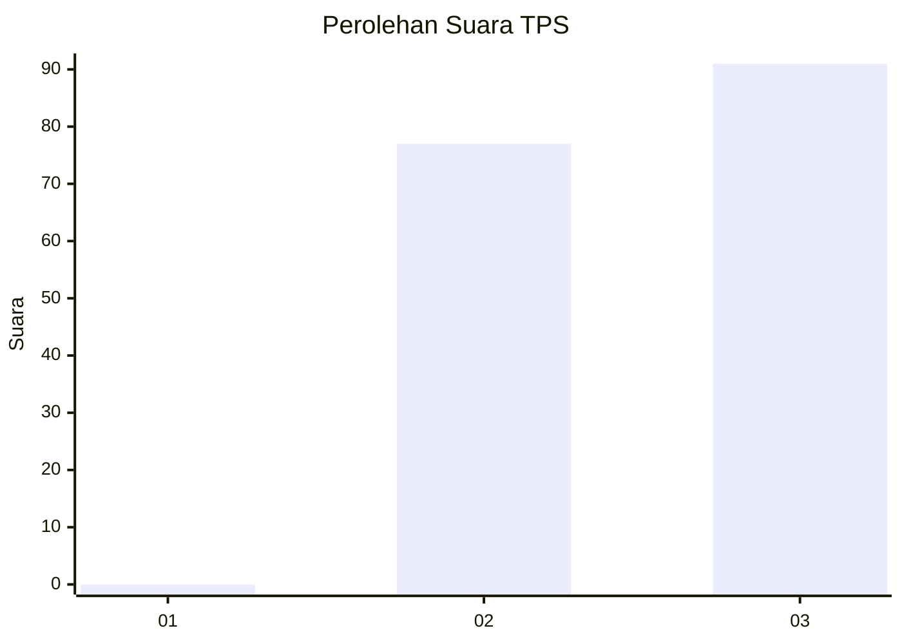
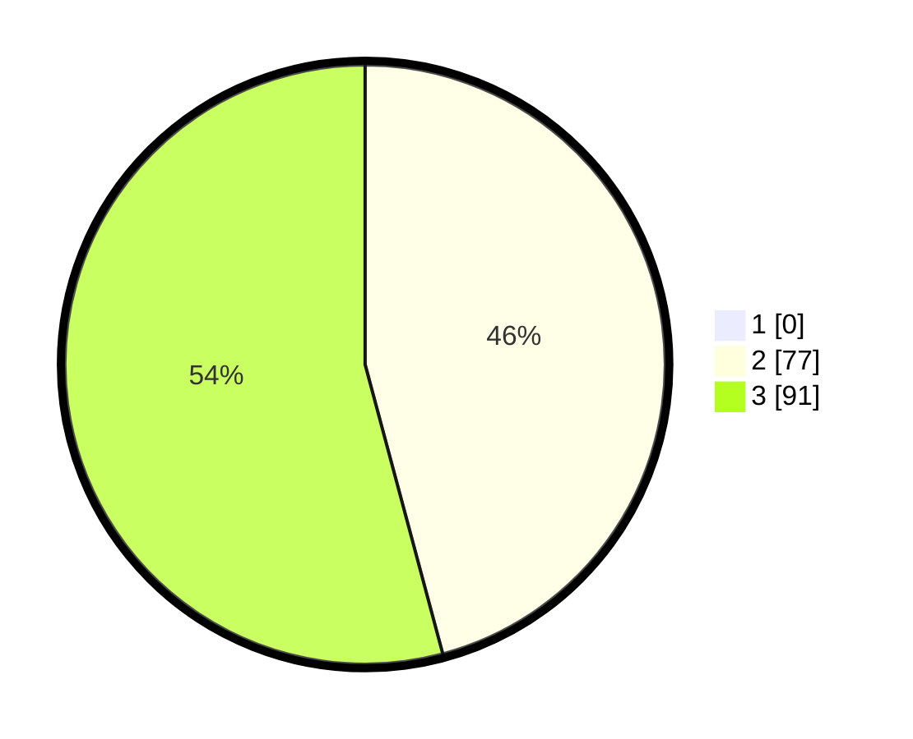

# Hasil

## Grafik

## Tabel

| No. | Nama Paslon    | Suara | Suara (raw) | Persentase |
|:--- |:-------------- | -----:| -----------:| ----------:|
| 1   | ANIES MUHAIMIN | 0     | [0][p-1]    | 0,00       |
| 2   | PRABOWO GIBRAN | 77    | [77][p-2]   | 45,83      |
| 3   | GANJAR MAHFUD  | 91    | [91][p-3]   | 54,17      |

[p-1]: https://github.com/gigit-pemilu/pemilu-2024-51-bali/blob/main/pilpres/hitung-suara/sub/51-bali/sub/08-buleleng/sub/06-buleleng/sub/1009-paket-agung/sub/006-tps/sub/paslon-1.txt
[p-2]: https://github.com/gigit-pemilu/pemilu-2024-51-bali/blob/main/pilpres/hitung-suara/sub/51-bali/sub/08-buleleng/sub/06-buleleng/sub/1009-paket-agung/sub/006-tps/sub/paslon-2.txt
[p-3]: https://github.com/gigit-pemilu/pemilu-2024-51-bali/blob/main/pilpres/hitung-suara/sub/51-bali/sub/08-buleleng/sub/06-buleleng/sub/1009-paket-agung/sub/006-tps/sub/paslon-3.txt

## Foto C Plano

https://sirekap-obj-formc.kpu.go.id/b34c/pemilu/ppwp/51/08/06/10/09/5108061009006-20240215-003704--8bbcf707-4799-4d52-afe2-ea73ba792be4.jpg

https://sirekap-obj-formc.kpu.go.id/b34c/pemilu/ppwp/51/08/06/10/09/5108061009006-20240215-003720--4592fa26-4a50-46d5-b556-6b637fc3d6ae.jpg

https://sirekap-obj-formc.kpu.go.id/b34c/pemilu/ppwp/51/08/06/10/09/5108061009006-20240215-003732--e1aaf8e1-1f14-460a-95bf-8b4d43e1c1dd.jpg

## Metadata

| Key        | Value               |
| ---------- | ------------------- |
| Time Stamp | 2024-02-15 17:30:25 |

## DATA PEMILIH TETAP

Jumlah pemilih dalam DPT: **206**.
 * L: **101**.
 * P: **105**.

## DATA PENGGUNA HAK PILIH

Jumlah pengguna hak pilih dalam DPT: **160**.
 * L: **75**.
 * P: **85**.

Jumlah pengguna hak pilih dalam DPTb: **7**.
 * L: **6**.
 * P: **1**.

Jumlah pengguna hak pilih dalam DPK: **1**.
 * L: **0**.
 * P: **1**.

Jumlah pengguna hak pilih: **168**.
 * L: **81**.
 * P: **87**.

## JUMLAH SUARA SAH DAN TIDAK SAH

JUMLAH SELURUH SUARA SAH: **168**.

JUMLAH SUARA TIDAK SAH: **0**.

JUMLAH SELURUH SUARA SAH DAN SUARA TIDAK SAH: **168**.

