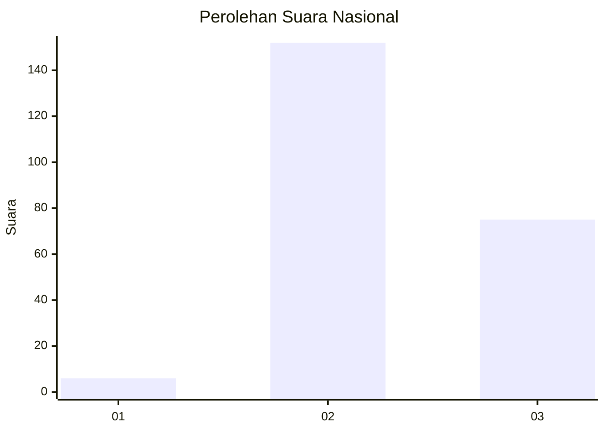
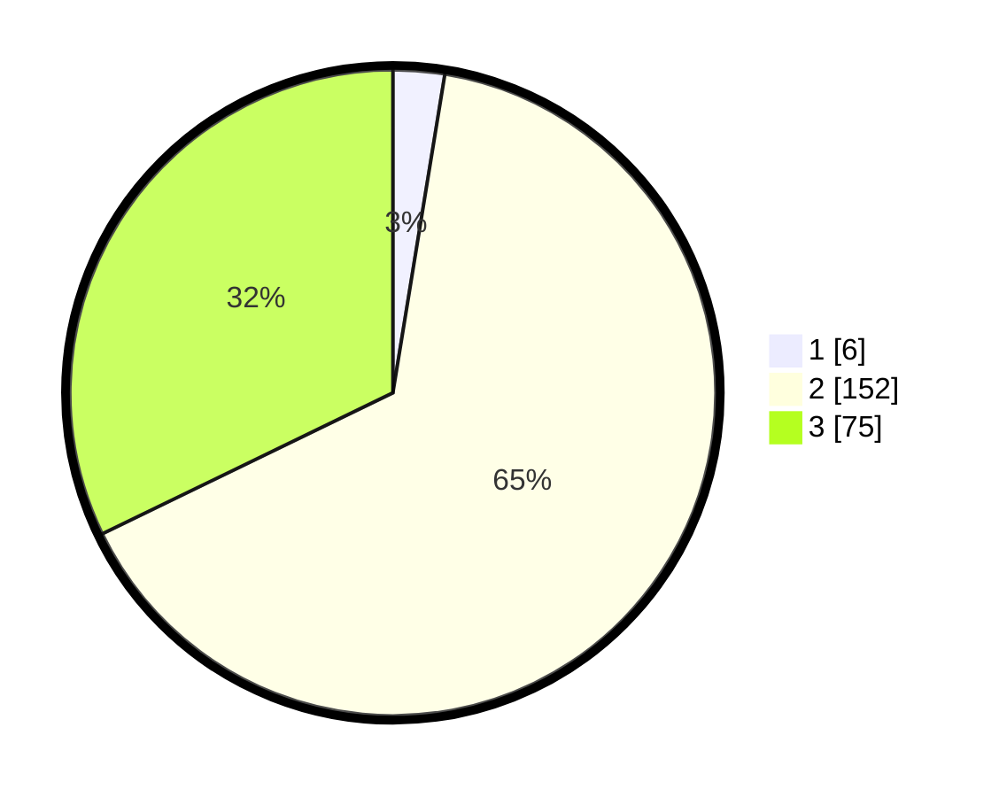

# Hasil

## Grafik

## Tabel

| No. | Nama Paslon    | Suara | Suara (raw) | Persentase |
|:--- |:-------------- | -----:| -----------:| ----------:|
| 1   | ANIES MUHAIMIN | 6     | [6][p-1]    | 2,58       |
| 2   | PRABOWO GIBRAN | 152   | [152][p-2]  | 65,24      |
| 3   | GANJAR MAHFUD  | 75    | [75][p-3]   | 32,19      |

[p-1]: https://github.com/gigit-pemilu/pemilu-2024/blob/main/pilpres/hitung-suara/sub/51-bali/sub/08-buleleng/sub/06-buleleng/sub/1009-paket-agung/sub/901-tps/sub/paslon-1.txt
[p-2]: https://github.com/gigit-pemilu/pemilu-2024/blob/main/pilpres/hitung-suara/sub/51-bali/sub/08-buleleng/sub/06-buleleng/sub/1009-paket-agung/sub/901-tps/sub/paslon-2.txt
[p-3]: https://github.com/gigit-pemilu/pemilu-2024/blob/main/pilpres/hitung-suara/sub/51-bali/sub/08-buleleng/sub/06-buleleng/sub/1009-paket-agung/sub/901-tps/sub/paslon-3.txt

## Foto C Plano

https://sirekap-obj-formc.kpu.go.id/4cb5/pemilu/ppwp/51/08/06/10/09/5108061009901-20240216-035428--0ad0e9c0-674d-4a73-863c-9da531a22051.jpg

https://sirekap-obj-formc.kpu.go.id/4cb5/pemilu/ppwp/51/08/06/10/09/5108061009901-20240216-035430--fe9b13c4-4bfb-4726-b895-6b2c530e6853.jpg

https://sirekap-obj-formc.kpu.go.id/4cb5/pemilu/ppwp/51/08/06/10/09/5108061009901-20240216-035428--5d2b52a9-c295-4b44-93cf-dad22bd4a37c.jpg

## Metadata

| Key        | Value               |
| ---------- | ------------------- |
| Time Stamp | 2024-02-16 21:01:00 |

## DATA PEMILIH TETAP

Jumlah pemilih dalam DPT: **247**.
 * L: **231**.
 * P: **16**.

## DATA PENGGUNA HAK PILIH

Jumlah pengguna hak pilih dalam DPT: **0**.
 * L: **0**.
 * P: **0**.

Jumlah pengguna hak pilih dalam DPTb: **241**.
 * L: **225**.
 * P: **16**.

Jumlah pengguna hak pilih dalam DPK: **0**.
 * L: **0**.
 * P: **0**.

Jumlah pengguna hak pilih: **241**.
 * L: **225**.
 * P: **16**.

## JUMLAH SUARA SAH DAN TIDAK SAH

JUMLAH SELURUH SUARA SAH: **233**.

JUMLAH SUARA TIDAK SAH: **8**.

JUMLAH SELURUH SUARA SAH DAN SUARA TIDAK SAH: **241**.

