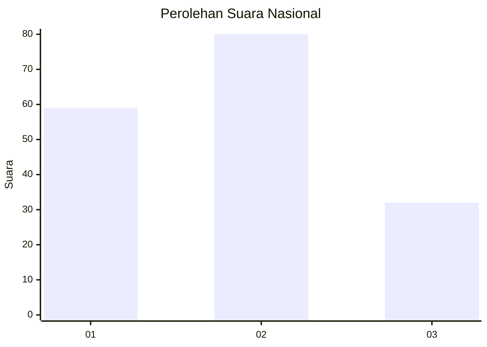
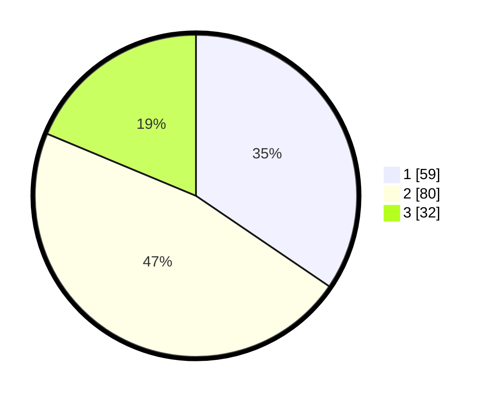

# Hasil

## Grafik

## Tabel

| No. | Nama Paslon    | Suara | Suara (raw) | Persentase |
|:--- |:-------------- | -----:| -----------:| ----------:|
| 1   | ANIES MUHAIMIN | 59    | [59][p-1]   | 34,50      |
| 2   | PRABOWO GIBRAN | 80    | [80][p-2]   | 46,78      |
| 3   | GANJAR MAHFUD  | 32    | [32][p-3]   | 18,71      |

[p-1]: https://github.com/gigit-pemilu/pemilu-2024/blob/main/pilpres/hitung-suara/sub/51-bali/sub/08-buleleng/sub/06-buleleng/sub/1010-kampung-singaraja/sub/001-tps/sub/paslon-1.txt
[p-2]: https://github.com/gigit-pemilu/pemilu-2024/blob/main/pilpres/hitung-suara/sub/51-bali/sub/08-buleleng/sub/06-buleleng/sub/1010-kampung-singaraja/sub/001-tps/sub/paslon-2.txt
[p-3]: https://github.com/gigit-pemilu/pemilu-2024/blob/main/pilpres/hitung-suara/sub/51-bali/sub/08-buleleng/sub/06-buleleng/sub/1010-kampung-singaraja/sub/001-tps/sub/paslon-3.txt

## Foto C Plano

https://sirekap-obj-formc.kpu.go.id/db8a/pemilu/ppwp/51/08/06/10/10/5108061010001-20240214-155710--187b8e55-defc-4fd3-ac95-3e5b54f74ae8.jpg

https://sirekap-obj-formc.kpu.go.id/db8a/pemilu/ppwp/51/08/06/10/10/5108061010001-20240214-222633--969801c5-cf10-43c0-aec0-0bd1e4c43910.jpg

https://sirekap-obj-formc.kpu.go.id/db8a/pemilu/ppwp/51/08/06/10/10/5108061010001-20240214-160111--4f2567ef-01cf-48a2-bb7f-cee33f73b7f4.jpg

## Metadata

| Key        | Value               |
| ---------- | ------------------- |
| Time Stamp | 2024-02-17 18:00:00 |

## DATA PEMILIH TETAP

Jumlah pemilih dalam DPT: **220**.
 * L: **94**.
 * P: **126**.

## DATA PENGGUNA HAK PILIH

Jumlah pengguna hak pilih dalam DPT: **169**.
 * L: **76**.
 * P: **93**.

Jumlah pengguna hak pilih dalam DPTb: **1**.
 * L: **1**.
 * P: **0**.

Jumlah pengguna hak pilih dalam DPK: **5**.
 * L: **2**.
 * P: **3**.

Jumlah pengguna hak pilih: **175**.
 * L: **79**.
 * P: **96**.

## JUMLAH SUARA SAH DAN TIDAK SAH

JUMLAH SELURUH SUARA SAH: **171**.

JUMLAH SUARA TIDAK SAH: **4**.

JUMLAH SELURUH SUARA SAH DAN SUARA TIDAK SAH: **175**.

