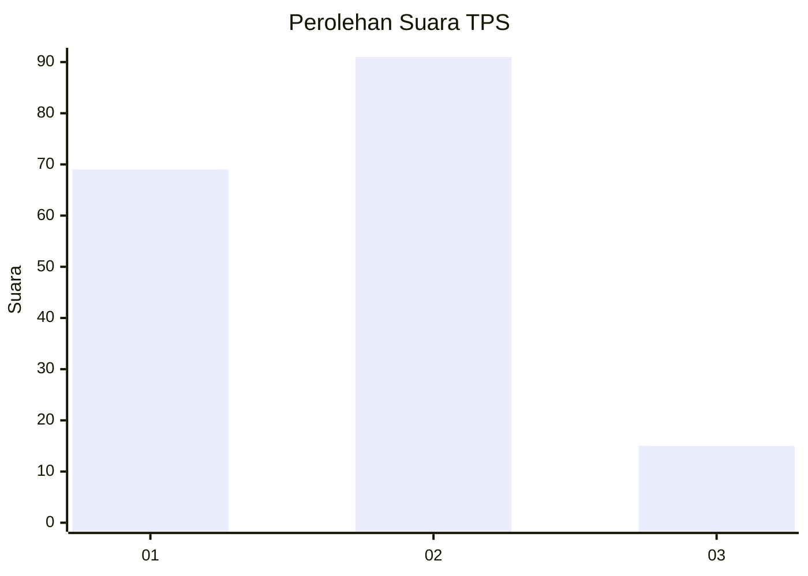

# Hasil

## Grafik

## Tabel

| No. | Nama Paslon    | Suara | Suara (raw) | Persentase |
|:--- |:-------------- | -----:| -----------:| ----------:|
| 1   | ANIES MUHAIMIN | 69    | [69][p-1]   | 39,43      |
| 2   | PRABOWO GIBRAN | 91    | [91][p-2]   | 52,00      |
| 3   | GANJAR MAHFUD  | 15    | [15][p-3]   | 8,57       |

[p-1]: https://github.com/gigit-pemilu/pemilu-2024-51-bali/blob/main/pilpres/hitung-suara/sub/51-bali/sub/08-buleleng/sub/06-buleleng/sub/1010-kampung-singaraja/sub/002-tps/sub/paslon-1.txt
[p-2]: https://github.com/gigit-pemilu/pemilu-2024-51-bali/blob/main/pilpres/hitung-suara/sub/51-bali/sub/08-buleleng/sub/06-buleleng/sub/1010-kampung-singaraja/sub/002-tps/sub/paslon-2.txt
[p-3]: https://github.com/gigit-pemilu/pemilu-2024-51-bali/blob/main/pilpres/hitung-suara/sub/51-bali/sub/08-buleleng/sub/06-buleleng/sub/1010-kampung-singaraja/sub/002-tps/sub/paslon-3.txt

## Foto C Plano

https://sirekap-obj-formc.kpu.go.id/bfa5/pemilu/ppwp/51/08/06/10/10/5108061010002-20240215-080343--ca1f489e-cc61-4939-ad02-a447f3675ba7.jpg

https://sirekap-obj-formc.kpu.go.id/bfa5/pemilu/ppwp/51/08/06/10/10/5108061010002-20240215-080245--4b7c76ac-4d75-4403-9d15-ced563933745.jpg

https://sirekap-obj-formc.kpu.go.id/bfa5/pemilu/ppwp/51/08/06/10/10/5108061010002-20240215-080424--560552cd-b19f-483b-bc90-e218abb23511.jpg

## Metadata

| Key        | Value               |
| ---------- | ------------------- |
| Time Stamp | 2024-02-16 21:01:00 |

## DATA PEMILIH TETAP

Jumlah pemilih dalam DPT: **221**.
 * L: **123**.
 * P: **98**.

## DATA PENGGUNA HAK PILIH

Jumlah pengguna hak pilih dalam DPT: **182**.
 * L: **99**.
 * P: **83**.

Jumlah pengguna hak pilih dalam DPTb: **0**.
 * L: **0**.
 * P: **0**.

Jumlah pengguna hak pilih dalam DPK: **1**.
 * L: **0**.
 * P: **1**.

Jumlah pengguna hak pilih: **183**.
 * L: **99**.
 * P: **84**.

## JUMLAH SUARA SAH DAN TIDAK SAH

JUMLAH SELURUH SUARA SAH: **175**.

JUMLAH SUARA TIDAK SAH: **8**.

JUMLAH SELURUH SUARA SAH DAN SUARA TIDAK SAH: **183**.

