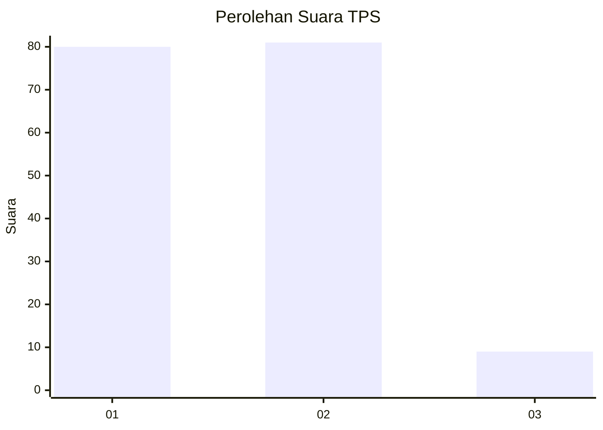
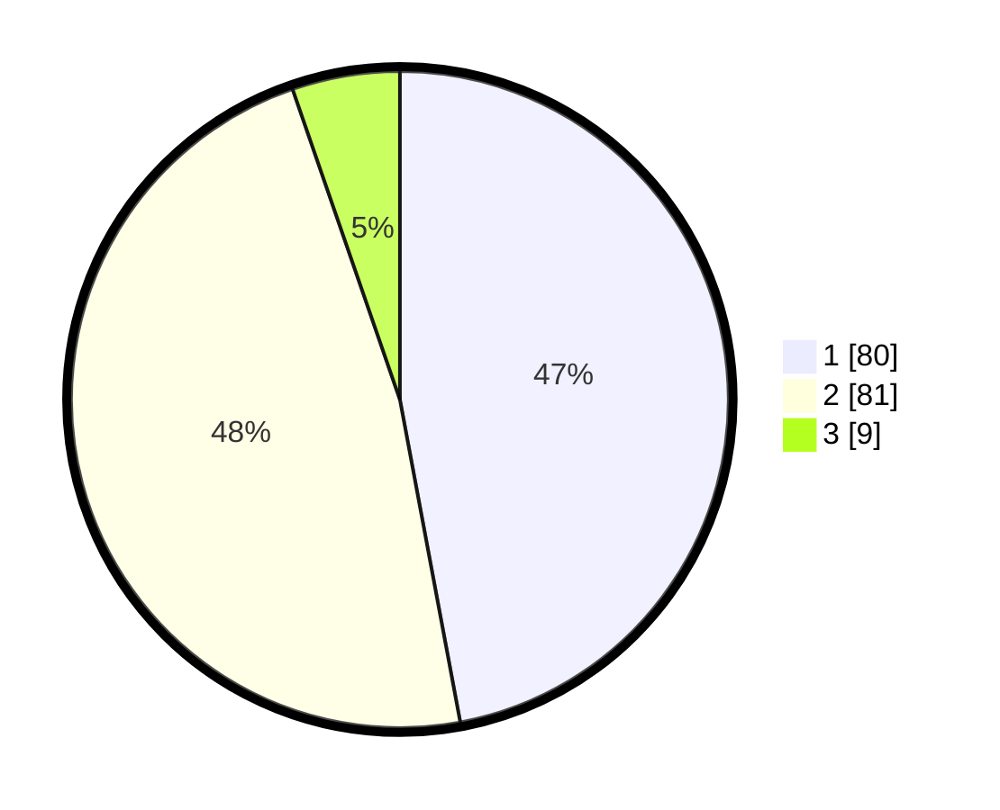

# Hasil

## Grafik

## Tabel

| No. | Nama Paslon    | Suara | Suara (raw) | Persentase |
|:--- |:-------------- | -----:| -----------:| ----------:|
| 1   | ANIES MUHAIMIN | 80    | [80][p-1]   | 47,06      |
| 2   | PRABOWO GIBRAN | 81    | [81][p-2]   | 47,65      |
| 3   | GANJAR MAHFUD  | 9     | [9][p-3]    | 5,29       |

[p-1]: https://github.com/gigit-pemilu/pemilu-2024-51-bali/blob/main/pilpres/hitung-suara/sub/51-bali/sub/08-buleleng/sub/06-buleleng/sub/1010-kampung-singaraja/sub/003-tps/sub/paslon-1.txt
[p-2]: https://github.com/gigit-pemilu/pemilu-2024-51-bali/blob/main/pilpres/hitung-suara/sub/51-bali/sub/08-buleleng/sub/06-buleleng/sub/1010-kampung-singaraja/sub/003-tps/sub/paslon-2.txt
[p-3]: https://github.com/gigit-pemilu/pemilu-2024-51-bali/blob/main/pilpres/hitung-suara/sub/51-bali/sub/08-buleleng/sub/06-buleleng/sub/1010-kampung-singaraja/sub/003-tps/sub/paslon-3.txt

## Foto C Plano

https://sirekap-obj-formc.kpu.go.id/d845/pemilu/ppwp/51/08/06/10/10/5108061010003-20240214-155206--25756cc4-54d9-4cf1-99ed-5ec91d77b604.jpg

https://sirekap-obj-formc.kpu.go.id/d845/pemilu/ppwp/51/08/06/10/10/5108061010003-20240214-160157--20521690-b1ab-48d4-b220-4490c9bdba13.jpg

## Metadata

| Key        | Value               |
| ---------- | ------------------- |
| Time Stamp | 2024-02-15 07:00:44 |

