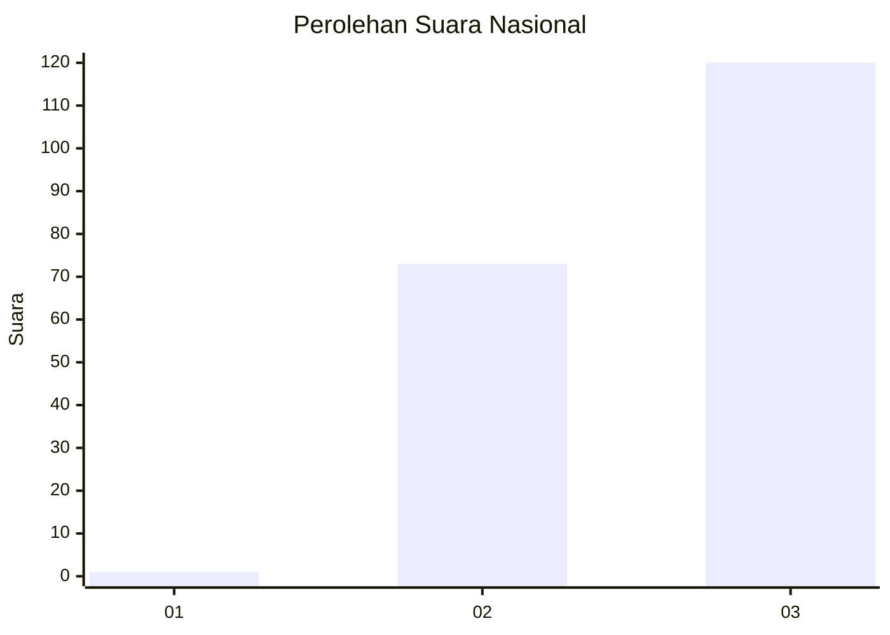
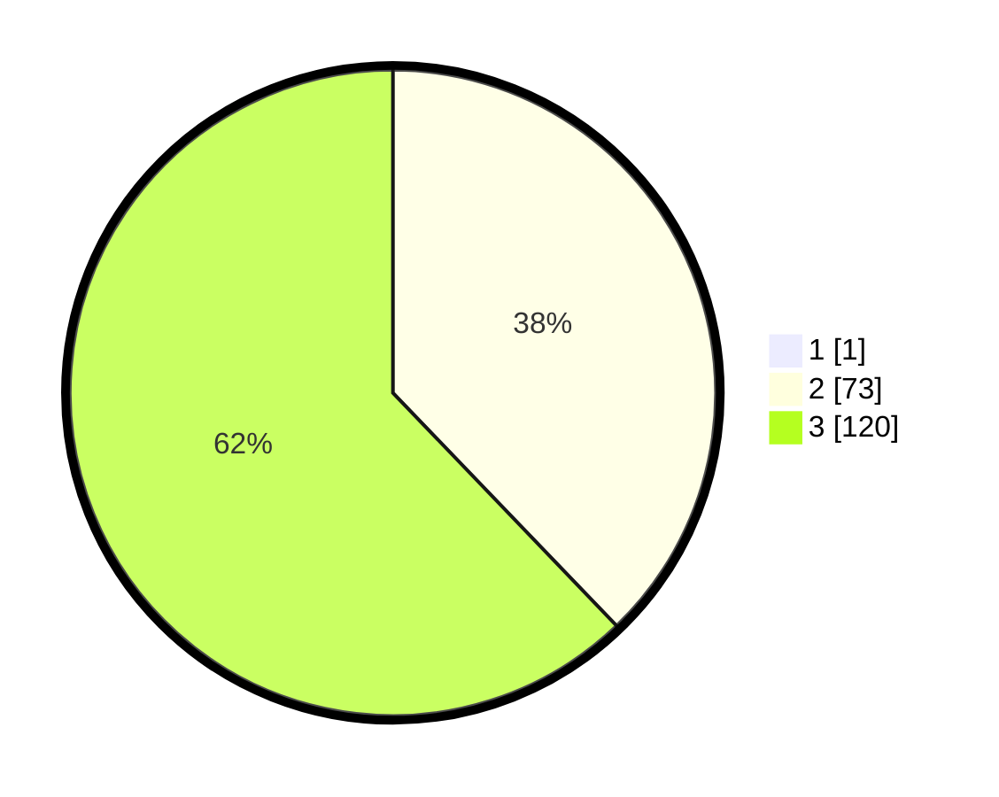

# Hasil

## Grafik

## Tabel

| No. | Nama Paslon    | Suara | Suara (raw) | Persentase |
|:--- |:-------------- | -----:| -----------:| ----------:|
| 1   | ANIES MUHAIMIN | 1     | [1][p-1]    | 0,52       |
| 2   | PRABOWO GIBRAN | 73    | [73][p-2]   | 37,63      |
| 3   | GANJAR MAHFUD  | 120   | [120][p-3]  | 61,86      |

[p-1]: https://github.com/gigit-pemilu/pemilu-2024/blob/main/pilpres/hitung-suara/sub/51-bali/sub/08-buleleng/sub/06-buleleng/sub/1012-beratan/sub/001-tps/sub/paslon-1.txt
[p-2]: https://github.com/gigit-pemilu/pemilu-2024/blob/main/pilpres/hitung-suara/sub/51-bali/sub/08-buleleng/sub/06-buleleng/sub/1012-beratan/sub/001-tps/sub/paslon-2.txt
[p-3]: https://github.com/gigit-pemilu/pemilu-2024/blob/main/pilpres/hitung-suara/sub/51-bali/sub/08-buleleng/sub/06-buleleng/sub/1012-beratan/sub/001-tps/sub/paslon-3.txt

## Foto C Plano

https://sirekap-obj-formc.kpu.go.id/dd85/pemilu/ppwp/51/08/06/10/12/5108061012001-20240214-212548--db98aeb5-843c-4ba3-b07a-90ef67df34c3.jpg

https://sirekap-obj-formc.kpu.go.id/dd85/pemilu/ppwp/51/08/06/10/12/5108061012001-20240214-212612--05615107-b94b-4ab4-86ad-c69a83c32473.jpg

https://sirekap-obj-formc.kpu.go.id/dd85/pemilu/ppwp/51/08/06/10/12/5108061012001-20240214-212620--f5d640ee-f8db-4adc-90a0-caa70264ec44.jpg

## Metadata

| Key        | Value               |
| ---------- | ------------------- |
| Time Stamp | 2024-02-24 22:31:28 |

