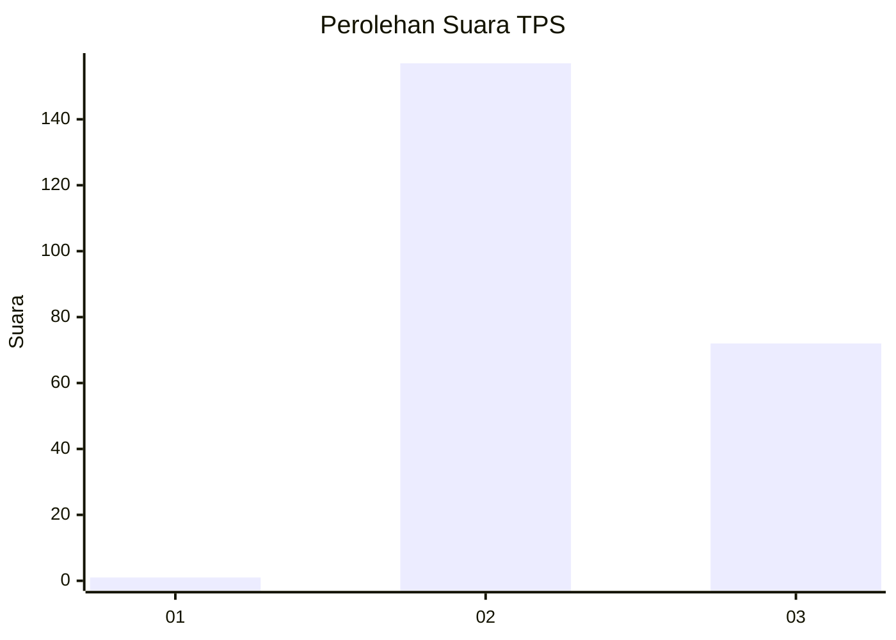
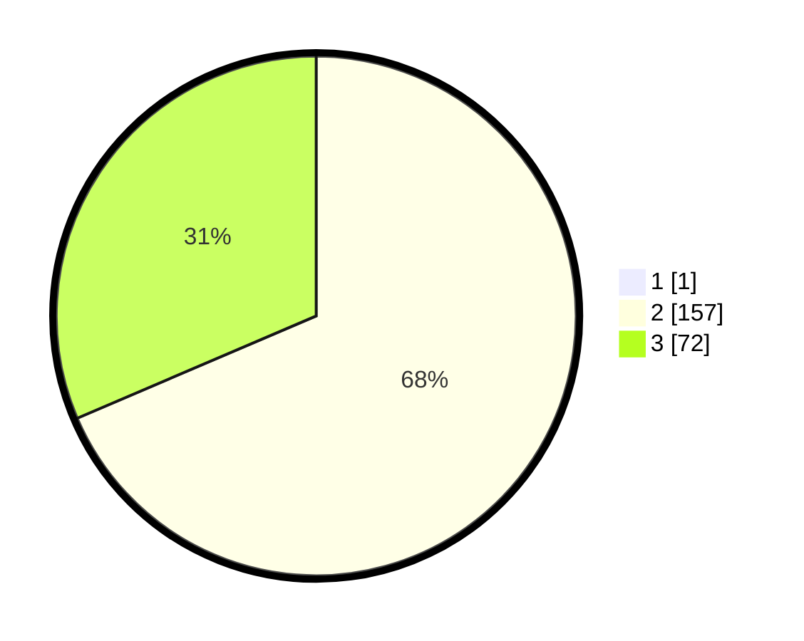

# Hasil

## Grafik

## Tabel

| No. | Nama Paslon    | Suara | Suara (raw) | Persentase |
|:--- |:-------------- | -----:| -----------:| ----------:|
| 1   | ANIES MUHAIMIN | 1     | [1][p-1]    | 0,43       |
| 2   | PRABOWO GIBRAN | 157   | [157][p-2]  | 68,26      |
| 3   | GANJAR MAHFUD  | 72    | [72][p-3]   | 31,30      |

[p-1]: https://github.com/gigit-pemilu/pemilu-2024-51-bali/blob/main/pilpres/hitung-suara/sub/51-bali/sub/08-buleleng/sub/06-buleleng/sub/1019-banyuning/sub/004-tps/sub/paslon-1.txt
[p-2]: https://github.com/gigit-pemilu/pemilu-2024-51-bali/blob/main/pilpres/hitung-suara/sub/51-bali/sub/08-buleleng/sub/06-buleleng/sub/1019-banyuning/sub/004-tps/sub/paslon-2.txt
[p-3]: https://github.com/gigit-pemilu/pemilu-2024-51-bali/blob/main/pilpres/hitung-suara/sub/51-bali/sub/08-buleleng/sub/06-buleleng/sub/1019-banyuning/sub/004-tps/sub/paslon-3.txt

## Foto C Plano

https://sirekap-obj-formc.kpu.go.id/dcf5/pemilu/ppwp/51/08/06/10/19/5108061019004-20240214-234851--28a87685-2fe2-4ade-81bf-f70bdae9f85e.jpg

https://sirekap-obj-formc.kpu.go.id/dcf5/pemilu/ppwp/51/08/06/10/19/5108061019004-20240214-235037--9ccf19bd-33e2-49b7-a645-d65f5578c5a3.jpg

https://sirekap-obj-formc.kpu.go.id/dcf5/pemilu/ppwp/51/08/06/10/19/5108061019004-20240214-235215--f9a33e75-9336-4487-8af1-fcfae48d292b.jpg

## Metadata

| Key        | Value               |
| ---------- | ------------------- |
| Time Stamp | 2024-02-24 22:31:28 |

