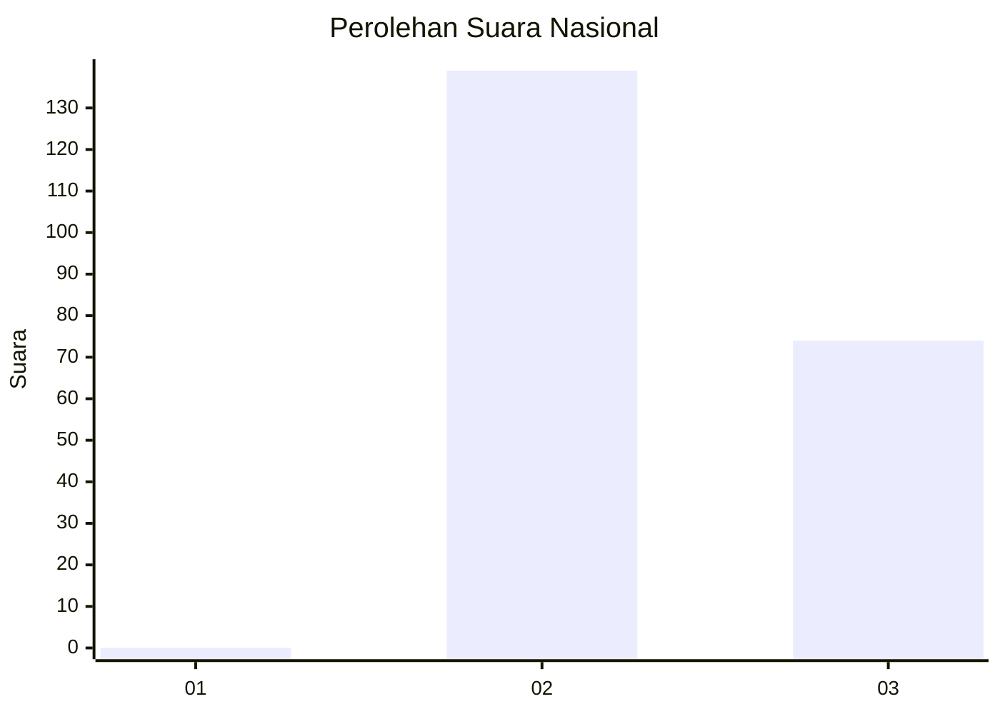
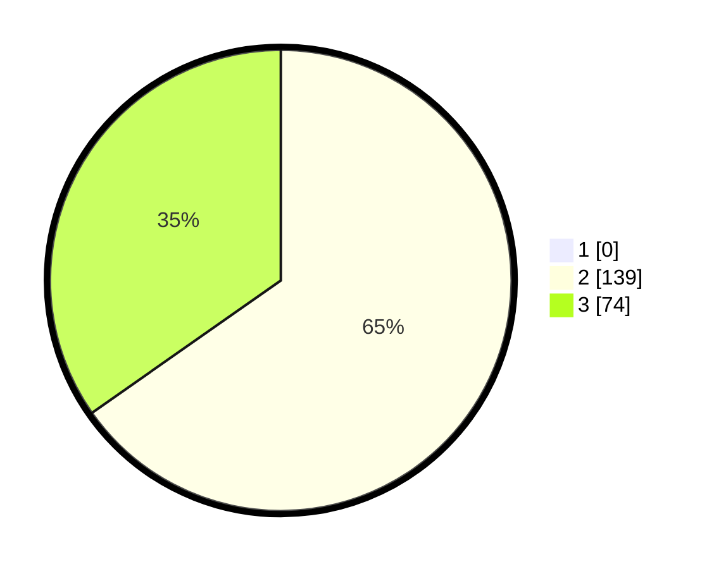

# Hasil

## Grafik

## Tabel

| No. | Nama Paslon    | Suara | Suara (raw) | Persentase |
|:--- |:-------------- | -----:| -----------:| ----------:|
| 1   | ANIES MUHAIMIN | 0     | [0][p-1]    | 0,00       |
| 2   | PRABOWO GIBRAN | 139   | [139][p-2]  | 65,26      |
| 3   | GANJAR MAHFUD  | 74    | [74][p-3]   | 34,74      |

[p-1]: https://github.com/gigit-pemilu/pemilu-2024/blob/main/pilpres/hitung-suara/sub/51-bali/sub/08-buleleng/sub/06-buleleng/sub/1019-banyuning/sub/007-tps/sub/paslon-1.txt
[p-2]: https://github.com/gigit-pemilu/pemilu-2024/blob/main/pilpres/hitung-suara/sub/51-bali/sub/08-buleleng/sub/06-buleleng/sub/1019-banyuning/sub/007-tps/sub/paslon-2.txt
[p-3]: https://github.com/gigit-pemilu/pemilu-2024/blob/main/pilpres/hitung-suara/sub/51-bali/sub/08-buleleng/sub/06-buleleng/sub/1019-banyuning/sub/007-tps/sub/paslon-3.txt

## Foto C Plano

https://sirekap-obj-formc.kpu.go.id/b42c/pemilu/ppwp/51/08/06/10/19/5108061019007-20240215-035439--39a7d310-8576-4876-a29e-7b40bc90823d.jpg

https://sirekap-obj-formc.kpu.go.id/b42c/pemilu/ppwp/51/08/06/10/19/5108061019007-20240215-035643--17ab667a-f5b0-4706-ac99-84dc22a1b2d2.jpg

https://sirekap-obj-formc.kpu.go.id/b42c/pemilu/ppwp/51/08/06/10/19/5108061019007-20240215-035845--0a22c33a-b2f3-40d6-a4fc-7b558a320b87.jpg

## Metadata

| Key        | Value               |
| ---------- | ------------------- |
| Time Stamp | 2024-02-24 22:31:28 |

