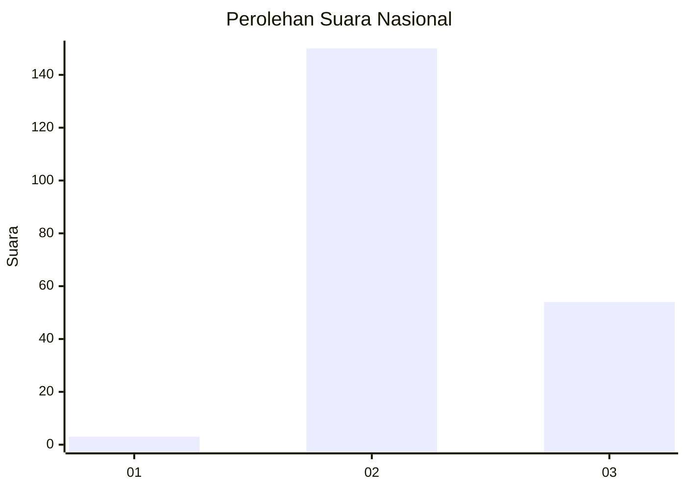
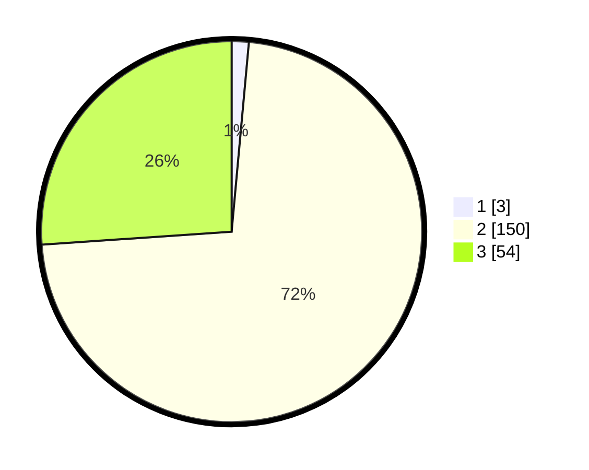

# Hasil

## Grafik

## Tabel

| No. | Nama Paslon    | Suara | Suara (raw) | Persentase |
|:--- |:-------------- | -----:| -----------:| ----------:|
| 1   | ANIES MUHAIMIN | 3     | [3][p-1]    | 1,45       |
| 2   | PRABOWO GIBRAN | 150   | [150][p-2]  | 72,46      |
| 3   | GANJAR MAHFUD  | 54    | [54][p-3]   | 26,09      |

[p-1]: https://github.com/gigit-pemilu/pemilu-2024/blob/main/pilpres/hitung-suara/sub/51-bali/sub/08-buleleng/sub/06-buleleng/sub/1019-banyuning/sub/008-tps/sub/paslon-1.txt
[p-2]: https://github.com/gigit-pemilu/pemilu-2024/blob/main/pilpres/hitung-suara/sub/51-bali/sub/08-buleleng/sub/06-buleleng/sub/1019-banyuning/sub/008-tps/sub/paslon-2.txt
[p-3]: https://github.com/gigit-pemilu/pemilu-2024/blob/main/pilpres/hitung-suara/sub/51-bali/sub/08-buleleng/sub/06-buleleng/sub/1019-banyuning/sub/008-tps/sub/paslon-3.txt

## Foto C Plano

https://sirekap-obj-formc.kpu.go.id/6d4f/pemilu/ppwp/51/08/06/10/19/5108061019008-20240215-015354--18f5495f-4ddc-4f76-bd69-8cf623b2df00.jpg

https://sirekap-obj-formc.kpu.go.id/6d4f/pemilu/ppwp/51/08/06/10/19/5108061019008-20240215-015601--047774f8-5fb0-45a9-8e5d-db119dd2e1ec.jpg

https://sirekap-obj-formc.kpu.go.id/6d4f/pemilu/ppwp/51/08/06/10/19/5108061019008-20240215-015727--2cd7b7a1-f7bf-4b81-a29b-0e2288c53763.jpg

## Metadata

| Key        | Value               |
| ---------- | ------------------- |
| Time Stamp | 2024-02-24 22:31:28 |

