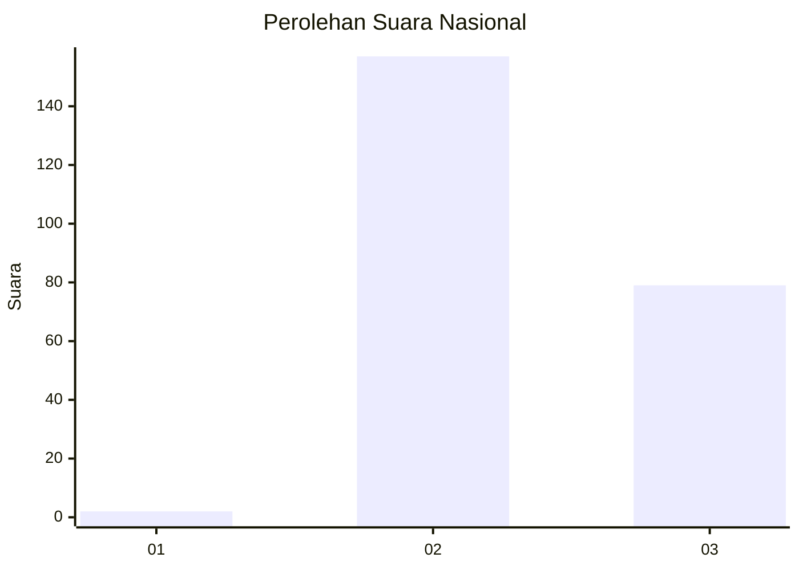
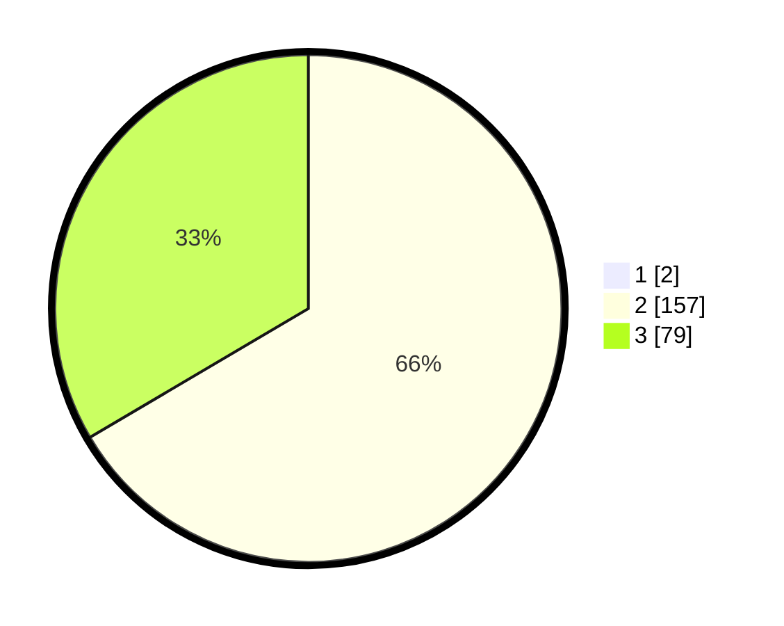

# Hasil

## Grafik

## Tabel

| No. | Nama Paslon    | Suara | Suara (raw) | Persentase |
|:--- |:-------------- | -----:| -----------:| ----------:|
| 1   | ANIES MUHAIMIN | 2     | [2][p-1]    | 0,84       |
| 2   | PRABOWO GIBRAN | 157   | [157][p-2]  | 65,97      |
| 3   | GANJAR MAHFUD  | 79    | [79][p-3]   | 33,19      |

[p-1]: https://github.com/gigit-pemilu/pemilu-2024/blob/main/pilpres/hitung-suara/sub/51-bali/sub/08-buleleng/sub/06-buleleng/sub/1019-banyuning/sub/009-tps/sub/paslon-1.txt
[p-2]: https://github.com/gigit-pemilu/pemilu-2024/blob/main/pilpres/hitung-suara/sub/51-bali/sub/08-buleleng/sub/06-buleleng/sub/1019-banyuning/sub/009-tps/sub/paslon-2.txt
[p-3]: https://github.com/gigit-pemilu/pemilu-2024/blob/main/pilpres/hitung-suara/sub/51-bali/sub/08-buleleng/sub/06-buleleng/sub/1019-banyuning/sub/009-tps/sub/paslon-3.txt

## Foto C Plano

https://sirekap-obj-formc.kpu.go.id/4aa7/pemilu/ppwp/51/08/06/10/19/5108061019009-20240214-220650--adc4c99c-8040-4dfa-a7b0-1dd19ed19a0b.jpg

https://sirekap-obj-formc.kpu.go.id/4aa7/pemilu/ppwp/51/08/06/10/19/5108061019009-20240214-221132--dd9520f1-2761-4b87-8878-d1f531baf8d2.jpg

https://sirekap-obj-formc.kpu.go.id/4aa7/pemilu/ppwp/51/08/06/10/19/5108061019009-20240214-221317--1047973a-c557-48a4-897d-923d51721753.jpg

## Metadata

| Key        | Value               |
| ---------- | ------------------- |
| Time Stamp | 2024-02-24 22:31:28 |

